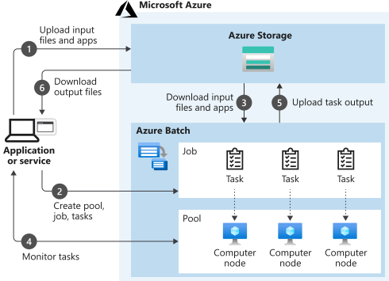

As the solution architect for the engineering organization, you need to understand the options available for batch processing and high-performance computing (HPC) on Azure. This knowledge helps to determine how you can efficiently render the 3D models of the facilities that the company designs, and how you store all of the related statistical data.

There are several HPC and batch processing choices available on Azure. You talk with an Azure expert who advises you to focus on three options: Azure Batch, Azure VM HPC Instances, and Microsoft HPC Pack. You'll look at each in the following units. It's important to note that these choices aren't mutually exclusive. They build upon one other and can be thought of as different tools in a toolbox.

Here, you'll learn about high-performance computing in general, and learn about Azure Batch.

## What is HPC?

There are many different industries that require very powerful computing resources for specialized tasks. For example:

- In genetic sciences, gene sequencing.
- In oil and gas exploration, reservoir simulations.
- In finance, market modeling.
- In engineering, physical system modeling.
- In meteorology, weather modeling.

These tasks require processors that can carry out instructions extremely fast. It's also helpful to run many processors in parallel, to obtain answers within a practical time duration. On-premises HPC systems have many powerful CPUs and, for graphics-intensive tasks, GPUs. They also require fast disks and high-speed memory.

Azure enables you to perform HPC tasks in the cloud, without building your own expensive HPC hardware. An Azure HPC system also has the advantage that you can dynamically add resources as they are needed, and remove them when demand falls. Azure makes it easy to coordinate an HPC task across many virtual machines, and it supports powerful VM sizes.

## Azure Batch

Azure Batch is a service for working with large-scale parallel and computationally intensive tasks on Azure. Unlike the other options you'll see in this module, Batch is a managed service. You provide data and applications, and you specify whether to run on Windows or Linux, how many machines to use, and what rules apply to autoscaling. Batch handles provisioning of the compute capacity and optimizes the way the work is done in parallel. You only pay for the underlying compute, networking, and storage you use. The Batch scheduling and management service is free.

Batch is ideally suited to heavy workloads, such as financial risk modeling, 3D rendering, media transcoding, and genetic sequence analysis. Think of Batch as a flexible management and scheduling service layer on top of the huge scale of Azure. For example, you might spin up 100 or 1000 virtual machines to support heavy workloads without the aid of Batch. However, you'd then be responsible for all the scheduling of the VMs, and for distributing the work according to available capacity.

## Components of Azure Batch

Batch has several components that act together. An *Azure Batch Account* forms a container for all of the main Batch elements. Within the Batch account, you typically create Batch *pools* of VMs, which are often called nodes, running either Windows or Linux. You set up Batch *jobs* that work like logical containers with configurable settings for the real unit of work in Batch, known as Batch *tasks*. This unit of work is highly flexible and can run either command-line instructions or entire applications. Optionally, you might associate an Azure Storage account with the Azure Batch account. You then upload and download data inputs and outputs. You also provide application installers for the Batch tasks that need them.

This diagram shows a client application or hosted service interacting with Batch to upload input, create jobs, monitor tasks, and download output.

## Azure Batch in action

When you create Batch tasks, the scheduling and management engine determines the  optimal plan for allocating and scheduling tasks across the specified compute capacity. This plan happens during the initial creation of a Batch pool.

In a series of 100 tasks and 10 nodes, for example, Batch schedules the first 10 tasks onto those 10 nodes. Batch immediately allocates later tasks when nodes finish processing. For spiky workloads, you can configure scaling rules, which Batch also handles automatically. If you provision 100 VMs with no Batch context, you must code these scheduling and work allocation mechanisms by hand.

Because of how this managed scheduling engine works, Batch is well-suited to highly parallel workloads, which are sometimes called *embarrassingly parallel* workloads. For example, the engineering company needs to generate highly detailed 3D models of the facilities they design. These models can be extraordinarily compute-intensive and take hours or days to complete. Using Batch, you allocate the rendering of different sections of the structures to separate compute nodes. For example, if 100 nodes are provisioned, it should be possible to complete the rendering in approximately 1/100th of the time.
