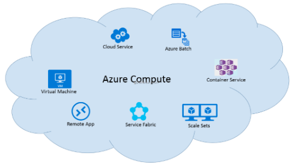
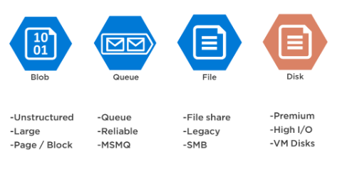
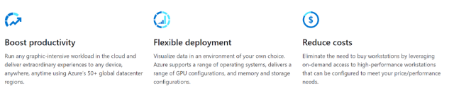
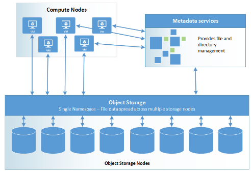

There are four main components to the HPC system: Compute, Storage, Networking, and Visualization.

## Compute

High-performance computing resources are offered at nearly unlimited scale on Azure. You can use the different H-series, N-series, and Cray for memory, graphic, and managed applications.

- **H-series virtual machines:** For memory-bound applications.
- **N-series virtual machines:** For graphic intensive and CUDA/OpenCL based applications.
- **Cray:** For a fully dedicated and customized supercomputer delivered as a managed service.

## Storage

The highly secure cloud storage is available to customers at a massive scale. It allows HPC applications to use it efficiently, customizing with either Azure Managed Lustre, Azure NetApp Files, or Cray ClusterStor.

- **Azure Managed Lustre:** Ideal for HPC workloads that require high throughput and low latency, making it suitable for applications that process large datasets quickly.
- **Azure NetApp Files:** Access large amounts of I/O with a submillisecond latency delivered as an Azure service natively within an Azure datacenter.
- **Cray ClusterStor:** A Lustre-based, bare-metal HPC storage solution that's fully integrated with Azure for a high throughput storage solution.

## Networking

Azure allows you to create private virtual networks in the cloud, which simplifies the network architecture and secures the connection between endpoints by disabling the data exposure to the public internet.

- Establish private, secure tunnels for hybrid cloud connectivity using Azure ExpressRoute.
- Take advantage of Linux remote direct memory access (RDMA) with InfiniBand for message passing interface (MPI) workloads within your datacenter.

## Visualization

Run visualization workloads with HPC and Azure Virtual Machines that boost productivity, reduces costs, and has flexible deployments.

- **Azure NV-series Virtual Machines (VMs):** GPU-powered, visualize simulation data and run streaming, gaming, encoding, and VDI scenarios.
- **NVv3-series VMs:** For the most extreme GPU-accelerated graphics applications, such as 3D CAD modeling, 3D rendering, and scientific visualization. NVv3 VMs support premium storage and come with twice the system memory (RAM) as earlier NV VMs.

## Mapping Azure VM and Storage products to components in an HPC system

### Azure Compute Virtual Machine Solutions  

#### VMs with low latency (HPC SKUs)

The following H-series and N-series VMs are RDMA capable and can communicate over the low latency and high bandwidth InfiniBand network. The RDMA capability over such an interconnect is critical to boost the scalability and performance of distributed-node HPC and AI workloads.

#### VMs with accelerators

|   **CPU**    |  **GP-GPU**    | **VISUAL**   |
| :------------------- | :-------------------  | :------------------- |
| **HB-series** VMs are optimized for applications that are memory intensive, such as fluid dynamics, explicit finite element analysis, and weather modeling.   **HC-series** VMs are optimized for applications that are compute intensive, such as molecular dynamics, implicit finite element analysis, and computational chemistry.    | **NC-series** VMs are powered by the NVIDIA Tesla K80 card and the Intel Xeon E5-2690 v3 (Haswell) processor. Users can crunch through data faster by using CUDA for energy exploration applications, crash simulations, ray traced rendering, deep learning, and more.    **ND-series** VMs are a new addition to the GPU family designed for AI and deep learning workloads. It offers configuration with a secondary low-latency, high-throughput network through RDMA, and InfiniBand connectivity enables running of large-scale training jobs spanning many GPUs.| **NV-series** VMs are made for desktop accelerated applications and virtual desktops where customers are able to visualize their data or simulations. Enables users to visualize their graphics intensive workflows on the NV instances to get a superior graphics capability and additionally run single precision workloads such as encoding and rendering.       |

### Azure Storage Solutions

#### Azure Blob Storage

Allows massively scalable and secure object storage for cloud-native workloads, archives, data lakes, high-performance computing, and machine learning. It's scalable and optimized for data lakes with comprehensive data management.

Key design features include:

- Serving images or documents directly to a browser.
- Storing files for distributed access.
- Streaming video and audio.
- Writing to log files.
- Storing data for backup and restore, disaster recovery, and archiving.
- Storing data for analysis by an on-premises or Azure-hosted service.

#### Azure NetApp Files

Makes it easy for enterprise line-of-business and storage professionals to migrate and run complex, file-based applications with no code change. It's used as the underlying shared file-storage service in various scenarios such as, lift-shift migration of POSIX compliant Linux and Windows applications, SAP HANA, databases, and enterprise web applications.

Key benefits include:

- 99.99% availability, High-performance, Secure.  
- PaaS service - easy to use and manage.  
- Online scale up/down size and/or service levels.  
- Data protection using Cross-Region replication.  
- Advanced Enterprise Data Management features.

#### Azure Files

Azure Files offers fully managed file shares in the cloud that are accessible via the industry standard Server Message Block (SMB) protocol or Network File System (NFS) protocol.

Key design features include:

- Can be mounted concurrently in cloud or on-premises deployments.
- Azure Files SMB file shares are accessible from Windows, Linux, and macOS clients.
- Azure Files NFS file shares are accessible from Linux or macOS clients.
- Also, Azure Files SMB file shares can be cached on Windows Servers with Azure File Sync for fast access near where the data is being used.

Useful for:

- Replacing or supplementing on-premises file servers.
- Lift and shift applications.
- Simplifying cloud development.
- Containerization.

Key benefits include:

- Shared access
- Fully Managed
- Scripting and Tooling
- Resiliency
- Familiar Programmability

#### Azure Managed Lustre

Azure Managed Lustre service gives you the capability to quickly create an Azure-based Lustre file system for cloud-based high-performance computing jobs. It's a fully managed parallel file system best suited for medium to large HPC workloads. It enables HPC applications in the cloud without breaking application compatibility by providing familiar Lustre parallel file system functionality, behaviors, and performance, securing long-term application investments.

Ideal to use for HPC workloads that require high throughput and low latency, making it suitable for applications that process large datasets quickly.

Key benefits include:

- High storage capacity up to 12.5 PiB upon request.
- Low (~2ms) latency.
- Up to 1M IOPS, up to 500 GiB/s throughput.
- Spin up new clusters in minutes.
- Supports containerized workloads with AKS.
- Integrates with Azure Blob Storage as a source for importing and exporting data for long-term storage.

#### VM-based file systems

##### Single VM NAS

Cloud-based Network Attached Storage (NAS) helps you address storage needs in the cloud using the same constructs as an on-premises NAS system. It gives organizations storage that's as performant as their on-premises NAS with the added ability to scale in the cloud-and all without having to make major changes to their existing application interfaces and processes.

NAS is a centralized storage appliance that allows applications and services to access data from a centralized location in the network. Virtual NAS is the virtual appliance version of NAS systems that can run on virtualization platforms such as VMware, Hyper-V, etc.

Key benefits include:  

- Network devices accessing Virtual NAS storage can continue to do so using the same protocols without any reconfiguration.
- Capacity management is also easier since any required storage can be allocated from the underlying virtualization layer.

##### Multi-node Parallel file systems

Parallel file systems distribute block level storage across multiple networked storage nodes. File data is spread among these nodes, meaning file data is spread among multiple storage devices. It pools any individual storage I/O requests across multiple storage nodes that are accessible through a common namespace.

Multiple storage devices and multiple paths to data are utilized to provide a high degree of parallelism, reducing bottlenecks imposed by accessing only a single node at a time. Parallel file systems are broken up into two main pieces:

- **Metadata services:** Store namespace metadata, such as filenames, directories, access permissions, and file layout. Based on the parallel file system, metadata services are provided as an integrated part of an overall storage node distribution or through a separate server cluster.
- **Object storage:** Object storage contains actual file data. Clients pull the location of files and directories from the metadata services, then access file storage directly.

The advantages of distributed storage and superior I/O performance make parallel file systems preferable to NFS in most HPC scenarios, particularly when it comes to shared working storage space.

    

##### Cray ClusterStor

The Cray ClusterStor in Azure storage system is a high capacity and high throughput storage solution to accelerate your HPC simulations. It's a bare metal appliance that is fully integrated in the Azure fabric and accessible by a large selection of other Azure services. Cray ClusterStor in Azure offers a Lustre-based, single-tenant, bare metal and fully managed HPC environment in Microsoft Azure.

Key benefits include:

- Can be used with Cray XC and CS series supercomputers and also now supports data processing of HPC jobs executed on H-series virtual machines from Azure.  
- Can move your data within Azure from high-performance scratch, to warm Azure blob storage and cold archive storage.  
- Get access to high performance and capacity during simulation. Move post-simulation data to a redundant, less-expensive cloud storage solution, to either be easily distributed or made available for your next simulation.
- Enables more than three times the throughput in GB/sec per Lustre Object Storage Servers (OSS) than the currently available Lustre offer.
