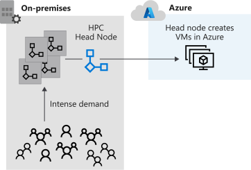
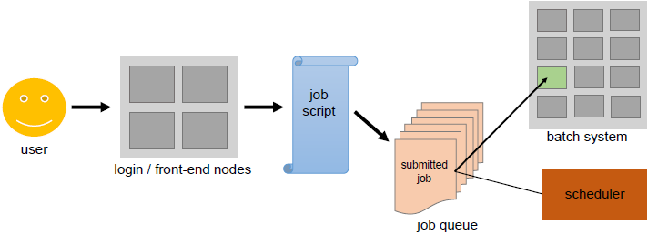
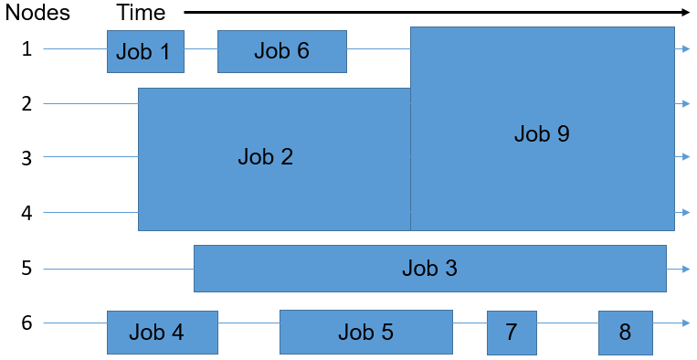

For high level control of your high-performance infrastructure, or to manage both cloud and on-premises VMs, consider using the Microsoft HPC Pack.

In your engineering company, you want to migrate high-performance infrastructure from on-premises datacenters into Azure. Because these systems are business critical, you want to migrate gradually. You need to ensure that you can rapidly respond to demand and manage VMs flexibly during the migration, when there are both on-premises and cloud VMs.

Here, you learn how the HPC Pack can manage HPC infrastructure.

## What is HPC Pack?

In researching options for the engineering organization, you looked at Azure Batch and Azure HPC Instances. But what if you want to have full control of the management and scheduling of your clusters of VMs? What if you have significant investment in on-premises infrastructure in your datacenter? HPC Pack offers a series of installers for Windows that allows you to configure your own control and management plane, and highly flexible deployments of on-premises and cloud nodes. By contrast with the exclusively cloud-based Batch, HPC Pack has the flexibility to deploy to on-premises and the cloud. It uses a hybrid of both to expand to the cloud when your on-premises reserves are insufficient.

HPC Pack is a version of the Batch management and scheduling control layer, which gives you full control and responsibility. Deployment of HPC Pack requires Windows Server 2012 or later.

## Plan for HPC Pack

Typically, you should prepare for the installation of HPC Pack with a full review of requirements. You need SQL Server and an Active Directory controller. You must also plan a topology. How many head or control nodes should there be, and how many worker nodes? Do you need to expand up to Azure? If so, you pre-provision Azure nodes as part of the cluster. The size of the main machines that make up the control plane (head and control nodes, SQL Server, and Active Directory domain controller) depends on the projected cluster size.

When you install HPC Pack, it shows a job scheduler with support for both HPC and parallel jobs. The scheduler appears in the Microsoft Message Passing Interface. HPC Pack is highly integrated with Windows, so you can use Visual Studio for parallel debugging. You can see all of the application, networking, and operating system events from the compute nodes in the cluster in a single, debugger view.

HPC Pack also offers an advanced job scheduler. You can rapidly deploy, even to nodes not exclusively dedicated to HPC Pack, to Linux-based nodes, and Azure nodes. That means you can use spare capacity within your datacenter. HPC Pack provides an ideal way to use existing infrastructure investments, and keep more discrete control over how work gets divided up than is possible with Batch.

## Use a mix of technologies

The options you're considering in this module aren't mutually exclusive. You can use the H-Series VMs, which you looked at in the last unit, as possible Azure nodes in an HPC configuration. While you've concentrated on hybrid use cases to highlight the differences with Batch, HPC Pack is flexible. It allows for both exclusively on-premises deployments and exclusively cloud-based deployments. This flexibility is useful when you want more granular control than Batch offers.

## Deploying and managing HPC Systems

### Orchestrating HPC systems

One of the key concepts of cloud computing is *Orchestration*. It refers to overseeing the deployment, running and monitoring of all the components of an application in the cluster.

Additionally, an orchestrator can perform other tasks like healing (managing errors), scaling and logging. Orchestrators like the well-known Kubernetes or Mesos, can access cloud cluster resources directly by virtualization.

### Deploying HPC systems

HPC deployments in Azure can vary according to your specific workload needs and budget. There are some standard components in any deployment, including:

- **Azure Resource Manager:** Enables deployment of applications to clusters using script files or templates.
- **HPC head node:** Enables schedule jobs and workloads onto worker nodes. It's a virtual machine (VM) that's used to manage HPC clusters.
- **Virtual Network:** Enables creating an isolated network of clusters and storage through secure connections with ExpressRoute or IPsec VPN. You can integrate established DNS servers and IP addresses in your network and granularly control traffic between subnets.
- **Virtual Machine Scale Sets:** Enables provisioning of VMs of clusters and includes features for autoscaling, multi-zone deployments, and load balancing. You can use scale sets to run several databases, including MongoDB, Cassandra, and Hadoop.
- **Storage:** Enables mount persistent storage clusters in the form of blob, disk, file, hybrid, or data lake storage.

### Managing Azure HPC Deployments

Azure offers a few native services to help you manage your HPC deployments. These tools provide flexibility for your management and can help you schedule workloads in Azure and in hybrid resources.

- **Microsoft HPC Pack:** A set of utilities that enables you to configure and manage VM clusters, monitor operations, and schedule workloads. HPC Pack includes features to help you migrate on-premises workloads or to continue operating with a hybrid deployment. The utility doesn't provision or manage VMs or network infrastructure for you.
- **Azure CycleCloud:** An interface for the scheduler of your choice. You can use Azure CycleCloud with a range of native and third-party options, including HPC Pack, Grid Engine, Slurm, and Symphony. CycleCloud enables you to manage and orchestrate workloads, define access controls with Active Directory, and customize cluster policies.
- **Azure Batch:** A managed tool that you can use to autoscale deployments and set policies for job scheduling. The Azure Batch service handles provisioning, assignment, runtimes, and monitoring of your workloads. To use it, you just need to upload your workloads and configure your VM pool.

Azure HPC workloads offer machine learning, visualization, and rendering, all of which strengthen applications in the semiconductor industry. It enables seamless and resilient cloud integration of oil and gas workloads, as well as cloud-based genomic sequencing and semiconductor design.

### Best Practices for Azure HPC deployments

The following best practices can help you get the expected performance, and value.

- **Distribute Deployments Across Cloud Services:**
Distributing large deployments across cloud services can help you avoid limitations created by overloading or relying on a single service. By splitting your deployment into smaller segments, you can:

  - Stop idle instances after job completion without interrupting other processes
  - Flexibly start and stop node clusters
  - More easily find available nodes in your clusters
  - Use multiple data centers to ensure disaster recovery

- **Use Multiple Azure Storage Accounts for Node Deployments:** 
Similar to spreading deployments across services, it’s recommended to attach multiple storage accounts to each deployment. It can provide better performance for large deployments, applications restricted by input/output operations, and custom applications. When setting up your storage accounts, you should have one account for node provisioning and another for moving job or task data to ensure consistency and low latency.
- **Increase Proxy Node Instances to Match Deployment Size:** 
Proxy nodes enable communication between head nodes you're operating on-premises and Azure worker nodes. These nodes are attached automatically when you deploy workers in Azure. If you're running large jobs that meet or exceed the resources provided by the proxy nodes, consider increasing the number you have running. Increasing is especially important as your deployment gets bigger.
- **Connect to Your Head Node With the HPC Client Utilities:**  
The HPC Pack client utilities are the preferred method for connecting to your head node, particularly if you're running large jobs. You can install these utilities on your users’ workstations and remotely access the head node as needed rather than using Remote Desktop Services (RDS). These utilities are especially helpful if many users are connecting at once.

### Task scheduling

Another HPC service that's offered is task scheduling. You can use the scheduler in your application to dispatch work, allowing the execution of batch jobs efficiently. The scheduler's main goals can be broadly classified as:

- Minimize the time between the job submission and finishing the job. No job should stay in the queue for extensive periods of time.
- Optimize CPU utilization. Especially, lower CPU downtime.
- Maximize job throughput, the scaling of jobs per time unit.

#### About task scheduling

Users submit non-interactive batch jobs to the scheduler. The scheduler stores the batch jobs, evaluates their resource requirements and priorities, and distributes the jobs to suitable compute nodes. They make up the bulk of HPC clusters (about 98%) as the most power consuming.

Unlike the sign-in nodes and their interactive usage, compute nodes aren't directly accessible over ssh. The scheduler on the sign-in node, acts as an interface between compute node and user. The user is required to specify the application inside a job script based on time and memory resources.

The job script submitted through the scheduler adds the job to a job queue. Depending on the available resources the job needs, the scheduler decides when the job leaves the queue, and on which (part of the) back-end nodes it runs.

The user must ensure that the requested resources are within the system's limits. For example:

  1. The scheduler kills the job once the allocated time is up, even if the job demands more time.
  1. The job is stuck in the queue forever if the job demands more memory than what's available on the system.  

**Illustration**

Assuming that the batch system you're using consists of six nodes, the scheduler uses IT to place the nine jobs in the queue onto the available nodes. The goal is to eliminate wasted resources, depicted in the following diagram as the free areas showing nodes without any job execution on them.

Therefore, the jobs may not be distributed among the nodes in the same order in which they first entered the queue. The time and number of nodes required for executing a task determines the space that a job takes up. The scheduler plays a multidimensional rotational role to fill the cluster's nodes uniformly, by balancing the resource requirements of all the jobs with the available resources in the cluster.

**Scheduling Algorithms**

There are two basic strategies that schedulers can use to determine which job to run next. Modern schedulers don't stick strictly to just one of these algorithms, but rather employ a combination of the two. Besides, there are many more aspects a scheduler has to take into consideration, e. g. the current system load.

- **First Come, First Serve**
    Jobs are run in the exact same order in which they first enter the queue. The advantage is that every job is definitely run. However, a small set of jobs might wait for an inadequately long time compared to their actual execution time.

- **Shortest Job First**
    Based on the execution time declared in the job script, the scheduler estimates the job execution time. The jobs are ranked in the ascending order of the execution time. While short jobs will start after a short waiting time, long running jobs (or at least jobs declared as such) might never actually start.

- **Backfilling:**
    The scheduler maintains the concept of *First Come, First Serve* without preventing long running jobs from executing. The scheduler runs the job only when the first job in the queue can be executed. If otherwise, the scheduler goes through the rest of the queue to check whether another job can be executed without extending the waiting time of the first job in queue. If it finds such a job, the scheduler runs that job. Small jobs usually encounter short queue times.

### Workflow management

- **Task pipelining & automation**

    Repeated operations such as, tool usage and software process task sequence executions can be organized into a pipeline. Automating it can make the overall software and tool usage more efficient. It creates efficiencies by making the task itself faster and reducing the burden upon the knowledge worker for its management.

    Automation can reduce the error rate of a process by eliminating variance in how it's performed. And pipelining and automation of a task can open the door for further process innovations like parallelization and cloud deployment.

- **Tools for workflow management**

## Use Azure Batch

Use Azure Batch to run large-scale parallel and high-performance computing (HPC) batch jobs efficiently in Azure. Azure Batch creates and manages a pool of compute nodes (virtual machines), installs the applications you want to run, and schedules jobs to run on the nodes. There's no cluster or job scheduler software to install, manage, or scale. Instead, you use Batch APIs and tools, command-line scripts, or the Azure portal to configure, manage, and monitor your jobs.

For full details on Azure Batch, including more capabilities and how it works, see [Azure Batch](/azure/batch).

## Use Azure CycleCloud

Azure CycleCloud is an enterprise-friendly tool for orchestrating and managing High Performance Computing (HPC) environments on Azure. With CycleCloud, users can plan infrastructure for HPC systems, deploy familiar HPC schedulers, and automatically scale the infrastructure to run jobs efficiently at any scale. Through CycleCloud, users can create different types of file systems and mount them to the compute cluster nodes to support HPC workloads.

For more information on Azure CycleCloud, see [Azure CycleCloud](/azure/cyclecloud).
