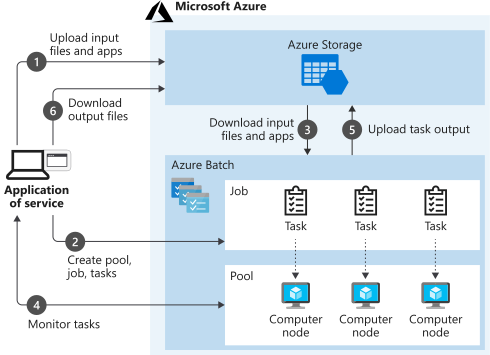
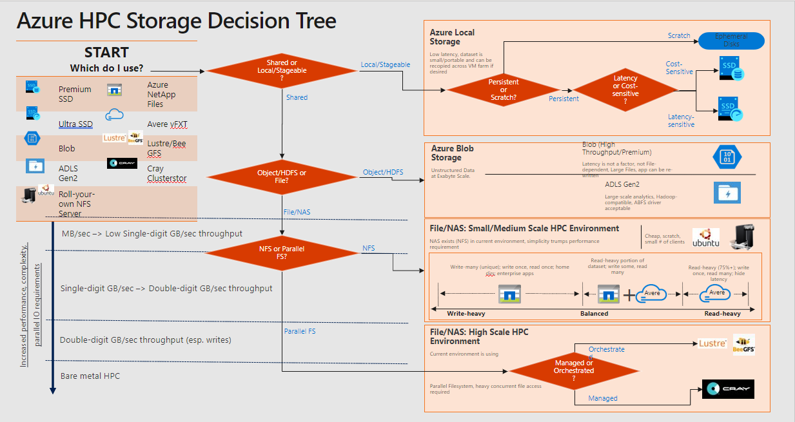
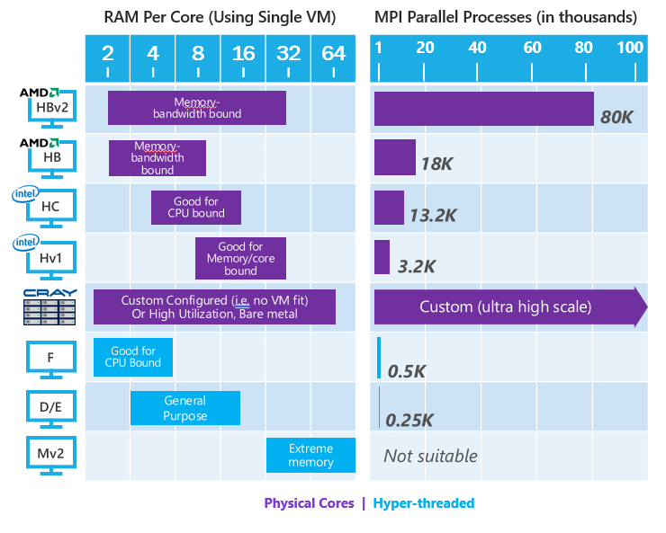
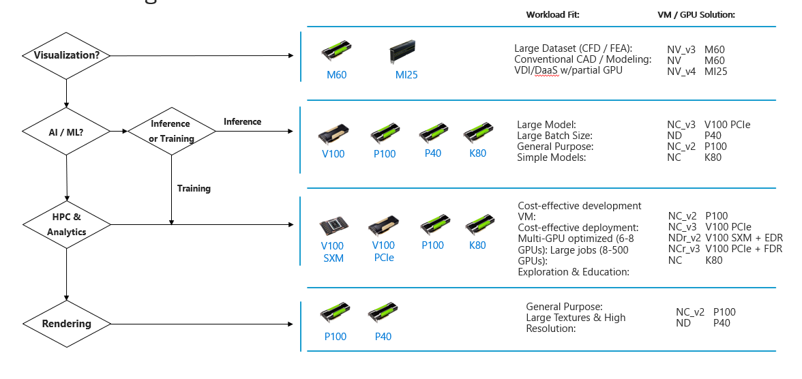
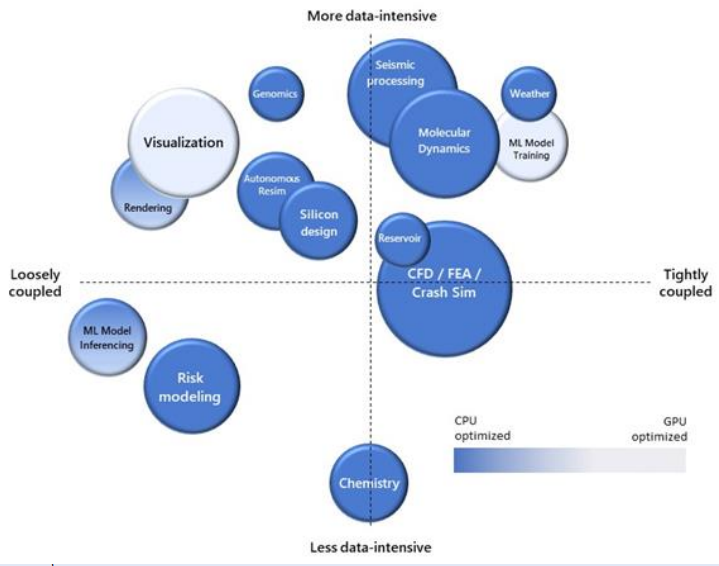

Each high-performance computing (HPC) challenge has its own requirements, and often requires a unique solution.

As the solution architect for the engineering organization, you need to use HPC solutions on Azure to solve the complex tasks that the organization faces. These tasks include rendering 3D models of the facilities the company designs, and storing large amounts of statistical data. The essence of HPC is to use many computers, or computers that have highly specified CPU, GPU, and memory configurations, to deal with complex, time-consuming tasks.

Here, you learn about some typical HPC use cases. This knowledge should help you to identify future problems that might be addressed by using HPC solutions.

## Common HPC use cases

Organizations use HPC to solve varied business problems. Your requirements might be unique, but often, a use case falls into one of several common scenarios.

### Finite element analysis

Finite element analysis deals with problems that involve complex questions of engineering physics. Such problems might include heat transfer, structural analysis, mass transport, and electromagnetic potential. To solve these problems, large systems are subdivided into smaller chunks called finite elements, and reassembled into a larger system of equations.

Examples include car crash simulation and weather prediction. You can emphasize the most interesting aspects of the system. For example, car crash simulation might focus on the front of the vehicle, while weather simulations can optimize for identifying extreme weather events. Using finite element analysis to model car crashes merely requires the specification of the vehicle's structural geometry and material composition. The mathematical variations for what might happen in a car crash over a couple of seconds are so vast that you might need HPC to model it properly.

### 3D model rendering

3D rendering is a classic use case for HPC in the cloud. A single machine might take hours or days to fully render a 3D video file or image from static assets. You might purchase an expensive and well-specified machine to deal with this problem. However, because of the speed with which technology ages, it can be more economical and efficient to rent the required power in the cloud. Use Azure Batch to rent as much power as you need for the rendering in the time you have, and then shut it down when the job is finished. You can adopt this process when you have frequent similar jobs to complete.

The underlying infrastructure improves as technology upgrades become available. Batch also lets you use some of the most important 3D rendering packages, like Maya, 3D Studio Max, and Chaos V-Ray. You pay any licensing fees by the hour. Because rendering is particularly taxing on the CPU, deploying H-Series VMs into Batch pools provides an efficient solution.

The following diagram shows a typical Batch architecture that you can use to support 3D rendering.

### DNA analysis

Genomics, the study of an individual organism's complete set of DNA, is also well-suited to cloud-based HPC techniques. Genome research typically involves vast amounts of data. The configuration of DNA is tracked across a sufficiently large number of individuals to identify significant variation. On average, there are around 25,000 genes in the human body, each consisting of instructions of between 500 and 2.3 million letters. HPC in the cloud allows enormous amounts of data to be stored and worked with efficiently, without major capital expenditure on technology that quickly becomes outdated.

### Computer-aided design

Computer-aided design (CAD), which has some similarities to both finite element analysis and 3D Batch rendering, is another good use case for HPC in the cloud. CAD accelerates product design and testing, and allows complex visualizations and simulations to be done on the resulting artifacts.

This diagram shows a possible architecture that you can use to publish a CAD software as a service (SaaS) product, based on N- and H-series VMs in Azure.

### Computational fluid dynamics

Computational fluid dynamics use mathematics to model fluid flows, both free-flowing and in interaction with solid surfaces. These simulations are taxing from a compute point of view. They provide a good use case for some of the more intricate aspects of the H-Series VMs you saw earlier. These aspects include InfiniBand networking capabilities and an ability to interact via Message Passing Interface (MPI).

## Decision Criteria

### What Candidate Service Do I Use?

- **Lift and shift** is a strategy for migrating a workload to the cloud without redesigning the application or making code changes. Also called rehosting. For more information, see Azure migration center.

- Cloud optimized is a strategy for migrating to the cloud by refactoring an application to take advantage of cloud-native features and capabilities.

### Which Azure HPC Storage Service Do I Use?

#### CPU-based vs GPU-based Computing

- A CPU (the brain) can work on various different calculations, while a GPU (the brawn) is best at focusing all the computing abilities on a specific task.

- While individual CPU cores are faster as measured by CPU clock speed, and smarter as measured by available instruction sets. The sheer number of GPU cores and the massive amount of parallelism that they offer, make up the single-core clock speed difference and limited instruction sets.

- **CPU**  

  - CPU consists of some cores  optimized for sequential serial processing. It's designed to maximize the performance of a single task within a job.
  - Steps to find the right CPU VM:
    - Determine if one job for the HPC application runs on less than one machine or uses MPI across multiple machines.
    - Determine the job’s RAM per core usage (for example, 6 GB of RAM per core), and benchmark the instances that fit.  
    - If the workload requires Physical Cores, use the VM families (shown in purple).  
    - Check on availability of preferred machines.
    - Cray is applicable for any workloads:
      - Where a workable VM type isn’t regionally available
      - Which are high utilization, servers are used 80+%  
      - Where we have no working VM configuration

- **GPU**  

  - A GPU uses thousands of smaller and more efficient cores for a massively parallel architecture aimed at handling multiple functions at the same time.
  - Modern GPUs provide superior processing power, memory bandwidth and efficiency over their CPU counterparts. They're 50–100 times faster in tasks that require multiple parallel processes.

### Why low-latency networking is important for tightly coupled jobs?

- Many HPC applications are highly parallel and have tightly coupled communication. Means during an applications parallel simulation run, all parallel processes must communicate with each other frequently.  

- These types of applications usually perform best when the inter-communication between the parallel processes is done on high bandwidth/low latency networks like InfiniBand.  

- The tightly coupled nature of these applications means that if a single VM isn't functioning optimally, then it may cause the job to have an impaired performance.  

- Nodes require significant crosstalk (**chat**) with each other to operate properly.  

