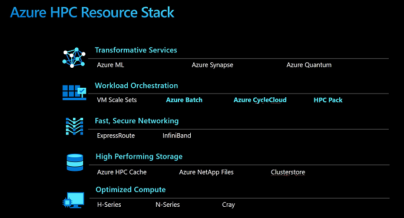

Azure high-performance computing (HPC) is a complete set of computing, networking, and storage resources integrated with workload orchestration services for HPC applications. With purpose-built infrastructure and optimized application services, Azure offers HPC customers a competitive price/performance against on premises with more benefits.

As companies acquire larger volumes of data and more sophisticated methods to manipulate it, HPC becomes more popular. You learned about the solutions available on Azure for HPC workloads: Azure Batch, Azure CycleCloud, and the Microsoft HPC Pack. You can now choose the best option for your HPC workloads.

You've learned:

- What is Azure HPC, the HPC architecture on Azure and its foundational components. ​
- How Azure HPC works and its various configuration options. ​
- How to deploy/manage and update an HPC workload. ​
- When and how to run a workload application via Azure HPC.  

## Learn more

For more information on solutions in Azure for HPC and batch, see:

- [High-performance computing](https://azure.microsoft.com/solutions/high-performance-computing/)
- [High-performance computing (HPC) architecture on Azure](/azure/architecture/topics/high-performance-computing/)
- [High-performance compute VM sizes](/azure/virtual-machines/windows/sizes-hpc)
- [Azure VM pricing detail page](https://azure.microsoft.com/pricing/details/virtual-machines/windows/#h-series)
- [HPC Pack 2016 download](https://www.microsoft.com/download/details.aspx?id=54507)
