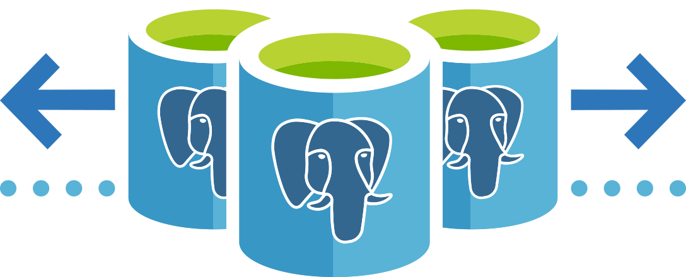

Azure Database for PostgreSQL Hyperscale (Citus) transforms PostgreSQL into a distributed database, letting you scale compute, memory, and storage. Your tables are broken into smaller parts and intelligently distributed over several servers.

## Citus - Open-source scaling for relational databases

:::row:::
:::column span="2":::

As modern workloads increased, relational databases struggled to scale to at the same pace. Many database solutions gave up standard, relational features so they could scale. Citus, an extension of PostgreSQL enabling massive scale, was created in 2011 to solve this problem. By 2016, Citus became so popular it was open-sourced.

Azure Database for PostgreSQL Hyperscale, created by the Citus Data team, combines the benefits of PostgreSQL, Citus, and Azure. No more giving up transactions, joins, or foreign keys. Developers retain all of the benefits that two decades of open-source community development have given PostgreSQL.

 :::column-end:::
:::column span="2":::

:::column-end:::
:::row-end:::

## What is Hyperscale (Citus)?

:::row:::
:::column span="2":::

Hyperscale is a deployment option, built into Azure Database for PostgreSQL - A fully managed database-as-a-service. You keep the open-source PostgreSQL relational database engine, while scaling as much as you need.

Hyperscale should be used when applications require high performance or massive scale. A real-life example of a Hyperscale deployment is the credit card processing company Clearent, which handles over half a billion transactions every year. An application like this requires transaction speed and has a high analytical workload: Hyperscale takes care of these requirements for employees and customers alike.

The Helsinki Region Transport Authority (HSL) in Finland also utilizes Hyperscale. The HSL is responsible for more than half of all public transportation in Finland, and more than 1 million journeys are made every day across their bus, train, and ferry routes. It’s critical to log and monitor this traffic efficiently.

 :::column-end:::
:::column span="2":::

#### "Along with much better performance, moving to Hyperscale has reduced operational costs by over 50 percent... It was a whole different environment once we moved to Hyperscale. Queries that often took up to 10 minutes with the old system are now processed instantaneously."

###### \- Sami Räsänen, Product Owner and Team Lead, HSL
:::column-end:::
:::row-end:::

### Scaling out

Hyperscale allows you to easily ”scale out,” where a single PostgreSQL instance is run on multiple servers, instead of a single server. Collectively, server groups can hold more data and use more CPU cores than a single server, while reducing the distance to users. This gives faster responses on large datasets, even over multiple regions.

### Scenario: Scaling across the Atlantic

Throughout this module, we’ll be using an example scenario to explain key PostgreSQL and Hyperscale concepts and processes.

In this scenario, you work for Woodgrove Bank, and you’ve developed and trialed a contactless payment app that works from six feet away. Your app is currently using a single on-premises PostgreSQL server.

The trial went well, and now you’re planning to start releasing your app to customers across Europe and the United States. Although it performed well in the trial environment, the current single on-premises server will struggle under the heavy analytical loads that your bank requires. It will also slow transaction times across the Atlantic. To avoid this problem, you need to scale the database solution for both capacity and geographic performance.

Hyperscale will let you scale out, seamlessly distributing and managing your data. Transactions will be spread across multiple servers, resulting in better transaction times, lower latency, and more room for analytical workloads.

With this scenario in mind, over the rest of the module, we’ll create a Hyperscale instance on Azure, design how to effectively distribute the PostgreSQL database, and then scale it. Most importantly, we’ll explain what we’re doing, and why.

## Prerequisites

* Basic familiarity with relational databases

## Learning objectives

In this module, you will:

* Create a Hyperscale instance of Azure Database for PostgreSQL
* Automatically shard and distribute tables in Hyperscale
* Scale and rebalance a Hyperscale database without downtime
