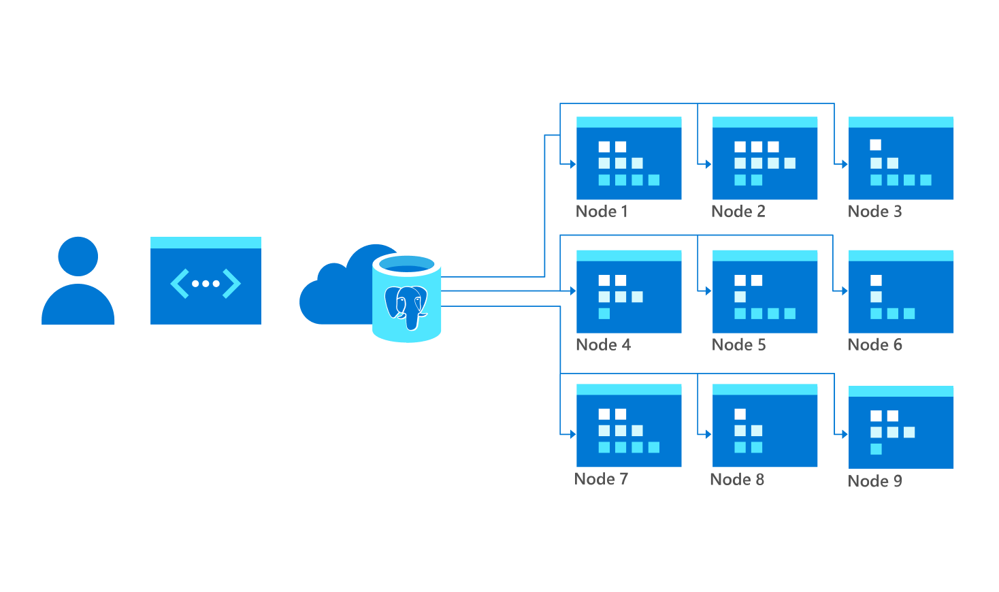
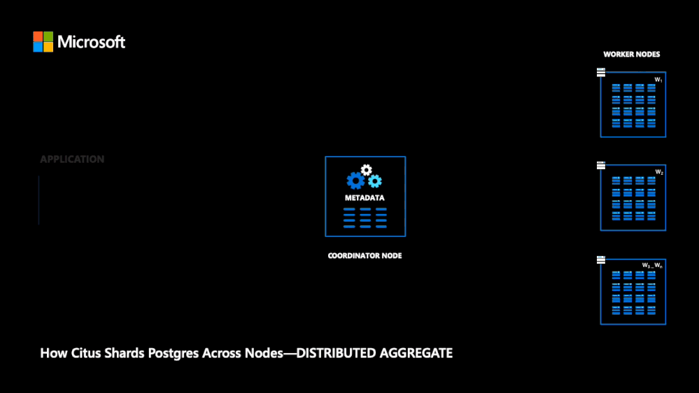

Hyperscale works by splitting up your database across a server group in the cloud. Your database is split between servers, known as nodes, which Hyperscale coordinates for you.

## What is a node?

A node is an instance of a database server. Hyperscale creates and coordinates nodes across the cloud, multiplying the available storage and compute. Your database is divided between nodes, so multiple CPUs work in parallel on your queries, providing faster performance.

By leveraging multiple nodes, instead of a single node, you can scale out, otherwise known as horizontal scaling.

We'll start with three nodes for our payment app. Later, we'll horizontally scale by creating extra nodes.

## What is a shard?

A shard is a portion of a database. When Hyperscale splits up your database into portions, these are known as shards. The shards are split between different nodes.

Shards bring efficiency to scale, intelligently distributing your data across nodes.

## How do the nodes work together?

Every server group has a coordinator node and multiple worker nodes. The coordinator node knows how the data has been split up between the worker nodes, so it coordinates queries to the right nodes. Here’s how it works:

1. Applications send their queries to the coordinator node
2. The coordinator node relays queries to the worker nodes with the relevant shards
3. Each node queries the table rows it holds within its shard
4. The coordinator node accumulates their results

Applications can't connect directly to worker nodes. Instead, nodes working together allows extremely large databases to be stored and queried with a level of performance that is impossible to achieve on a single server.

For our payment app, the server group will have one coordinator node and two worker nodes. We'll shard our data, storing it on the two worker nodes.

### How does Hyperscale keep track of data?

Hyperscale distributes shards to different worker nodes, and metadata tables keep track of which shards are stored where.

Using the metadata tables, the coordinator node either routes queries to a single worker node, or parallelizes the query across several nodes. Hyperscale checks if the data lives on a single node or multiple nodes.
