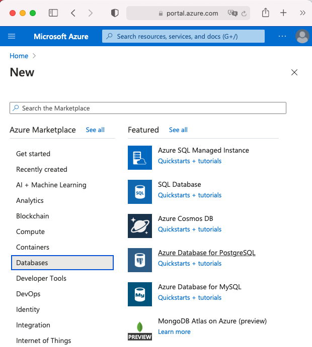
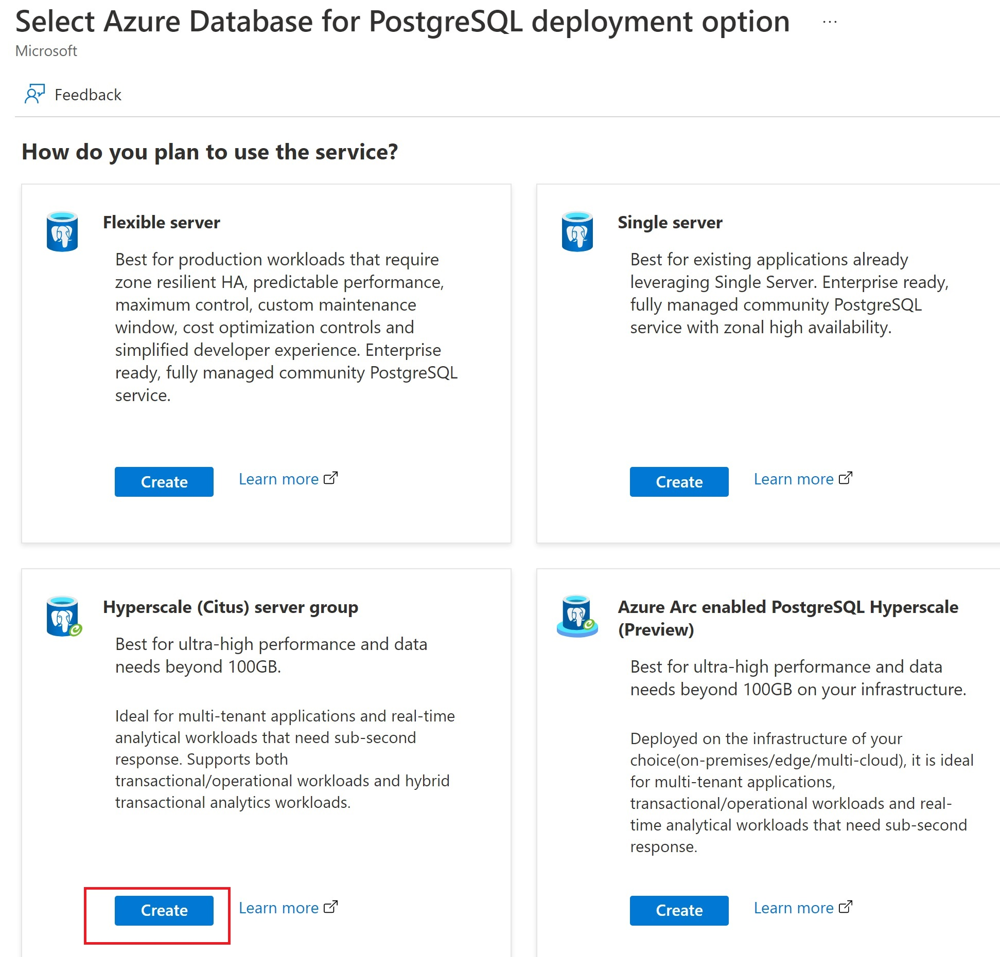
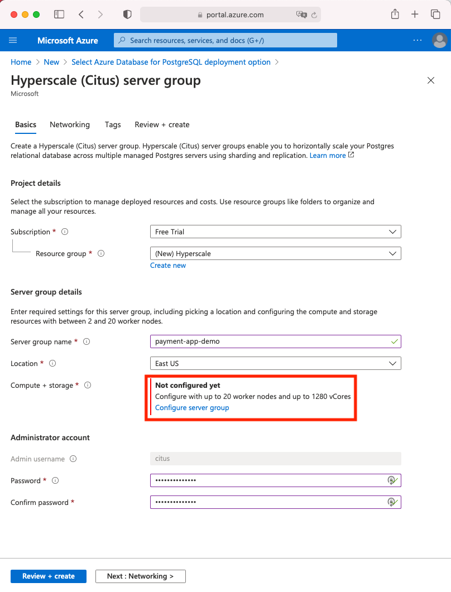
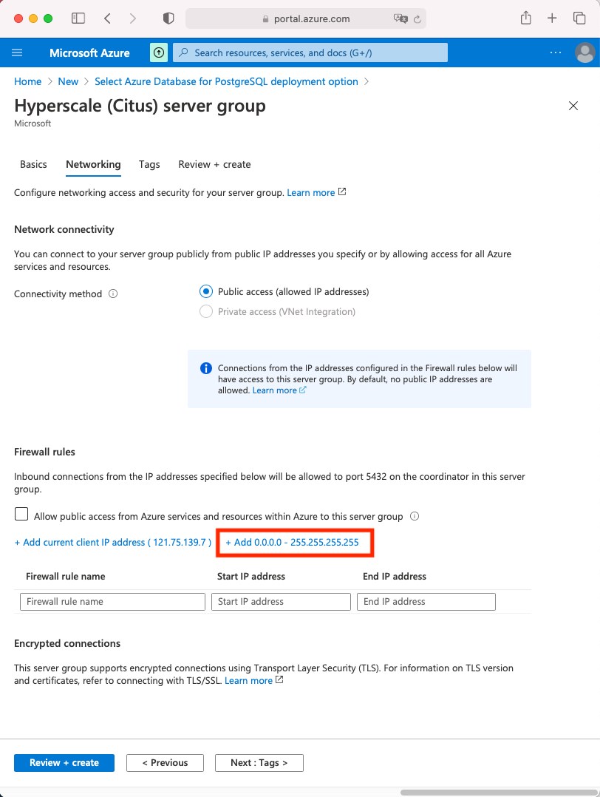

In this exercise, we're going to create a Hyperscale instance using the Azure portal. Our server group will have:

* One coordinator node, with 4 vCores and 0.5 TiB of storage
* Two worker nodes, each with 4 vCores and 0.5 TiB of storage

For a total of 12 vCores and 1.5 TiB of storage.

[!include]

1. Sign in to the Azure portal using your Azure account.

    > [!div class="nextstepaction"]
    > [Azure portal](https://portal.azure.com/)

2. Next, select **Create a resource**, **Databases**, and **Azure Database for PostgreSQL**. You can also use the **Search** functionality to find this category.

3. Select **Create** in the **Hyperscale (Citus) server group** box.

> The portal will display a PostgreSQL server configuration screen.

4. On the **Basics** tab, enter the following information:  

    |Parameter  |Value  |
    |---------|---------|
    |**Subscription**     |  Select **Free Trial** or **your existing subscription**       |
    |**Resource group**     | Select **Create new** and name your resource group **Hyperscale**       |
    |         **Server name** |  Enter **payment-server-demo**  |
    |**Location**| Use a region that's close to you, or leave as default |
    |**Compute + storage**     |  Leave as default, we'll configure this in the next step      |
    | **Admin username**| Citus will be selected by default |
    | **Password/Confirm Password**|  Choose a password |

    1. Note the password down for later use.
    1. Select **Configure server group** in the **Compute + storage** options.

5. Increase compute and storage if you want. Next, scroll to the bottom of the page and select the blue **Save** box.

6. Select the **Networking** tab at the top of the page
7. Select **Add 0.0.0.0 - 255.255.255.255**, then select **Continue**.

8. Scroll to the bottom of the page and Select the blue **Review + create** button.

9. Select the blue **Create** button at the bottom of the page.

Congratulations! Your Hyperscale server group is being deployed to Azure.
