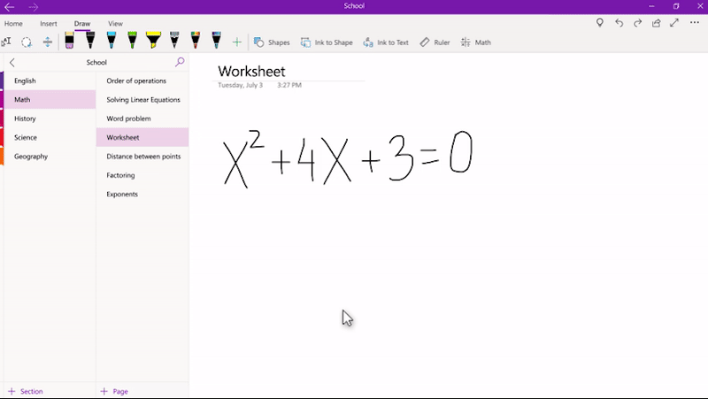
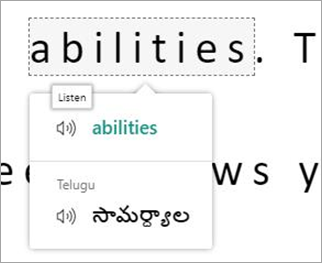

Immersive Reader embeds text reading and cognition capabilities on top of existing web applications, by using an iframe. Immersive Reader is a cognitive service designed in accordance with the latest education research. It creates an inclusive learning environment designed to increase comprehension, attention, and confidence. **Immersive Reader is free to educators and students**, and is built into all Office 365 products.

## Reading

Immersive Reader helps readers build confidence, by breaking down content into more manageable chunks. Words are broken down into syllables and highlighted as they're read. What's more, you can change the color of words according to their grammar.

**For people who struggle with concentration**, Immersive Reader can be put into focus mode or line focus to take away distractions. Background, text color, and font spacing can also be changed to mitigate sensory overload, and increase attention-spans and comprehension.

Further, Immersive Reader has text to speech capabilities built into the service. It can read one word, phrase, or an entire document, depending on your need.

## Writing

Dictation is built into Immersive Reader, which can help people who struggle with writing, either because of physical or learning differences like dysgraphia. Dictation functionality is already built into OneNote, Outlook, and Word.

## Math

:::row:::
:::column span="1":::

Immersive reader is also available for anyone who finds math difficult. When Immersive reader is combined with Math Assistant, learners can have problems, equations, and solutions read aloud to them step by step. **Immersive Reader’s other functions, like line focus, focus mode, and spacing, all work with Math Assistant** to make math more accessible.

:::column-end:::
:::column span="1":::

:::column-end:::
:::row-end:::

## Translation

:::row:::
:::column span="3":::

Immersive Reader is a great tool for new language learners, as it has real-time translation built into the service. Translation is available in 80 languages, and learners can translate specific words or phrases or an entire document. Further, Immersive Reader has a picture dictionary, which also includes translation services, and a read aloud function to help learners with pronouncing of new words.

:::column-end:::
:::column span="1":::

:::column-end:::
:::row-end:::

