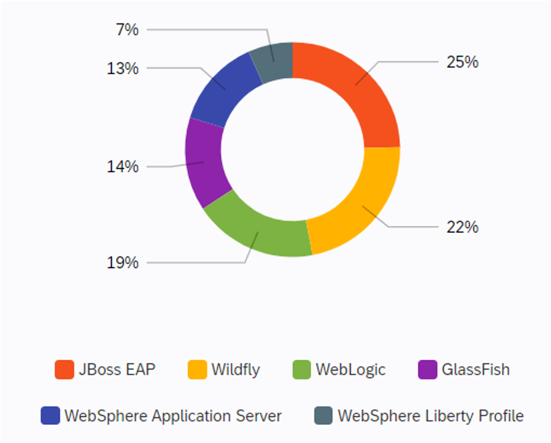

It's necessary to distinguish between the different types of Java application before choosing the matching cloud solution.

You can distinguish your type of application specification wise. The most famous ones are:

## Jakarta EE, the Java for Enterprises

Formerly known as Oracle's Java Enterprise Edition (Java EE), is Jakarta EE open source and aimed to be cloud native for java development. It's a set of specifications to enable java developers world wide to work together on java enterprise applications. Jakarta EE was donated to the Eclipse Foundation. Jakarta EE applications can be packaged as archives with the .ear extension (EAR files) or as archives with the .war extension (WAR files).

- **WebProfile** is a properly defined subset of Jakarta EE for backend services with Web focus. But no worries! You can add specific APIs of the Enterprise platform on top of it.

- **MicroProfile** is a subset of Jakarta EE for Microservice Architectures. They call themselves an _open forum to optimize Enterprise Java for a microservices architecture_. The MicroProfile aims to innovate across multiple implementations and collaborate on common areas of interest. The goal remains standardization.

## Spring Framework and the Spring Ecosystem

The Spring Framework is an application framework and inversion of control container for the Java platform. The framework's core features can be used by any Java application, but there are extensions for building web applications on top of the Java EE (Enterprise Edition) platform. Although the framework doesn't impose any specific programming model, it has become popular in the Java community as an addition to the Enterprise JavaBeans (EJB) model. The Spring Framework is open source.
The Spring Framework brings the core functionality and supports:

- i18n
- Validation
- Data binding
- Type conversion
- and more.

### Spring Boot

Spring Boot is by far the most used framework as an alternative to application servers. It's running on top of the Spring Framework and simplifies the life of developers. Spring Boot has become so successful, that more than half of all Java Web applications are already using it. It has become the most popular Java web framework. And it's getting more and more momentum over the last years. Its opinionated autoconfiguration makes it easy to use. Spring boot applications are running stand-alone. As such they can be a perfect fit for Microservices.

### Spring Data

Spring Data simplifies the data access, no matter which technologies: relational and non-relational databases, map-reduce frameworks, and cloud-based data services.

### Spring Cloud

Spring Cloud is the de-facto standard where to deploy your Java services if you have a distributed system. It's the most stable and mature technology for that use case. Spring Cloud comes with Service Discovery, Scalability, Configuration Management, Monitoring, and a good developer experience.

### Spring Batch

Spring Batch is a lightweight framework for robust batch applications vital for daily operations.

## Application Servers

Java EE applications must be deployed onto Java EE-compliant application servers (such as WebLogic, WebSphere, WildFly, GlassFish, Payara, and others).

(Add image to show usage like:)

- **Apache Tomcat** is the most used Enterprise Server for Java applications. It's an open-source implementation of the Java Servlet, JavaServer Pages, Java Expression Language, and Java WebSocket technologies. The Java Servlet, JavaServer Pages, Java Expression Language, and Java WebSocket specifications are developed under the Java Community Process.

- The **Oracle Weblogic Server** is a unified and extensible platform for developing, deploying, and running enterprise applications, such as Java, for on-premises and in the cloud. WebLogic Server offers a robust, mature, and scalable implementation of Java Enterprise Edition (EE) and Jakarta EE.

- **Red Hat JBoss Enterprise Application Platform** delivers enterprise-grade security, performance, and scalability in any environment. Whether on-premise; virtual; or in private, public, or hybrid clouds, JBoss EAP can help you deliver apps faster, everywhere.

- **WildFly** is the open source upstream for JBoss EAP.

## Other Frameworks for Microservice-oriented Architectures

- **Netty** is a NIO client-server framework, which enables quick and easy development of network applications such as protocol servers and clients. It greatly simplifies and streamlines network programming such as TCP and UDP socket server. Netty is an asynchronous event-driven network application framework for rapid development of maintainable high-performance protocol servers & clients.

- **Spark Java** is a micro framework for creating web applications in Kotlin and Java 8 with minimal effort. The Spark framework is a simple and lightweight Java web framework built for rapid development. It was inspired by Sinatra, a popular Ruby micro framework.

- **Vert.x** is an event driven and nonblocking tool-kit. You can use Vert.x with multiple languages including Java, Kotlin, JavaScript, Groovy, Ruby, and Scala. It aims to be the most lightweight, fastest framework. It's simple but not simplistic. Eclipse Vert.x is open source and dual-licensed under the Eclipse Public License 2.0 and Apache License 2.0.

- **Micronaut** is a modern, JVM-based, full-stack framework for building modular, easily testable microservice, and serverless applications. Micronaut features a dependency injection and aspect-oriented programming runtime that uses no reflection. That makes it easier for Micronaut applications to run on GraalVM.
