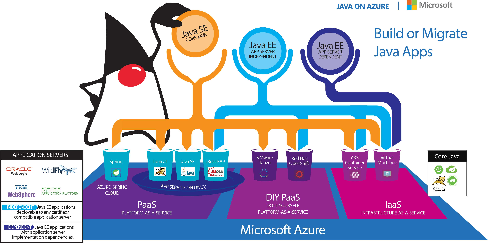

Azure offers various deployment solutions for Java applications. In this unit, we'll discuss a few of them.

## Virtual machines  

Azure virtual machines (VMs) are available for Windows and Linux. Linux VMs allow you to choose between different distributions like Ubuntu, Red Hat, or SUSE.

VMs are usually the starting point for *lift and shift*, which is the process to migrate existing machines into Azure. You'll have to take care of OS updates, Java runtime, network settings, port forwarding, and security.

## Containers

- **Azure Kubernetes Service** (AKS) is a managed Kubernetes service. Kubernetes is the *de facto* standard to orchestrate your containerized applications. It's perfect for microservices and for midsized applications. AKS comes with service discovery, autoscaling, and monitoring. Microsoft is a collaborator in Kubernetes projects such as Virtual Kubelet, Dapr, and Open Application Model.

- **Azure Red Hat OpenShift** is the Red Hat-managed variety of Kubernetes.

- **Azure Container Instances** is a solution for quick tests, proofs of concept, and sidecar containers.

## Azure App Service

One of the easiest and most straightforward deployment opportunities for Java applications on Azure is Azure App Service. It comes with autoscaling, integrated monitoring, and security.

## Azure Spring Apps

Azure Spring Apps lets you focus on building Spring Boot apps without managing infrastructure. Deploy your JARs or code, and it will automatically wire your apps with the Spring service runtime. After you deploy the apps, you can easily monitor their performance, fix errors, and make improvements.

Azure Spring Apps is integrated into the Azure ecosystem and is ready to tackle enterprise workloads.

## Functions

You can deploy your Java code as Azure functions. You'll benefit from great tooling and integration with other Azure services.

Here are sample scenarios for functions:

- Web, mobile and Internet of Things (IoT)-connected back ends
- Bot or real-time file and stream processing
- Automation of scheduled tasks
