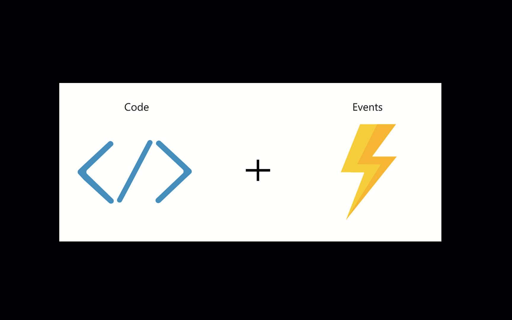

Azure offers different deployment solutions for Java applications. We'll just look at a few of them here.

## Virtual Machines  

Just like in your own data center, Virtual Machines (VMs) are available on Azure. You can choose between different flavors on Windows also on Linux, such as Ubuntu, Red Hat, or Suse.
VMs are usually the starting point for the Lift and Shift approach.
Just like in your data center you have all the freedom. Attention! With great power comes great responsibility. Master OS updates, Java runtime, Network settings, as well as port forwarding and Security is on your side, if you chose this infrastructure as a service (IAAS) solution.

## Container

When you realize, that the OS didn't bring any business impact to our application we can abstract from it and use Containers instead.

- **Azure Container Instances** ACI is a great solution for quick tests and proof of concepts as well as sidecars.

- **Azure Kubernetes Service** is the managed Kubernetes Service. Kubernetes is the de-facto standard to orchestrate your containerized applications. It is perfect for Microservices as well as mid-sized applications. It comes with service discovery, scalability, and monitoring.

##  Azure App Service

One of the easiest and straight forward deployment opportunities for Java applications on Azure is Azure App Service. It comes with Service Discovery, Scalability, integrated Monitoring with Azure Monitoring out of the box.

## Azure Spring Cloud

Azure Spring Cloud is Spring Cloud with all its advantages plus all the greatness of Azure with the global scalability and high availability.

## Functions

Azure Functions can be written in Java as well. You can leverage from great tooling and integration with other Azure Services.
Sample scenarios for Functions are

- Web, mobile and IoT-connected backends
- Bot or Real-time file and stream processing
- Automation of scheduled tasks

