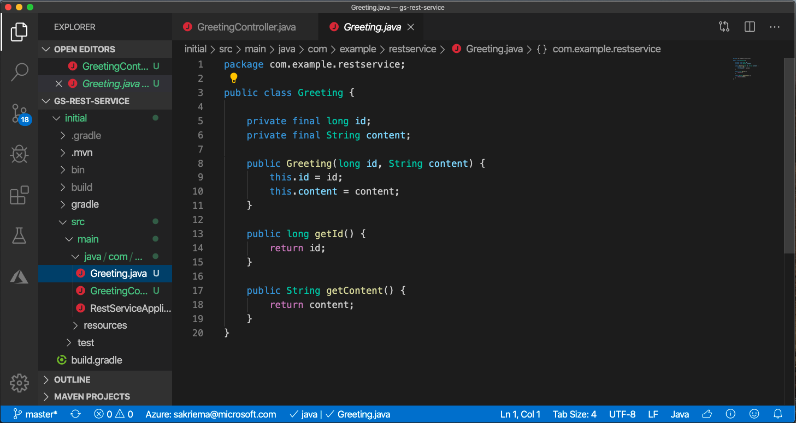
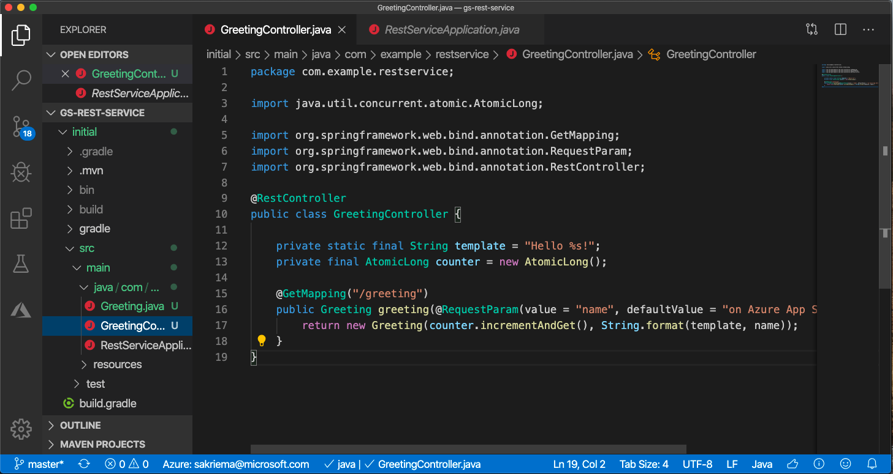
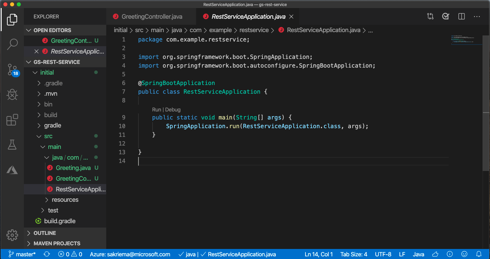

Probably you're more than curious how a deployment of a Java application in Azure can look like! No worries! We got you.

## Sample application

You can go with an example, you've created by yourself. Or you succeed with a common Spring Boot example that can be found at the spring starters.

Clone in your favorite command-line tool.

``` bash
git clone https://github.com/spring-projects/spring-petclinic.git
```

## When to choose which

Before you decide which Service is the best for you to use, have a look at the following flowchart. It should be simple to follow. It can help you decide if using an Azure App Service is the best solution for your application code. We take App Service for our sample deployment.


to be replaced:

Inside the complete folder, you'll find those three important classes.






