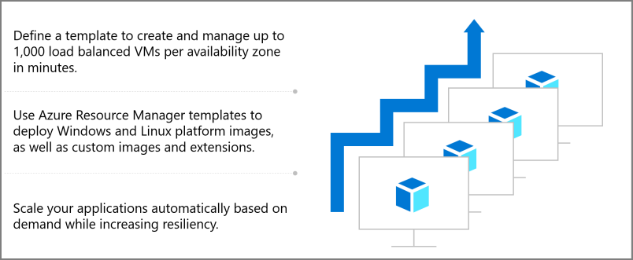
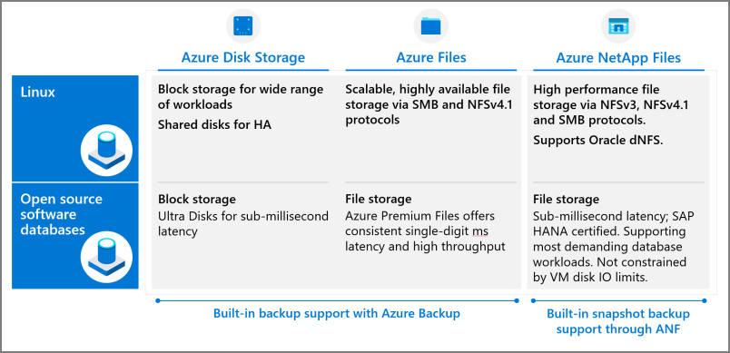
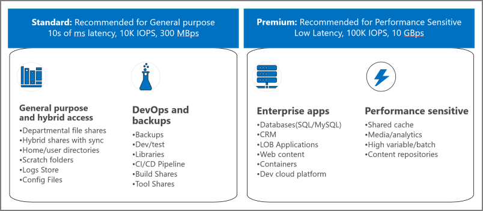

IaaS enables you to create a private, virtual datacenter for your organization and populate it with virtual machines. You can provision and manage VMs on an individual basis, or as virtual machine scale sets: groups of identical VMs managed through a central configuration interface.

### Use Azure virtual machine scale sets to create and manage a group of load balanced VMs

With scale sets, you can distribute your workloads to achieve high availability, redundancy, load balancing, and manual and automatic elastic scale. Common use cases include the following:

- Large scale SaaS applications, stateless workloads, container workloads like Kubernetes, dev test, and load balanced front-end web applications.

- On-premises applications you want to migrate for cloud-scale manageability and economics.

- Specialized workloads for high-performance computing and batch processing.

## Choosing a Linux distribution

If your goal is to evaluate Linux on Azure, you can get started quickly. Set up a free Azure account and select your favorite distribution of Linux, which is typically free for an introductory period. Then, configure your virtual machines, network, security, and storage. Register for the free basic support that is available free to all Azure customers. After your evaluation is complete and you begin moving towards production deployment, determine pricing and support options as part of the planning process.

### Licensing/pricing

It pays to understand [different pricing models](https://azure.microsoft.com/pricing/details/virtual-machines/linux/). Many customers prefer the flexibility of pay-as-you-go subscriptions. Pay-as-you-go pricing lets you pay only for the resources you use and scale up or down as needed. This option can be perfect for environments where demand for computing resources fluctuates or if you're uncertain how many VMs you'll need for new workloads.

Other customers, especially those with predictable workloads, prefer the predictable pricing available with Azure Reserved VM Instances for Linux. Purchase reserved instances of Linux machines for one-year or three-year terms at a fixed price and save up to 72 percent over pay-as-you-go.

You can also combine the two options, managing costs across predictable and variable workloads. You can save even more with the [Azure Hybrid Benefit](/azure/virtual-machines/linux/azure-hybrid-benefit-linux). The benefit, available only with Azure, lets you bring your own Red Hat or SUSE Linux subscriptions to Azure by taking advantage of bring your own subscription pricing. And as your business needs change, the Azure Hybrid Benefit enables you to switch between pay-as-you-go and bring your own subscription pricing. [Review options](https://azure.microsoft.com/pricing/details/virtual-machines/linux/) and [calculate your hourly or monthly costs](https://azure.microsoft.com/pricing/calculator/). Discuss pricing with your Microsoft representative to achieve maximum savings based on existing licensing agreements.

Consult your technical and business teams to learn whether your organization has cost-saving agreements with Microsoft and Linux software providers.  

### Support

Microsoft gives you the option of running almost any Linux image, but the [level of support](/troubleshoot/azure/cloud-services/support-linux-open-source-technology) you receive depends on the type of Linux distribution you choose.

Microsoft recommends using [endorsed distributions](/azure/virtual-machines/linux/endorsed-distros) for most production workloads because you benefit from the support and collaboration between Microsoft and Linux providers &mdash; Red Hat, SUSE, Canonical, and others.  For example, Microsoft and Linux providers optimize Linux kernels for Azure as part of the endorsed Linux distributions. The Azure-tuned kernels incorporate new features and performance improvements at a faster cadence compared to other kernels that are available in Azure Marketplace. Microsoft and the Linux development teams frequently work side-by-side, ensuring a quick resolution of many issues.

To receive Azure support, you must first register for a support plan. [Several tiers are available](https://azure.microsoft.com/support/plans), including free Basic, Developer, Standard, and Professional Direct.

Three of the largest Linux vendors &mdash; [Red Hat](https://www.redhat.com/en/resources/integrated-support-for-rh-solutions-in-azure-brief), [SUSE](https://www.suse.com/news/suse-linux-enterprise-server-basic-and-priority-support-now-offered-on-windows-azure/), and [Ubuntu](https://ubuntu.com/azure/support) &mdash; partner with Microsoft to provide end-to-end support of Linux deployments. The integrated, enterprise-level support covers everything from operating-system issues to security patches to application support. Microsoft and your Linux provider collaborate to solve your issues through a single point of contact.

## Describe next steps with Azure IaaS

After choosing a Linux distribution and virtual machine configuration, you take the following basic steps:

- Instantiate the Linux images on your virtual machines.

- Connect your virtual machines with one another and with the internet by using the virtual private networking built into Azure. 

- Configure basic storage such as an operating system, paging/swap, and data disk.

- As you build out your Linux IaaS environment, consider adding security, backup, and other capabilities by incorporating additional Azure infrastructure tools and services. These tools and services are summarized later in this module.

## Virtual networking and network appliances

[Azure Virtual Network](/azure/virtual-network/virtual-networks-overview) is the fundamental building block for your private network in Azure. Virtual Network enables many types of Azure resources, such as Azure Linux VMs, to securely communicate with each other, the internet, and on-premises networks. Virtual Network is similar to a traditional network that you'd operate in your own datacenter but brings with it additional benefits of Azure infrastructure such as scale, availability, and isolation.

If you already use a third-party networking solution, consider incorporating their [Azure network virtual appliance](https://azure.microsoft.com/solutions/network-appliances/) into your Azure environment. These VM images allow you to bring the networking, security, and other functions of your favorite provider to Azure for a familiar experience &mdash; using skills you and your team already have.

Network virtual appliances today provide a diverse set of capabilities such as:

- Firewalls
- WAN optimizers
- Application delivery controllers
- Routers
- Load balancers
- Proxies

Find network virtual appliances in [Azure Marketplace](https://azuremarketplace.microsoft.com/).

## Azure Storage

In your on-premises Linux environment, you probably use a variety of storage mechanisms, including file stores, object stores, and messaging stores. Azure offers both standard and workload specific storage support for Linux deployments.

Azure managed disks are one component of the [Azure Storage](/azure/storage/common/storage-introduction) platform. Azure managed disks are block-level virtual storage volumes managed by Azure and used with Azure virtual machines. At a minimum, VMs typically require an operating system disk that contains the boot volume, a temporary disk for managing paging and swap files, and a data disk.

Storage options include these workload-specific services:

- [Azure Blob Storage](/azure/storage/blobs/storage-blobs-introduction): A massively scalable object store for text and binary data. Also includes support for big data analytics through Data Lake Storage Gen2.

- [Azure Files](/azure/storage/files/storage-files-introduction): Managed file shares for cloud or on-premises deployments.

- [Azure Elastic SAN](/azure/storage/elastic-san/elastic-san-introduction) : A fully integrated solution that simplifies deploying, scaling, managing, and configuring a SAN in Azure. Elastic SAN is currently in preview.

- [Azure Queue Storage](/azure/storage/queues/storage-queues-introduction): A messaging store for reliable messaging between application components.

- [Azure Table storage](/azure/storage/tables/table-storage-overview): A NoSQL store for schemeless storage of structured data.

- [Azure NetApp Files](/azure/azure-netapp-files/azure-netapp-files-introduction): Enterprise file storage.  NetApp Files makes it easy to migrate and run complex, file-based applications with no code change. Azure NetApp Files is managed via your NetApp account and accessed via NFS, SMB, and dual-protocol volumes.

### Choose the appropriate Azure Files tier

Azure Storage data objects are accessible from anywhere in the world over HTTP or HTTPS via a REST API. Azure Storage also offers client libraries for developers building applications or services. Developers and IT pros can use Azure PowerShell and Azure CLI to write scripts for data management or configuration tasks. The Azure portal and Azure Storage Explorer provide user-interface tools for interacting with Azure Storage.

## When to use Azure IaaS resources for Linux deployments

Some organizations want to take a hands-on approach with all aspects of their infrastructure, from the choice of virtual machine configurations to storage and network optimization to building custom development environments. For those organizations, IaaS is an appropriate approach.

With Azure IaaS resources, you manage the virtual infrastructure while Azure manages the physical infrastructure. Here are some of the reasons you might use IaaS:

- Eliminate the burden of provisioning and maintaining physical infrastructure.

- Replicate the on-premises environment in the cloud to reduce the need to refactor.

- Develop hybrid solutions spanning on-premises and cloud systems.

- Increase security, elasticity, reliability, and resiliency with Azure infrastructure services.

- Decrease costs with more flexible licensing and pricing.
