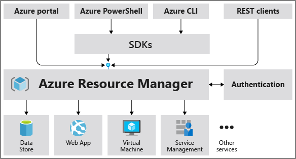

As you've learned in the preceding units of this module, Azure tools enable you to create a private, virtual datacenter for your organization. Use the same virtual datacenter for both your IaaS and PaaS implementations. It's another example of how Azure offers developers and IT pros freedom of choice.

Whether you choose IaaS, PaaS, DBaaS, or a combination of these services, you can find tools and services built into Azure to control and manage deployments. Some of these tools and services come directly from members of the open-source community, while others were developed by the Azure team to help make Azure more compatible with Linux.

## Examples of open-source tools

### Prometheus

Monitor your Linux environment on Azure with Prometheus, a popular open-source metric monitoring solution. On Azure, you don't need to set up and manage a Prometheus server with a database. Instead, use Azure Monitor managed service for Prometheus, a component of [Azure Monitor Metrics](/azure/azure-monitor/essentials/data-platform-metrics). Prometheus metrics share some features with platform and custom metrics, but use some different features to better support open-source tools such as [PromQL](https://aka.ms/azureprometheus-promio-promql) and [Grafana](/azure/managed-grafana/overview). The service allows you to collect and analyze metrics at scale by using a Prometheus-compatible monitoring solution.

### Terraform

To simplify common IT Ops and DevOps tasks, use Terraform, an open-source declarative coding tool. Terraform works with Bash or Azure PowerShell for Linux.

- Define and provision datacenter and cloud-based infrastructure, including Azure.
- Provision core platform capabilities such as management groups, policies, users, groups, and policies.
- Provision Azure DevOps projects and pipelines to automate regular infrastructure and application deployments.
- Provision Azure resources required by your applications.

Terraform uses its own Terraform CLI. If you want to use a declarative coding tool more closely integrated with Azure, consider Bicep, which works with Azure CLI and the Azure portal.

### Red Hat Ansible Automation Platform on Azure

Operate and manage automation with a [Red Hat solution](https://azuremarketplace.microsoft.com/marketplace/apps/redhat.rhaapomsa?tab=Overview) that's integrated with native Azure services. Deploy, automate, and manage Azure resources along with your broader IT ecosystem of resources and applications. Streamline operating system configuration, application provisioning, network automation, security orchestration, and more.

## Azure CLI

The [Azure Command-Line Interface (CLI)](/cli/azure/what-is-azure-cli) is a cross-platform command-line tool to execute administrative commands on Azure resources. Run commands through a terminal using interactive command-line prompts or batch commands together in a script.

Azure CLI works with several shells, including Windows PowerShell, PowerShell, Cmd, Bash, and other Linux shells. First launch a shell, and then run the command at the shell prompt. To automate repetitive tasks, you assemble the CLI commands into a shell script by using the appropriate script syntax, and then execute the script.

## Azure portal

The [Azure portal](/azure/azure-portal/) is a web-based, unified console that provides an alternative to command-line tools. With the Azure portal, you can manage your Azure subscription by using a graphical user interface and you can build, manage, and monitor everything from Linux virtual machines to simple web apps to complex cloud deployments in the portal.

## Azure Resource Manager

As you begin building out your Linux environment on Azure, complexity will likely increase to where you want a more centralized management tool. [Azure Resource Manager](/azure/azure-resource-manager/management/overview) provides a management layer that enables you to create, update, and delete resources in your Azure account. Use features like access control, locks, and tags, to secure and organize your resources after deployment.

When you send a request through any of the Azure APIs, tools, SDKs, or through Azure CLI, Resource Manager receives the request. It authenticates and authorizes the request before forwarding it to the appropriate Azure service. Because all requests are handled through the same API, you see consistent results and capabilities in all the different tools.

The following image shows the role Azure Resource Manager plays in handling Azure requests.

## Security tools and capabilities

Azure provides multilayered security across physical datacenters, infrastructure, and operations in Azure. No matter which Linux distribution you choose, you can protect your workloads by using built-in controls and services in Azure across identity, data, networking, and apps. If you're building up your infrastructure from scratch, much of the initial security setup will be similar to what you've done previously on Linux. After that, amp up security with Microsoft Defender for Cloud. You can employ it across Azure, other cloud platforms, and on-premises. It allows you to continuously assess your security posture, secure resources and services, and detect and resolve threats. Other security services include Azure Application Gateway for web front ends, Azure Key Vault, Azure Active Directory, Azure DDos Protection, and Azure Information Protection.

## Business continuity and disaster recovery

Azure offers an end-to-end backup and disaster recovery solution for Linux that's simple, secure, scalable, and cost-effective &mdash; and can be integrated with on-premises data protection solutions. In the case of service disruption or accidental deletion or corruption of data, recover your business services in a timely and orchestrated manner. Components of the solution include:

- **Azure Backup** &mdash; Back up cloud and on-site resources to the Azure cloud securely with no management or maintenance required. Azure Backup automatically allocates and manages backup storage, and it uses a pay-as-you-go model, meaning you only pay for the storage you consume.

- **Azure Site Recovery** &mdash; Ensure business continuity by keeping business apps and workloads running during outages. Site Recovery [replicates](/azure/site-recovery/azure-to-azure-quickstart) workloads running on physical and virtual machines from a primary site to a secondary location.

- **Azure Archive Storage** &mdash; Provides a low-cost means of delivering durable, highly available, secure cloud storage and data management for data that's rarely accessed.

## Azure Migrate

Use [Azure Migrate](/azure/migrate/migrate-services-overview) to simplify migration and optimization when moving Linux workloads to Azure. All pre-migration steps such as discovery, assessments, and right-sizing of on-premises resources are included for infrastructure, data, and applications. The [Azure Migrate](https://azure.microsoft.com/products/azure-migrate/) hub includes tools to migrate VMs, databases, web apps, and offline data.

## Other services

The services mentioned in this section are some of the core services used to manage your Linux infrastructure more effectively on Azure. But many other services and apps are available from Azure and third parties. You can view free and pay-as-you-go Azure services at [azure.microsoft.com/free](https://azure.microsoft.com/free) and partner apps and services at [azuremarketplace.microsoft.com/marketplace/apps](https://azuremarketplace.microsoft.com/marketplace/apps). Categories range from migration, security, and networking to containers, machine learning, and IoT. Browsing there is a great way to explore the scope of what's possible on Azure.
