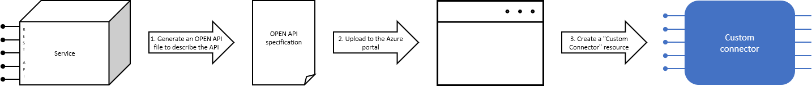

Now that we know what Logic Apps can do, let's discuss how they work behind the scenes. The goal is still to help you decide if Logic Apps is a good option for your own apps. Knowing how they work will let you judge how difficult it will be to connect to a nonstandard service. You'll also be able to handle the rare cases where the Logic Apps Designer doesn't support the operation you need.

## What is a connector?

A *connector* is a Logic Apps component that provides an interface to an external service. For example, the Twitter connector allows you to send and retrieve tweets while the Office 365 Outlook connector lets you manage your email, calendar, and contacts. Logic Apps provides hundreds of pre-built connectors that you can use to create your apps.

Connectors use an underlying REST or SOAP API to do their work. When you use a connector in your Logic App, the connector calls the functions in the underlying API for you. The following illustration shows the Twitter connector and its use of the Twitter REST API.


## Custom connectors

You can write custom connectors to access services that don't have pre-built connectors. The services must have a REST or SOAP API. The requirement that the services provide an API shouldn't be too surprising since connectors are essentially wrappers around that underlying API.

To create a custom connector, you first generate an OpenAPI or Postman description of the API and then use it to create a Custom Connector resource in the Azure portal. You can give your connector a name, and icon, and a description for each operation. The following illustration shows an example of the process; notice that there's no coding involved.



You can use your new connector in your own apps and share it with other people in your organization. You can also submit your connector to Microsoft for certification and inclusion in the set of connectors available to all users.

## What are triggers and actions?

Think about the different pieces of a business process. We know that a process is the combination of steps in a specific pattern to accomplish a goal; however, not all the steps are of the same type. For example, in our social-media monitor scenario we have three distinct types: we *trigger* the process when a new tweet is posted, we do several *actions* like detect the sentiment, and we make a *control* decision based on the sentiment score. The following illustration shows the type of each step in the social-media monitor app.


Let's be more formal about the definitions for trigger and action:

* A *trigger* is an event that occurs when a specific set of conditions is satisfied. Triggers activate automatically when the conditions are right. For example, when a timer expires or data becomes available.

* An *action* is an operation that executes one of the tasks in your business process. Actions run when a trigger activates or another action completes.

Triggers and actions are packaged inside connectors. Let's look at a few examples.

The Twitter connector lets your Logic App interact with Twitter. The social-media monitor app would use a trigger from the Twitter connector to determine when new relevant tweets are available. The following illustration shows the Twitter connector with its operations divided into the two categories.


Next, we have the Dropbox connector. Suppose you were working with a small team on a project that stored its shared data in Dropbox. You could build a workflow that detects when someone modifies any of your files and sends a notification to the other team members. The following illustration shows the Dropbox connector with its triggers and actions.


Finally, let's look at the Twilio connector. Most connectors offer both triggers and actions; however, this connector shows that's not always true since it only has actions. The Twilio connector would fit in any workflow that used text messages for notifications. For example, you could use it in the previous Dropbox example to send team members a text message whenever a shared file changes. The following illustration shows the Twilio connector and its actions.


## How to build Logic Apps from triggers and actions

Triggers and actions are the building blocks of Logic Apps. An app must begin with a trigger. After the trigger, you include as many actions as you need to implement the tasks in your business process. The following illustration shows the trigger and actions used in the social-media monitor app.


## How do triggers and actions work together?

Triggers and actions are essentially function calls to an underlying API operation. Each operation has inputs and outputs. For example, the "When a new tweet is posted" Twitter trigger takes in a search string and returns the tweets that contain that string. The "Detect sentiment" action takes a string as input and returns the sentiment score as a floating-point number. The following illustration shows these two operations.


Logic Apps automatically places the return values into special variables that are available throughout the rest of the operations. These variables let you pass the results from one operation as input to the next operation. The following illustration shows the data flow for the first two operations in the social-media monitor app. Notice that the results from an operation are available in all of the following steps.


## What are control actions?

Most business processes need to do different actions based on the data being processed. For example, an expense report might be routed to a different manager based on the amount. In the social-media monitor app, we need to branch based on the sentiment score of the tweet. The following illustration shows the flowchart for the social-media monitor app with the control logic highlighted.


*Control actions* are special actions built-in to Logic Apps that provides these control constructs:

* *Condition* statements controlled by a Boolean expression
* *Switch* statements
* *For each* and *Until* loops
* Unconditional *Branch* instructions.

The following illustration shows the use of a *Condition* statement in the social-media monitoring application.


## What is the Logic Apps Designer?

The Logic Apps Designer is a graphical tool for creating your workflows. It lets you pick from a gallery of connectors that contain the triggers and actions you can use in your app. For example, the social-media monitor app uses the _When a new tweet is posted_ trigger, a _Condition_ to branch, and the _Detect Sentiment_, _Insert row_, and _Send an email_ actions. The following screenshot shows the social-media monitor Logic App displayed in the Designer.


## What is Workflow Definition Language?

_Workflow Definition Language_ is the language used by Logic Apps to represent an app. When you use the Logic Apps Designer to build your app, the Designer is actually writing JavaScript Object Notation (JSON) behind the scenes.

For example, the following code shows part of the JSON definition for the social-media monitor app. This part of the JSON represents the use of the _Detect Sentiment_ action. Take a moment to examine the JSON. Find where it specifies that the _TweetText_ is the input parameter and that it uses HTTP POST to invoke the underlying API.

```json
"Detect_Sentiment": {
    "inputs": {
        "body": {
            "language": "en",
            "text": "@triggerBody()?['TweetText']"
        },
        "host": {
            "connection": {
                "name": "@parameters('$connections')['myconnection']['connectionId']"
            }
        },
        "method": "post",
        "path": "/sentiment"
    },
    "runAfter": {},
    "type": "ApiConnection"
}
```

## When would you edit your app's JSON?

The Azure portal has a _code view_ that lets you view and edit your app's JSON directly. Most of the time you don't need to since the Designer is typically easier to use and can do almost everything.

There are a few cases where you might want to use the code view. As a simple example, suppose you have a portion of an existing Logic App that you'd like to reuse in a new app. You can copy the JSON from one app into the other. Copy-paste is often faster than using the Designer to recreate the duplicate section in the new app.

It's also possible to hit an edge case where the Designer doesn't do exactly what you want. For example, the Designer automatically adds type-conversion operations when you pass the output of one action and as input to another action. If the choice the Designer makes isn't what you need, you can fix it by editing the JSON.

Finally, there are a few scenarios that aren't supported in the Designer. One interesting example in this category is building a Logic App that has more than one trigger. In the social-media monitor app, we could watch both Twitter and an RSS feed and run when new data is available from either source. Multiple triggers are intentionally not supported in the Designer because it often leads to confusing scenarios. There's also an alternative design where you create several Logic Apps, one containing all your processing steps and one for each trigger condition. This alternative decouples the triggers from the processing and usually leads to a cleaner and simpler design.

All of these cases are relatively rare and you'll generally spend most of your time using the Designer. It's still comforting to know that Logic Apps let you take control and edit the app's definition directly.