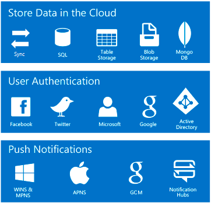

Let's start with a tour of the core features of Azure Mobile Apps. This overview should help you decide if Azure Mobile Apps can help support your next mobile client app. 

## What are Mobile Apps in Azure App Service?

The Mobile Apps feature of Azure App Service is a collection of Azure services commonly used to support mobile client apps. Mobile Apps is a managed platform-as-a-service (PaaS) that includes data storage, user authentication, and push notifications. The services provided by Mobile Apps are accessible using a REST API or commonly using a Microsoft provided API that can be added to your mobile client. 

> [!NOTE]
> You may see Mobile Apps referred to as *Azure Mobile App Service*, this is same as Mobile Apps in Azure.

### What are Azure Mobile Apps?

When creating mobile applications with Azure, it's helpful to think about the app in two parts, the client app and the supporting mobile service on Azure.

Typically when we think of "apps" we think about a client application running on a consumer mobile device from companies like Apple and Google. This is the part of the app that the user interacts with.

It's also common to have supporting services to manage data, identity, and so on. *Mobile Apps in Azure App Service* is a collection of backend services commonly used to support mobile client apps.

It's important to know that Azure Mobile Apps provides those backend services, but you still need to build the mobile client app that runs on the mobile device. This will be done using mobile development tools and SDKs, and will require a developer with mobile development skills.

## Mobile Apps features

### Data access

Mobile Apps provides a backend service that can be defined using either ASP.NET or node.js. This allows for an OData v3 source that can be linked to either an Azure SQL Database or an on-premises hosted SQL server. For ASP.NET, the data access service is based on Entity Framework, which allows your app to integrate with several SQL or NoSQL data providers including Azure Table Storage, MongoDB, and Azure Cosmos DB. 

The data can also be accessed via REST or using a Microsoft provided client SDK.

### Offline sync

When using the provided Mobile Apps SDK in your client app to access your cloud data, you'll also get a robust API to manage data synchronization between the client mobile app and the cloud data store. This can be very valuable for mobile devices that can lose connectivity and may need to manage data conflicts when more than one client app is saving or editing data.

### Authentication and authorization

Mobile Apps includes support for several identity providers. You can use Azure Active Directory or common client providers including Facebook, Google, Twitter and Microsoft. Mobile Apps provides OAuth 2.0 authentication for each.

### Push notifications

When using the client SDKs, you can integrate with Azure Notification Hubs to manage and send notifications to your app users.

## What mobile client devices are supported?

Azure Mobile Apps can be used with any mobile device capable of making REST API calls. However, specific modern platforms have additional support by using a Microsoft provided SDK.

Mobile Apps provides SDKs for several platforms:
- native iOS apps
- native Android apps
- native Windows UWP apps

As well, several cross-platform frameworks are supported:
- Xamarin.Forms
- Xamarin.iOS
- Xamarin.Android
- Apache Cordova
