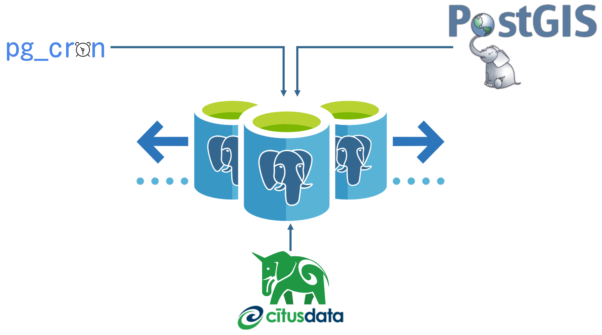

Azure Database for PostgreSQL - Hyperscale (Citus) is now [Azure Cosmos DB for PostgreSQL](../../../paths/azure-cosmos-db-for-postgresql/index.yml)!

[Azure Cosmos DB for PostgreSQL](/azure/postgresql/hyperscale/overview) is a fully managed database-as-a-service hosted on Azure that delivers the full functionality of PostgreSQL combined with the ability to distribute data across multiple PostgreSQL servers as nodes within a cluster. It's a robust database with a wide range of built-in features. However, sometimes additional capabilities are required to solve complex real-world problems. Azure Cosmos DB for PostgreSQL inherits many of its capabilities from the service formally called Azure Database for PostgreSQL - Hyperscale (Citus).

Azure Cosmos DB for PostgreSQL transforms PostgreSQL into a highly scalable distributed database by clustering PostgreSQL servers. Distributed databases work by spreading table data across nodes in the cluster, horizontally partitioning rows across worker nodes. By dispersing data across [shards](/azure/postgresql/hyperscale/concepts-nodes#shards) on different worker nodes, they can take advantage of cross-machine parallelism, providing the key performance benefits of Azure Cosmos DB for PostgreSQL.

In fact, the distributed capabilities of Azure Cosmos DB for PostgreSQL are made possible through the [Citus extension](https://github.com/citusdata/citus). Other examples of extensions are [`pg_cron`](https://github.com/citusdata/pg_cron), a cron-based job scheduler that allows you to schedule PostgreSQL commands directly from the database and [PostGIS](https://postgis.net/) that adds support for geographic objects, allowing location queries to be run in SQL.

In the [Extend functionality using extensions](../../extend-the-functionality-of-azure-cosmos-db-for-postgresql-using-extensions/1-introduction.yml) module, you'll explore how extensions can be used to improve the productivity of Azure Cosmos DB for PostgreSQL. You'll examine the Citus extension and how it enables data distribution and investigate other supported extensions and the capabilities they can provide to improve the overall effectiveness of a database.

## What is Citus?

[Citus](https://github.com/citusdata/citus) is an open-source extension for PostgreSQL that was created to allow data storage and computing capabilities to scale across a cluster of PostgreSQL servers without sacrificing traditional relational database functionality like transactions, joins, and foreign keys. The Citus extension enables this by transforming PostgreSQL into a highly scalable distributed database with features like a distributed SQL engine, [sharding](/azure/postgresql/hyperscale/concepts-nodes#shards), [reference tables](/azure/postgresql/hyperscale/concepts-nodes#type-2-reference-tables), and [distributed tables](/azure/postgresql/hyperscale/concepts-nodes#type-1-distributed-tables).

## Scale compute across nodes

Citus extends the functionality of PostgreSQL by enabling multiple PostgreSQL servers, known as [nodes](/azure/postgresql/hyperscale/concepts-nodes#nodes), to be clustered together. Every [cluster](/azure/postgresql/hyperscale/concepts-server-group) consists of a coordinator node and multiple worker nodes, enabling compute and memory to scale across numerous PostgreSQL servers in the cloud. Collectively, clusters can hold more data and use more CPU cores than a single server, providing faster responses on large datasets, even over multiple regions.

## Data distribution

The Citus extension allows data to be distributed across nodes in the cluster by letting you create [distributed tables](/azure/postgresql/hyperscale/concepts-nodes#type-1-distributed-tables). Distributed tables improve performance by horizontally partitioning table rows across worker nodes. Each row is assigned to a logical group called a [_shard_](/azure/postgresql/hyperscale/concepts-nodes#shards). Every row will be in precisely one shard, and every shard can contain multiple rows. By distributing data across nodes, you can take advantage of more storage capacity than would be available on a single server.

[Metadata tables](/azure/postgresql/hyperscale/reference-metadata#coordinator-metadata) located on the coordinator node stores information about which shards are stored on which node. The mapping of shards to worker nodes is referred to as [shard placement](/azure/postgresql/hyperscale/concepts-nodes#shard-placements). Shard placement enables performant query operations against distributed data in the database. These metadata tables track the DNS names and health of worker nodes in addition to data distribution across nodes. During query execution, the coordinator decides what action to take by referencing these metadata tables. The coordinator node checks the metadata tables to determine if data lives on a single node or multiple nodes and then routes queries to worker nodes as needed.

## Scenario: Scaling Woodgrove Bank's contactless payment app

Woodgrove Bank has a contactless payment app that works from six feet away, and the data is stored in a single, on-premises PostgreSQL database. Based on a successful trial of the app, Woodgrove Bank would like to release the app to customers across Europe and the United States. As the app needs to scale, the data will need to scale as well. Azure Cosmos DB for PostgreSQL is built to host PostgreSQL databases and support them at scale. The Woodgrove Bank development team is unfamiliar with a distributed environment, and as their tech lead, you have the most experience to lead them in this growth.

For this module, we'll focus on the Azure Database for PostgreSQL capabilities.
