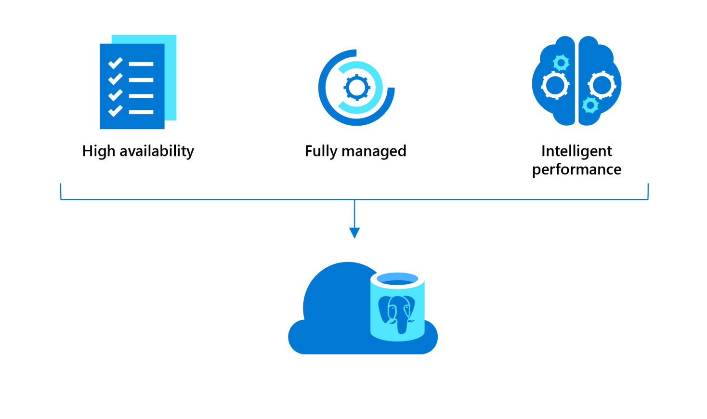

PostgreSQL is the world’s most advanced open source relational database.

In 1985, researchers at the University of California, Berkeley, began work on an entirely new kind of database that would fix the problems of contemporary systems. The new system proved so popular that the project was soon overwhelmed by user requests for support and new features. The software was open-sourced in 1994, and subsequent community development has given PostgreSQL - also known as Postgres - an incredibly rich feature set and extraordinary extensibility.

## Flexible by design

PostgreSQL is an object-relational database system, similar to MySQL and Microsoft SQL Server. While you can store data in relational tables, a PostgreSQL database also enables the storage of custom data types, with their own non-relational properties.

By design, Postgres extensions can be loaded into the database and function just like features that are built in. Users can access a trove of extensions, as you would expect from over two decades of open-source community development.

Postgres is used throughout the computing world, in everything from acting as the default database system in macOS Server, to collecting telemetry data from the International Space Station, to powering some of the world’s most well-known applications, like Skype, Reddit, and Instagram.

## PostgreSQL on Azure

:::row:::
:::column span="2":::

Azure Database for PostgreSQL is a service that provides a fully managed instance of community PostgreSQL in the Azure cloud - at any scale. It’s the same open-source software that is used in on-premises servers, with Azure taking care of maintenance and security obligations.

The service provides a relational database solution with horizontal scalability across as many machines - and locations - as needed. You don’t have to give up transactions, joins, and foreign keys for the ability to scale.

:::column-end:::
:::column span="2":::

:::column-end:::
:::row-end:::

As an example, let’s say you work for Woodgrove Bank, and you’re developing a new contactless payment app that works from six feet away. Your proof-of-concept app is currently using a relational database hosted on an on-premises server.

If your app was released, the on-premises server could easily become overloaded, which might cause slow transaction times, or even customer data loss or corruption. To avoid this problem, you need to scale the database solution for both capacity and performance. It's also a good idea to host data in more than one location, which means moving away from your current on-premises database server, without compromising security.

As you’re considering cloud-hosted database offerings, important qualities to consider include usability, scalability, and security. In this module, we'll refer back to the payment app scenario to evaluate the qualities of Azure Database for PostgreSQL and assess use cases.

## Prerequisites

- Basic knowledge of relational databases

## Learning objectives

In this module, you will:

- Describe the components of Azure Database for PostgreSQL
- Identify situations when to use Azure Database for PostgreSQL
