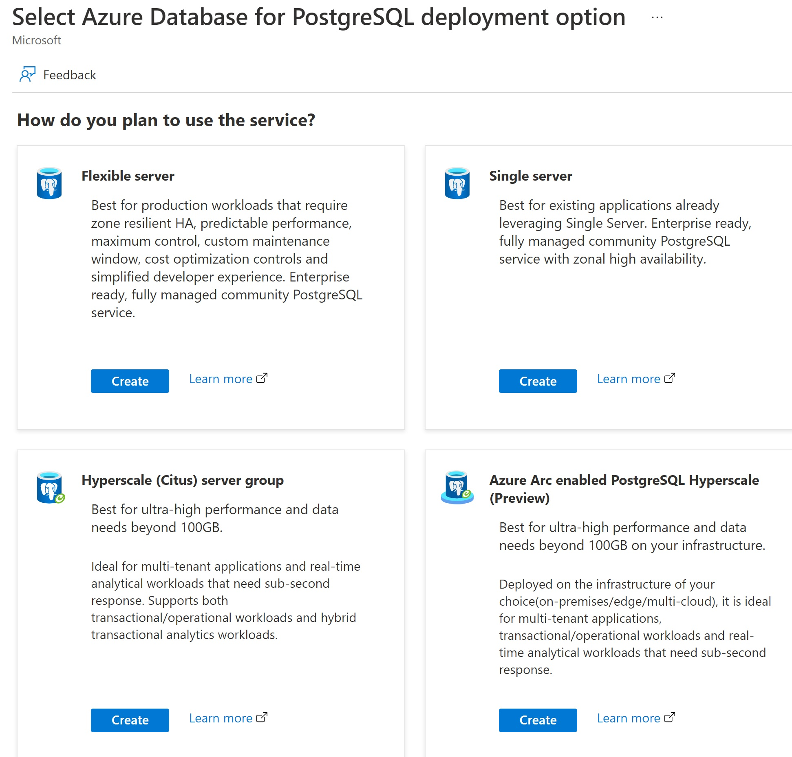

Hyperscale turns PostgreSQL into a distributed database. It’s based on a PostgreSQL extension called Citus, which has been migrated to Azure. If you require ultra-high performance and have data needs of nearly or more than 100 GB, you can select Hyperscale in the Azure portal.

## Growing with Hyperscale

Relational databases can’t always be scaled for modern workloads. Hyperscale ensures you won’t have any difficulties scaling, allowing PostgreSQL to "scale out" by managing multiple servers for you, increasing memory, compute, and storage space compared to a single server. This scale provides:

* Faster responses on large datasets
* Better performance across multiple regions
* The ability to scale far more compute and storage than a single server can provide

All without the need for application rewrites or manual optimization. Changes are kept transparent, so servers, compute, and storage can be added or removed as needed.

The process of horizontal scaling is automated by Azure, meaning connecting applications continue to connect and interact with the database in the same way. Changes are kept transparent, so that servers, compute, and storage can be added or removed as needed.

Once your payment app trial has been completed and approved, Hyperscale gives you the ability to roll out your app to multiple merchants and retailers while meeting demand in different locations. Hyperscale will help you to maintain business momentum while scaling up.

## Ultra-high performance for difficult workloads

Horizontal scaling isn’t just about more machines, it’s also about using resources effectively. Hyperscale scales queries for you, giving better performance on large or difficult workloads. Specific applications suited to Hyperscale include multi-tenant applications, real-time operational analytics, and high throughput transactional workloads.

Hyperscale also allows existing Citus users to offload administrative complexity to Azure, while still keeping the benefits and open-source tooling that postgres and Citus offer.

When our example payment app is released to a larger audience, Hyperscale will ensure that users connect to servers closer to them, with lower latency and greater performance. The extra servers will be able to handle more traffic than a single server.
