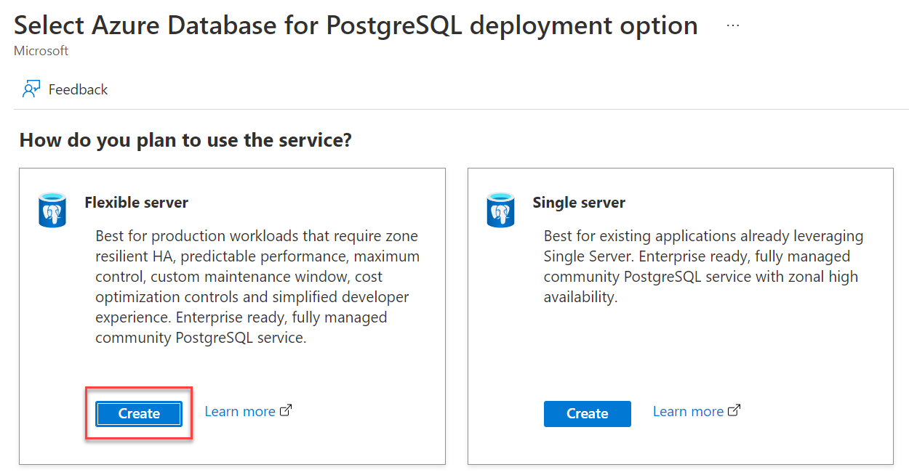
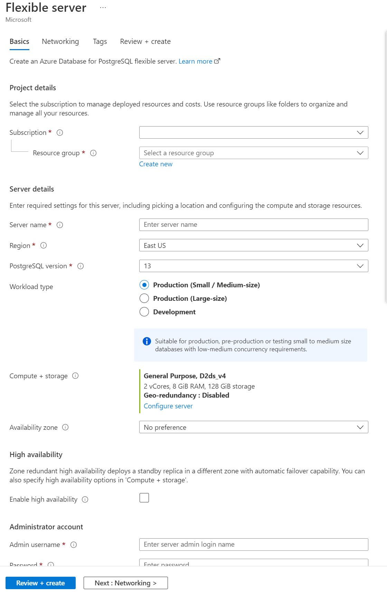

Azure Database for PostgreSQL is designed to handle most of the database and hardware management functions with minimal user configuration and control. Azure puts the database engine in a compute container, while data files reside on Azure storage.

Separating your database engine from your data in the cloud allows automated maintenance for underlying hardware, operating system, and database engine to keep the service secure and up to date. After setting up the database, the automated functions allow you to focus on application development, rather than get sidetracked by maintenance and security obligations.

## How to get set up

Azure Database for PostgreSQL can be quickly set up and configured from the Azure portal, CLI, or PowerShell. For a single server deployment, you only need to configure:

* Username and password
* The location(s) closest to your users

And (optionally):

* Whether you want a new database server, or to restore an existing one
* Whether you require an older version of PostgreSQL

The steps above create and deploy your PostgreSQL database with a single server. Your database is secure by default. If you add your current IP address to the firewall rules, you can connect to and query your database using your username and password.

You can connect using psql on the Azure Cloud Console, locally using your favorite programming language, or with free administrative tools such as pgAdmin.

## How the compute container works

The service runs the standard Community PostgreSQL in the compute container. Compute containers can be scaled dynamically - meaning Azure only charges for the resources that are needed, when they are needed. This allows, for example, hosting of a small database for a few dollars a month that can then be scaled as needs grow. The compute container is easily configured via the Azure portal with firewall and security rules, performance insights, and configuration recommendations.

Scaling your database after deployment means that you can reduce costs for your proof-of-concept app, and scale up only when you need to.

## How the backups work

Backup and restore are an essential part of any business continuity strategy because they protect your data from accidental corruption or deletion. For example, when a user accidentally deletes data, drops an important table or database, or if an application accidentally overwrites good data with bad data. On Azure Databases for PostgreSQL, data is backed up and encrypted on Azure storage by default. Backups can be used to restore data to any point in time within the last 35 days.

Servers can also be replicated on up to 5 read-only ‘read replica’ servers, improving the performance and scale of read-intensive workloads. A common scenario is to have business intelligence and analytical workloads use the read replica as the data source for reporting.

Storage ‘auto-grow’ is an option that prevents your server from running out of storage, automatically growing the storage without impacting the workload. This option allows you to keep storage costs to a minimum, only scaling up when absolutely necessary.

When you're assessing a trial of your payment app, creating a read-only server for analytics will be useful as you can show stakeholders analytics, without impacting the transaction times for users. Storage auto-grow will also keep costs down, while never running out of storage.

## How PostgreSQL extensions work

PostgreSQL provides the ability to extend the functionality of your database by using extensions. After being loaded in the database, extensions can function like built-in features. Due to the open-source nature of PostgreSQL, there are too many extensions available to list on this page. A hyperlink to the full list is available in Unit 7 - Summary.

As an example, PLV8 is a popular postgres extension, which allows JavaScript in your database to be callable from SQL. PostGIS is another popular extension, which enables SQL to work with spatial data types directly, for location-based information.
