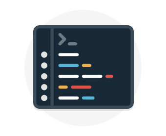
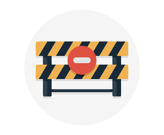

As computing environments move from customer-controlled data centers to cloud data centers, the responsibility of security also shifts. Security is now a concern shared both by cloud providers and customers. For every application and solution, it's important to understand what's your responsibility and what's Azure's responsibility.

#### Understand security threats

> [!VIDEO https://www.microsoft.com/videoplayer/embed/RWkotg]

#### Azure security: you versus the cloud

> [!VIDEO https://www.microsoft.com/videoplayer/embed/RE2yEvj]

## Share security responsibility with Azure

The first shift you’ll make is from on-premises data centers to infrastructure as a service (IaaS). With IaaS, you are leveraging the lowest-level service and asking Azure to create virtual machines (VMs) and virtual networks. At this level, it's still your responsibility to patch and secure your operating systems and software, as well as configure your network to be secure. At Contoso Shipping, you are taking advantage of IaaS when you start using Azure VMs instead of your on-premises physical servers. In addition to the operational advantages, you receive the security advantage of having outsourced concern over protecting the physical parts of the network.

Moving to platform as a service (PaaS) outsources a lot of security concerns. At this level, Azure is taking care of the operating system and of most foundational software like database management systems. Everything is updated with the latest security patches and can be integrated with Azure Active Directory for access controls. PaaS also comes with a lot of operational advantages. Rather than building whole infrastructures and subnets for your environments by hand, you can "point and click" within the Azure portal or run automated scripts to bring complex, secured systems up and down, and scale them as needed. Contoso Shipping uses Azure Event Hubs for ingesting telemetry data from drones and trucks &mdash; as well as a web app with an Azure Cosmos DB back end with its mobile apps &mdash; which are all examples of PaaS.

With software as a service (SaaS), you outsource almost everything. SaaS is software that runs with an internet infrastructure. The code is controlled by the vendor but configured to be used by the customer. Like so many companies, Contoso Shipping uses Office 365, which is a great example of SaaS!

## A layered approach to security

*Defense in depth* is a strategy that employs a series of mechanisms to slow the advance of an attack aimed at acquiring unauthorized access to information. Each layer provides protection so that if one layer is breached, a subsequent layer is already in place to prevent further exposure. Microsoft applies a layered approach to security, both in physical data centers and across Azure services. The objective of defense in depth is to protect and prevent information from being stolen by individuals who are not authorized to access it.

Defense in depth can be visualized as a set of concentric rings, with the data to be secured at the center. Each ring adds an additional layer of security around the data. This approach removes reliance on any single layer of protection and acts to slow down an attack and provide alert telemetry that can be acted upon, either automatically or manually. Let's take a look at each of the layers.

:::row:::
  :::column:::
    
  :::column-end:::
	:::column span="3":::  
**Data**

In almost all cases, attackers are after data:

- Stored in a database
- Stored on disk inside virtual machines
- Stored on a SaaS application such as Office 365
- Stored in cloud storage

It's the responsibility of those storing and controlling access to data to ensure that it's properly secured. Often, there are regulatory requirements that dictate the controls and processes that must be in place to ensure the confidentiality, integrity, and availability of the data.
  :::column-end:::
:::row-end:::

:::row:::
  :::column:::
    
  :::column-end:::
	:::column span="3":::  
**Application**

- Ensure applications are secure and free of vulnerabilities.
- Store sensitive application secrets in a secure storage medium.
- Make security a design requirement for all application development.

Integrating security into the application development life cycle will help reduce the number of vulnerabilities introduced in code. We encourage all development teams to ensure their applications are secure by default, and that they're making security requirements non-negotiable.
  :::column-end:::
:::row-end:::

:::row:::
  :::column:::
    
  :::column-end:::
	:::column span="3":::  
**Compute**

- Secure access to virtual machines.
- Implement endpoint protection and keep systems patched and current.

Malware, unpatched systems, and improperly secured systems open your environment to attacks. The focus in this layer is on making sure your compute resources are secure, and that you have the proper controls in place to minimize security issues.
  :::column-end:::
:::row-end:::

:::row:::
  :::column:::
    
  :::column-end:::
	:::column span="3":::  
**Networking**

- Limit communication between resources.
- Deny by default.
- Restrict inbound internet access and limit outbound, where appropriate.
- Implement secure connectivity to on-premises networks.

At this layer, the focus is on limiting the network connectivity across all your resources to allow only what is required. By limiting this communication, you reduce the risk of lateral movement throughout your network.
  :::column-end:::
:::row-end:::

:::row:::
  :::column:::
    
  :::column-end:::
	:::column span="3":::  
**Perimeter**

- Use distributed denial of service (DDoS) protection to filter large-scale attacks before they can cause a denial of service for end users.
- Use perimeter firewalls to identify and alert on malicious attacks against your network.

At the network perimeter, it's about protecting from network-based attacks against your resources. Identifying these attacks, eliminating their impact, and alerting you when they happen are important ways to keep your network secure.
  :::column-end:::
:::row-end:::

:::row:::
  :::column:::
    
  :::column-end:::
	:::column span="3":::  
**Identity and access**

- Control access to infrastructure and change control.
- Use single sign-on and multi-factor authentication.
- Audit events and changes.

The identity and access layer is all about ensuring identities are secure, access granted is only what is needed, and changes are logged.
  :::column-end:::
:::row-end:::

:::row:::
  :::column:::
    
  :::column-end:::
	:::column span="3":::  
**Physical security**

- Physical building security and controlling access to computing hardware within the data center is the first line of defense.

With physical security, the intent is to provide physical safeguards against access to assets. This ensures that other layers can't be bypassed, and loss or theft is handled appropriately.
  :::column-end:::
:::row-end:::

## Summary

We've seen here that Azure helps a lot with your security concerns. But security is still a **shared responsibility**. How much of that responsibility falls on us depends on which model we use with Azure.

We use the *defense in depth* rings as a guideline for considering what protections are adequate for our data and environments.
