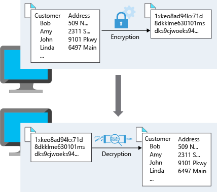
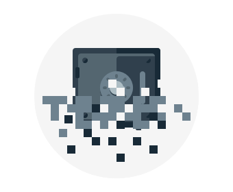
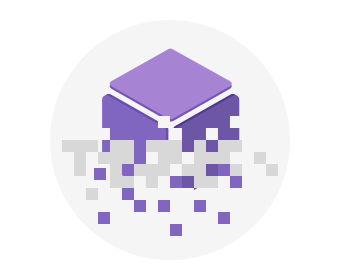
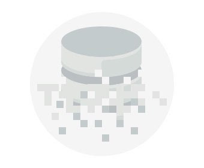
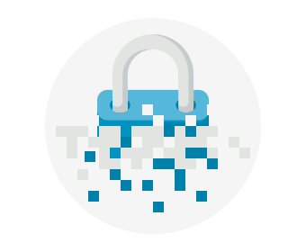

For most organizations, data is the most valuable and irreplaceable asset. Encryption serves as the last and strongest line of defense in a layered security strategy. 

Contoso Shipping knows that encryption is the only protection its data has once it leaves the data center as it heads to those mobile apps.

## What is encryption?

Encryption is the process of making data unreadable and unusable to unauthorized viewers. To use or read the encrypted data, it must be *decrypted*, which requires the use of a secret key. There are two top-level types of encryption: **symmetric** and **asymmetric**.

Symmetric encryption uses the same key to encrypt and decrypt the data. Consider a desktop password manager application. You enter your passwords and they are encrypted with your own personal key (your key is often derived from your master password). When the data needs to be retrieved, the same key is used, and the data is decrypted.

Asymmetric encryption uses a public key and private key pair. Either key can encrypt but a single key can't decrypt its own encrypted data. To decrypt, you need the paired key. Asymmetric encryption is used for things like Transport Layer Security (TLS) (used in HTTPS) and data signing.

Both symmetric and asymmetric encryption play a role in properly securing your data. 

Encryption is typically approached in two ways: encryption at rest and encryption in transit.

## Encryption in transit

Data in transit is the data actively moving from one location to another, such as across the internet or through a private network. Secure transfer can be handled by several different layers. It could be done by encrypting the data at the application layer prior to sending it over a network. HTTPS is an example of application layer in transit encryption.

You can also set up a secure channel, like a virtual private network (VPN), at a network layer, to transmit data between two systems.

Encrypting data in transit protects the data from outside observers and provides a mechanism to transmit data while limiting risk of exposure.

This diagram shows the process. Here, customer data is encrypted as it's sent over the network. Only the receiver has the secret key that can decrypt the data to a usable form.

## Encryption at rest

Data at rest is the data that has been stored on a physical medium. This could be data stored on the disk of a server, data stored in a database, or data stored in a storage account. Regardless of the storage mechanism, encryption of data at rest ensures that the stored data is unreadable without the keys and secrets needed to decrypt it. If an attacker was to obtain a hard drive with encrypted data and did not have access to the encryption keys, the attacker would not compromise the data without great difficulty.

The actual data that is encrypted could vary in its content, usage, and importance to the organization. This could be financial information critical to the business, intellectual property that has been developed by the business, personal data about customers or employees that the business stores, and even the keys and secrets used for the encryption of the data itself.

Here's a diagram that shows what encrypted customer data might look like as it sits in a database.

## Encryption on Azure

Let's take a look at some ways that Azure enables you to encrypt data across services.

:::row:::
  :::column:::
    
  :::column-end:::
	:::column span="3":::
**Encrypt raw storage**

Azure Storage Service Encryption for data at rest helps you protect your data to meet your organizational security and compliance commitments. With this feature, the Azure storage platform automatically encrypts your data before persisting it to Azure Managed Disks, Azure Blob storage, Azure Files, or Azure Queue storage, and decrypts the data before retrieval. The handling of encryption, encryption at rest, decryption, and key management in Storage Service Encryption is transparent to applications using the services.
  :::column-end:::
:::row-end:::

:::row:::
  :::column:::
    
  :::column-end:::
	:::column span="3":::
**Encrypt virtual machines**

Storage Service Encryption provides low-level encryption protection for data written to physical disk, but how do you protect the virtual hard disks (VHDs) of virtual machines? If malicious attackers gained access to your Azure subscription and exfiltrated the VHDs of your virtual machines, how would you ensure they would be unable to access data stored on the VHD?

Azure Disk Encryption is a capability that helps you encrypt your Windows and Linux IaaS virtual machine disks. Azure Disk Encryption leverages the industry-standard BitLocker feature of Windows and the dm-crypt feature of Linux to provide volume encryption for the OS and data disks. The solution is integrated with Azure Key Vault to help you control and manage the disk encryption keys and secrets (and you can use managed service identities for accessing Key Vault).

For Contoso Shipping, using VMs was one of the first moves toward the cloud. Having all the VHDs encrypted is a very easy, low-impact way to ensure that you are doing all you can to secure your company's data.
  :::column-end:::
:::row-end:::

:::row:::
  :::column:::
    
  :::column-end:::
	:::column span="3":::
**Encrypt databases**

Transparent data encryption (TDE) helps protect Azure SQL Database and Azure Data Warehouse against the threat of malicious activity. It performs real-time encryption and decryption of the database, associated backups, and transaction log files at rest without requiring changes to the application. By default, TDE is enabled for all newly deployed Azure SQL Database instances.

TDE encrypts the storage of an entire database by using a symmetric key called the database encryption key. By default, Azure provides a unique encryption key per logical SQL Server instance and handles all the details. Bring your own key (BYOK) is also supported with keys stored in Azure Key Vault.

Because TDE is enabled by default, you are confident that Contoso Shipping has the proper protections in place for data stored in the company's databases.
  :::column-end:::
:::row-end:::

:::row:::
  :::column:::
    
  :::column-end:::
	:::column span="3":::
**Encrypt secrets**

We've seen that the encryption services all use keys to encrypt and decrypt data, so how do we ensure that the keys themselves are secure? Corporations may also have passwords, connection strings, or other sensitive pieces of information that they need to securely store.

Azure Key Vault is a cloud service that works as a secure secrets store. Key Vault allows you to create multiple secure containers, called vaults. These vaults are backed by hardware security modules (HSMs). Vaults help reduce the chances of accidental loss of security information by centralizing the storage of application secrets. Key vaults also control and log the access to anything stored in them. Azure Key Vault can handle requesting and renewing TLS certificates, providing the features required for a robust certificate life cycle management solution. Key Vault is designed to support any type of secret. These secrets could be passwords, database credentials, API keys, and certificates.

Because Azure AD identities can be granted access to use Azure Key Vault secrets, applications with managed service identities enabled can automatically and seamlessly acquire the secrets they need.
  :::column-end:::
:::row-end:::

## Summary

As you may know, encryption is often the last layer of defense from attackers and is an important piece of a layered approach to securing your systems. Azure provides built-in capabilities and services to encrypt and protect data from unintended exposure. Protection of customer data stored within Azure services is of paramount importance to Microsoft and should be included in any design. Foundational services such as Azure Storage, Azure Virtual Machines, Azure SQL Database, and Azure Key Vault can help secure your environment through encryption.