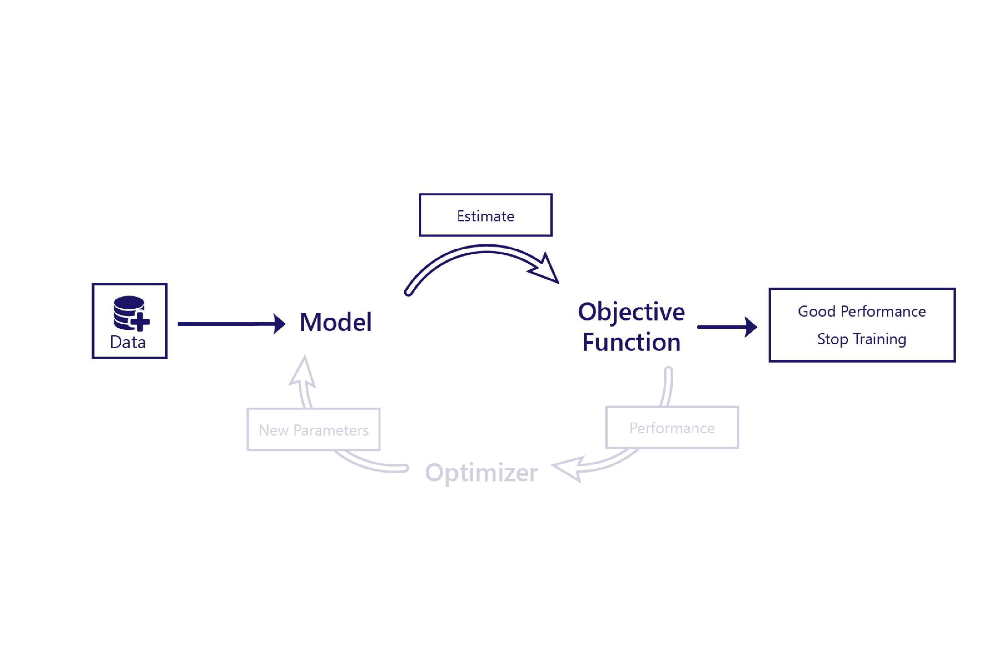
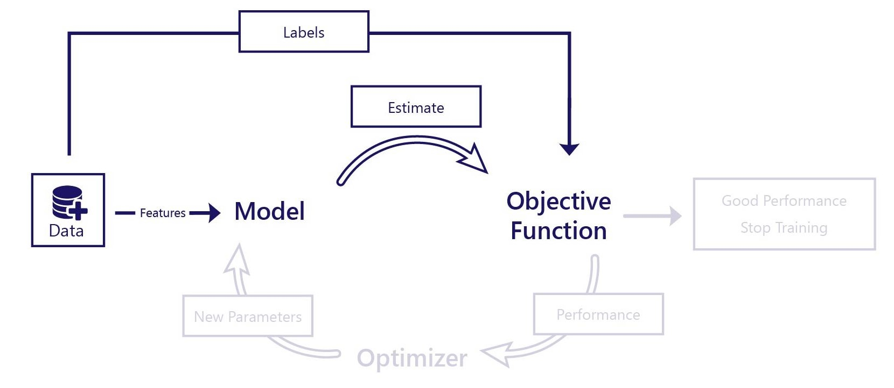

The process of training a model can be referred to as being either supervised or unsupervised. Our goal here is to contrast these approaches, and then take a deeper dive into the learning process, with a focus on supervised learning. That said, it's worth remembering throughout this discussion that the only difference between supervised and unsupervised learning is how the objective function works.

## What is Unsupervised Learning?

In unsupervised learning we train a model to solve a problem without us knowing the correct answer. In fact, unsupervised learning is usually used for problems where there isn’t one correct answer, but instead, better and worse solutions.

Imagine that we wanted our machine learning model to draw realistic pictures of avalanche rescue dogs. There isn’t one ‘correct’ drawing to draw–-so long as the image looked somewhat like a dog, we would be satisfied. Yet, if the image produced was of a cat, we would say it’s a worse solution.

Recall that training requires several components:

In unsupervised learning, the objective function makes its judgment purely on the model’s estimate, which means it often needs to be relatively sophisticated. For example, the objective function might need to contain a ‘dog detector’ to assess if images drawn by the model looked realistic. The only data we need for unsupervised learning are features: data that we provide to the model.

## What is Supervised Learning?

Supervised learning can be thought of as learning by example. In supervised learning, the model’s performance is assessed by comparing its estimates to the correct answer.

Meaning that, while we can have very simple objective functions, we need both:

* Features that are provided as inputs to the model, and
* Labels, which are the correct answers we want the model to be able to produce.

For example, consider our desire to predict what the temperature will be on January 31st of a given year. For this prediction, we'll need data with two components:

* Feature: Date
* Label: Daily temperature (for example, from historical records)

In the scenario, we would provide the date feature to the model. The model would predict the temperature and we would compare this to the datasets ‘correct’ temperature. The objective function can then calculate how well the model worked, and adjustments can then be made to the model.

## Labels are only for learning

It’s important to remember that, no matter how they are trained, models only ever process features. During supervised learning, the objective function is the only component that relies on access to labels. This means that, after training, we do not need labels to use our model.