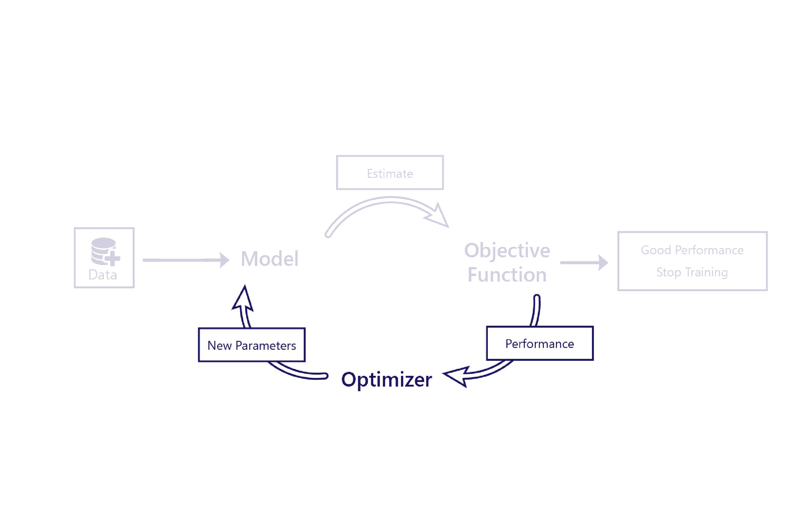
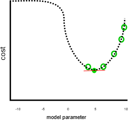
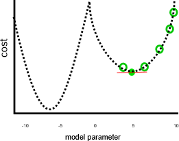
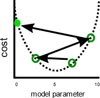

We’ve seen how cost functions evaluate how well models perform using data. The optimizer is the final piece of the puzzle.

The role of the optimizer is to alter the model in a way that improves its performance. It does this by inspecting the model outputs and cost and suggesting new parameters for the model.

For example, in our farming scenario, our linear model has two parameters: the line’s intercept and the line’s slope. If the intercept of the line is wrong, the model will be under or overestimating temperatures on average. If the slope is set wrong, the model won't do a good job of demonstrating how temperatures have changed since the 1950s. The optimizer changes these two parameters so that they do an optimal job of modeling temperatures over time.

## Gradient descent

The most common optimization algorithm today is called Gradient Descent. Several variants of this exist, but they all use the same core concepts.

Gradient descent uses calculus to estimate how changing each parameter will change the cost. For example, increasing a parameter might be predicted to reduce the cost.

Gradient descent is named as such because it calculates the gradient (slope) of the relationship between each model parameter and the cost. The parameters are then altered to move down this slope.

## Limitations of gradient descent

Gradient descent is a simple but powerful algorithm, yet it isn't guaranteed to find the optimal model parameters that minimize the cost. The two main sources of error are local minima and instability.

## Local minima

Our previous example looked to do a good job, assuming that cost would have kept increasing when the parameter was smaller than 0 or greater than 10, like so:

This won't have been such a great job, if parameters smaller than zero or larger than 10 would have resulted in lower costs, like in this image:

In the above graph, a parameter value of -7 would have been a better solution than 5 as it has a lower cost. Because gradient descent doesn’t know the full relationship between each parameter and the cost—which is represented by the dotted line—in advance, it’s prone to finding what are called local minima: parameter estimates that aren't the best solution, but the gradient is zero.

## Instability

A related issue is that gradient descent sometimes shows instability. This usually occurs when the step size or learning rate—the amount that each parameter is adjusted by each iteration—is too large. When this occurs, the parameters are adjusted too far on each step, and the model actually gets worse with each iteration, like so:

Having a slower learning rate can solve this problem but may also introduce issues. Firstly, slower learning rates can mean training takes a long time, as more steps are required. Secondly, taking smaller steps makes it more likely that training settles on a local minimum:

By contrast, a faster learning rate can make it easier to avoid hitting local minima, because larger steps can skip over local maxima:

As we'll see in the next exercise, for each problem, there's an optimal step size. Finding this optimum is something that often requires experimentation.
