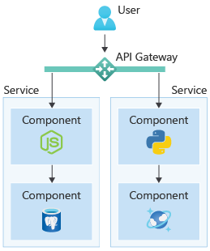

:::row:::
:::column span="2":::

The cloud-native approach allows you to build cloud-based applications where you choose the **components** you want to use. Components, such as a database and a .NET Function app, could be coupled together as a **service**, to form an isolated part of a system. For instance, you might have an inventory service, an ordering service, and a payment service, each with their own technology choices.

Additionally, cloud-native apps are modular in nature. You choose the cloud services and technologies, and loosely couple them together as shown in the diagram. Cloud-native apps often employ another pattern, called **Microservices.** Notice how each service has its own technology stack, independent of what other services use, meaning you choose the technologies that suit each individual service, rather than a one-size-fits-all solution.

With Cloud Native, we're using many pre-built types of services or services with pre-built infrastructure. So we can use scaling from Kubernetes or Azure Function Apps, and geo-redundant data storage from Cosmos DB or Hyperscale for PostgreSQL.

:::column-end:::
:::column:::

:::column-end:::
:::row-end:::

So, while apps built on "microservices" in general share many of the same characteristics, "cloud-native apps" can have parts of their tool chain where little to no custom code has to be used to get advanced functionality or operational excellence.

Further, with different components loosely coupled together to create an application, you can change technologies as required without rewriting the entire application. Such as with our smart fridges, each service can be upgraded, deployed, scaled, and restarted with no effect on other services, allowing for frequent updates.

### Use technologies that you’re strong with

:::row:::
:::column span="3":::

Most cloud-native services support a wide range of technologies. Kubernetes supports multiple client OSs and any tech stack, such as .NET, Node, Ruby, and Java. There are vast options for databases that can be connected using any major programming language.

You can connect a backend to your relational database of choice for one service, while also using a NoSQL database and a pre-built analytics service when it’s a better fit for another service. You can do it all quickly and simply, within the same overall cloud application.

:::column-end:::
:::column:::

:::column-end:::
:::row-end:::
