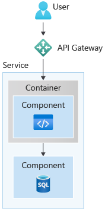
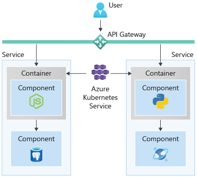

### Reliable, separated environments using containers

:::row:::
:::column span="3":::

Containers are loosely isolated environments that can run software packages. They’re usually a key component of cloud-native apps, as they provide a reliable, separated environment that works the same on any machine. Containers are often referred to as ”Docker containers”, named after the most popular tool for creating and managing them.

Each container is self-contained, with its own code, data, and dependencies. One of the strengths of containerization is that you don't have to configure hardware and spend time installing operating systems, virtual machines, and software to host a deployment.

While we can use containers directly, by taking a working software program from our own machine to the cloud, we can also export containers from services. Such as with Azure Speech Service, which transcribes real-time speech into text, and is available as container images that can be directly deployed to your own system. Many Azure services use containers under the hood, so there are a wide range available.

:::column-end:::
:::column span="1":::

:::column-end:::
:::row-end:::

Containers are easy to use with cloud services. They ensure that, once tested, your application works the same on your local machine as on the cloud—giving you a much more reliable, low-maintenance experience. This containerization means you can easily scale out by replicating containers, and that every instance of your application is in an identical environment. Further, you can manage containers with a container orchestrator, such as Kubernetes. Orchestrated containers, with their lightweight nature, can scale out much more cost effectively and nimbly than virtual machines.

### Manage containers easily with a Kubernetes service

:::row:::
:::column:::

Kubernetes, often abbreviated as K8s, is a technology that manages multiple containers for you. You can connect containers so your database can talk to a backend, scale resources, and automate application deployment, backups, and maintenance.

One of the key benefits of Kubernetes is the ability to restore applications to the exact instance that has been tested and saved, otherwise known as **self-healing**. As containers can be saved and replicated, Kubernetes can check on the health of a container and replace it with an original copy if necessary.

Kubernetes can also automatically increase or decrease the number of containers if demand changes. If traffic to a container is high, Kubernetes can load balance and distribute the network traffic so that the deployment is stable.

:::column-end:::
:::column:::

:::column-end:::
:::row-end:::

Additionally, one of the main benefits of using a Kubernetes service is simplified security configuration management. Many have built in authentication services, allowing the services to provide compliance offerings for most countries/regions and industries.

Further, when a component is updated, you can automate Kubernetes to create new containers for your deployment, remove existing containers, and adopt all their resources to the new containers. Kubernetes services, such as AKS, simplify container management and can provide massive savings in development time, cost, and security obligations. Continuous integration and continuous delivery (CI/CD), allow Kubernetes services to optimize development pipelines and application deployment.
