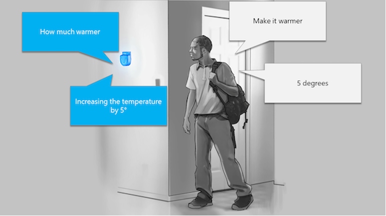

Custom Commands is a tool for designing AI voice assistants that allow you to give verbal commands to your smart devices. It provides a quick solution to build and integrate command-and-control features within applications—without the need to understand complicated speech and language processing systems. With the Custom Commands low-code Web UI, you can easily create increasingly complex commands step by step as you learn or require new functionality for your devices.

Custom Commands brings together the best speech and language features from Azure Cognitive Services, using *Speech-to-Text* to transcribe the user’s speech, and natural language understanding to take action on that speech. This action frequently includes a response from the voice assistant, which is generated with *Text-to-Speech.* These underlying technologies are seamlessly integrated within Custom Commands to create a voice assistant solution to fit your needs.

Voice assistant command-and-control features are helpful for users who require hands-free task-oriented control of nearby smart devices. That's why Custom Commands is ideal for companies in the hospitality, retail, and automotive industries to assist in building voice control capability for end users. Whether that’s a command to turn on seat warmers in a car, or creating an advanced in-room voice control experience for your home.

## Azure integration

Custom Commands can integrate with several Azure services to give your voice assistant the added complexity and functions you need.  

The voice assistant can work with your own custom client apps using the Azure Speech Services SDK or connect with existing API endpoints, giving you the flexibility to build voice command experiences where you need. The voice assistant uses **LUIS (Language understanding)** capabilities, specializing in extracting relevant information from speech. With this, Custom Commands can understand what users are saying and what parts of their speech are relevant for issuing commands.

The Custom Commands tool can also integrate with the Speech SDK **custom keyword recognition**, allowing users to create personalized wake-up words or phrases for their smart devices to start listening for commands.

If your commands require more complexity, you can extend the service as a skill using the **Bot Framework**. Bot framework skills are reusable conversational skill building-blocks covering conversational use-cases enabling you to add extensive functionality to a Bot within minutes.

## Customizing the voice assistant

Another significant benefit of Custom Commands is its ability to use the Speech SDK’s suite of voices and languages. With over **100 voices and languages** to choose from, you'll always find a voice to fit your needs. If none of the voices suit your requirements, there is also the ability to add a custom voice that emulates speech provided to the service, allowing branded or personalized voice assistants.
