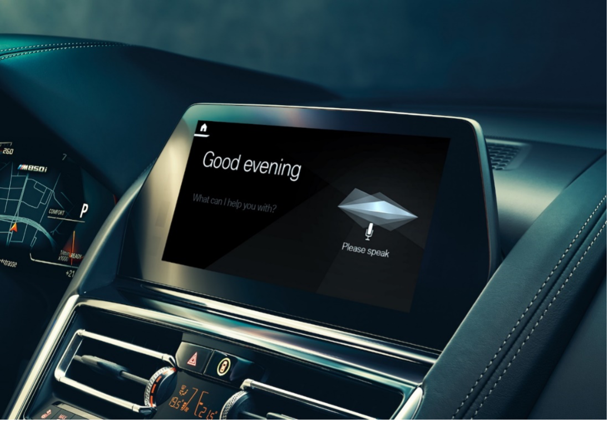
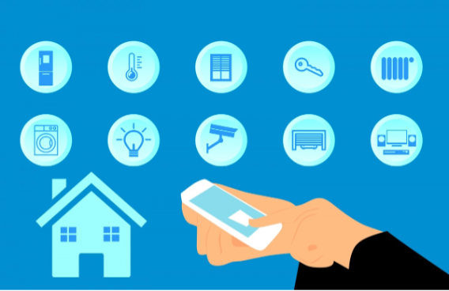

In our current environment, growing considerations around public health and accessibility mean voice-based contactless experiences play an increasingly important role in customer interactions with businesses and smart devices. Custom Commands is particularly well matched for Internet of Things (IoT) devices or ambient and headless devices that are invaluable to users who are on the move and require hands-free interaction while they drive, work, or play.

## Smart Cars

The American Automobile Association’s Traffic Safety Division says that between 25-50% of accidents are caused by distracted drivers—with changing the radio or other console settings listed as one of the top causes. With Custom Commands, you can create effective voice commands to control the internal settings of your smart car, such as requesting a specific change in temperature or turning on seat warmers. By keeping the commands to voice rather than using their hands, drivers can keep their eyes safely on the road, while car manufacturers can design cleaner internal spaces.

## Hands-free work

Many industries require staff to juggle a wide range of items and responsibilities in their role, such as inventory management or logistics within warehouses. A typical day in these positions may involve moving literal tons of different goods to various places within the warehouse and worldwide. With Custom Commands and a new generation of robotics, staff can manage inventory by collecting, tracking, and adjusting stock through voice commands and queries. Custom Commands can also create contactless solutions for hospitals and businesses, increasing productivity and safety for staff and customers.

## Smart Homes

Internet of Things (IoT) devices’ growing market share means smart homes are becoming less science fiction and more of a common feature in our day-to-day lives. The use of Custom Commands in this space can give you the flexibility to interact with the devices you own while securing your data from potential advertisers or other privacy concerns. Examples of voice commands for your home could be adjusting the thermostat, opening blinds, and activating devices such as ovens or kettles at your convenience. The custom keywords feature from the Speech SDK can be used with the Custom Commands capabilities. So, once set, the system only reacts to your unique wake-up request, further enhancing the security and privacy of your home’s voice assistant.

## Personifying Smart Devices

Custom Commands can incorporate features from the Speech SDK to change the voice of the assistant. There are over 100 voices and languages to choose from, including the ability to create your own custom voice. By switching to a custom voice, you can significantly enhance your customer engagement across a broad range of services and interfaces while tying into brand personas or advertising campaigns. An example of this is integrating the bot framework with custom voices to create personalized hotel assistants, helping guests control their room’s devices without them needing to learn the location of switches and remotes. Using the same voice as the hotel chain’s brand persona can enhance users’ trust through familiarity with that voice or character—helping make their stay a relaxing one.