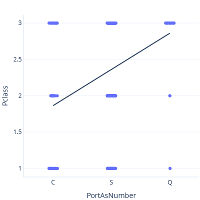
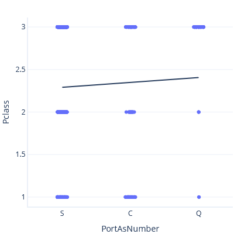

So far, we covered continuous data encoding (floating point numbers), ordinal data encoding (usually integers), and binary categorical data encoding (survived/died, male/female, etc.).

Now we learn how to encode data, and we'll explore categorical data resources that have more than two classes. We'll also explore the potentially harmful effects of our model improvement decisions on model performance.

## Categorical data aren't numerical

Categorical data doesn't work with numbers the same way that other datatypes work with numbers. With _ordinal_ or _continuous_ (numerical) data, higher values imply an increase in amount. For example, on the Titanic, a ticket price of £30 is more money than a ticket price of £12.

In contrast, categorical data has no logical order. We'll have problems if we try to encode, as numbers, categorical features that have more than two classes.

For example, Port of Embarkment has three values, C (Cherbourg), Q (Queenstown), and S (Southampton). We can't replace these symbols with numbers. If we do, it would imply that one of these ports is ‘less than’ the other ports, while another is ‘greater than’ the other ports. This replacement makes no sense.

As an example of this problem, let’s throw caution to the wind and model the relationship between Port of Embarkment and Ticket Class, treating Port of Embarkment as a number. First, we set C < S < Q:

In this plot, the line predicts a Class of ~3 for Port Q.

Now, if we set S < C < Q, we get a different trendline and prediction:

Neither of these trendlines are correct. It makes no sense to treat categories as continuous features. How then do we work with categories?

## One-hot encoding

One-hot encoding can encode categorical data in a way that avoids this problem. Each available category gets its own single column, and a given row only contains a single **1** value in the category it belongs to.

For example, we can encode the port value in three columns, one for Cherbourg, one for Queenstown, one for Southampton (the exact order here has no relevance). Someone who boarded at Cherbourg would have a **1** in the Port_Cherbourg column, like this:

|Port_Cherbourg|Port_Queenstown|Port_Southampton|
|---|---|---|
|1|0|0|

Someone who boarded at Queenstown would have a **1** in the second column:

|Port_Cherbourg|Port_Queenstown|Port_Southampton|
|---|---|---|
|0|1|0|

Someone who boarded at Southampton would have a **1** in the third column

|Port_Cherbourg|Port_Queenstown|Port_Southampton|
|---|---|---|
|0|0|1|

## One-hot encoding, data cleaning, and statistical power

Before we use one-hot encoding, we should understand that its use can have positive or negative impacts on the real-world performance of a model.

### What is statistical power?

Statistical power refers to the ability of a model to reliably identify real relationships between features and labels. For example, a powerful model might report a relationship between ticket price and survival rate, with a high degree of certainty. By contrast, a model with low statistical power might report a relationship with a low degree of certainty, or might not even find this relationship at all.

We’ll avoid the math here, but remember that the choices we make can influence the power of our models.

### Removing data lowers statistical power

We've mentioned several times that data cleaning - in part - involves removal of incomplete data samples. Unfortunately, data cleaning can reduce statistical power. For example, let’s pretend that we want to predict Titanic voyage survival, given the following data:

|Ticket Price|Survival|
|---|---|
|£4|0|
|£8|0|
|£10|1|
|£25|1|

We could guess that someone with a ticket worth £15 would survive, because people with tickets ≥ £10 all survived. If we had less data, though, this guess would become more difficult:

|Ticket Price|Survival|
|---|---|
|£4|0|
|£8|0|
|£25|1|

### Worthless columns lower statistical power

Features that have little value can also damage statistical power, especially when the number of features (or **columns**) begins to approach the number of samples (or **rows**).

For example, say that we want to be able to predict survival with the following data:

|Ticket Price|Survival|
|---|---|
|£4|0|
|£4|0|
|£25|1|
|£25|1|

We could confidently predict that someone with a Cabin A ticket would survive, because everyone with £25 tickets survived.

However, now we have another feature (Cabin):

|Ticket Price|Cabin|Survival|
|---|---|---|
|£4|A|0|
|£4|A|0|
|£25|B|1|
|£25|B|1|

Cabin doesn't provide useful information, because it simply corresponds to the ticket price. It isn't clear if someone with a £25 Cabin A ticket would survive – do they perish, like others from Cabin A, or survive like those with £25 tickets?

### One-hot encoding can reduce statistical power

One-hot encoding reduces statistical power more than continuous or ordinal data, because it requires multiple columns – one for each possible categorical value. For example, one-hot encoding port of embarkation adds three model inputs (C, S, and Q).

A categorical variable becomes helpful if the number of categories is substantially less than the number of samples (dataset rows). A categorical variable also becomes helpful if it provides information not already available to the model through other inputs.

For example, we saw that the likelihood of survival differed for people who embarked at different ports. This variation probably reflects the fact that most people at the Queenstown port had third class tickets. Therefore, embarkment probably reduces statistical power to a slight degree, without adding relevant information to our model.

By contrast, Cabin likely has a strong influence on survival, because the ship’s lower cabins would have filled with water, before the cabins closer to the upper deck of the ship filled with water. That said, the Titanic dataset contains 147 different cabins. This reduces the statistical power of our model if we include them. We might need to experiment with including or excluding Cabin data in our model, to see if Cabin data can help us.

In our next exercise, we finally build our model that predicts Titanic voyage survival, and we'll practice one-hot encoding as we do so.