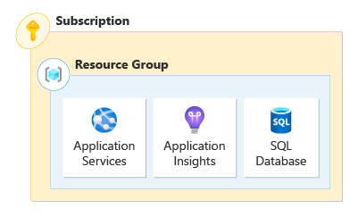
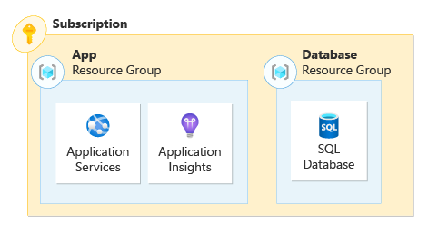
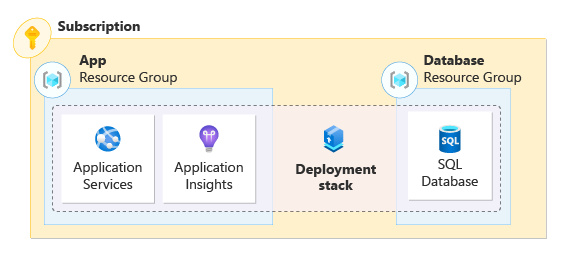

An Azure deployment stack is a type of Azure resource that enables you to manage the lifecycle of a collection of Azure resources as a single atomic unit, even if they span multiple resource groups or subscriptions. It allows for consistent and repeatable deployments, simplifies management, and enables efficient scaling and updating of resources.

In this unit, you learn about resource organization in Azure and how deployment stacks can help you to manage your resources in ways that weren't possible before.

## Resource organization

There are many ways to organize your resources in Azure. You may choose to organize resources based on an environment (production, staging, development), an application lifecycle, or a function (for example, connectivity or compute resources). Factors such as size of your organization, number of applications, and data residency influence these decisions and there are general best practices for each scenario.

For deployment environments, you may separate them into different subscriptions, or even management groups. All of the components of an application may exist in a single resource group, multiple resource groups, or even multiple subscriptions. For Azure resource organization, best practices suggest organizing resources into resource groups based on lifecycle and security.

### Single resource group application

There are times when using a single resource group for your application makes sense. If you're new to Azure and just getting started with a development environment, or deploying a production application without many resources, a single resource group may work.

A resource group is frequently used as a security boundary for permissions. You can manage a single role-based access control (RBAC) assignment at the resource group scope if your security requirements aren't strict.

Let's say your application consists of an app service, application insights, and an SQL database deployed to a single resource group. Your organization has separate teams for managing compute, web applications, and databases. If your organization's security policy requires granular RBAC, it's necessary to scope permissions at the resource scope instead of the resource group scope.



Over time, it's possible that resources unrelated to the application are also deployed to the same resource group. For example, a colleague of yours deploys a new Azure Key Vault and accidentally chooses the wrong resource group at the time of deployment. This scenario may make it tough to determine which resources belong to which application and could potentially lead to issues such as an accidental deletion of a critical resource.

### Multi-resource group application

What happens when your application scales to the point where a change is needed? It might be necessary to take parts of your application and break them out into separate resource groups for simplified security controls. For example, you may place all the compute resources into the compute resource group, the application resources into the application resource group, and all the databases into the database resource group.



This model allows you to scope permissions to the compute, application, and database teams to their appropriate resource groups. While this practice may solve for a problem, you introduced decentralized management. As most deployments in Azure are scoped to the resource group, you no longer have the ability to manage the resources as a single unit.

If application resources are deployed to separate resource groups, it may be difficult to identify what resources are part of the application. You can use Azure Tags to help identify resources in an application, but it's possible that a resource isn't properly tagged.

Deployment operations may need to be performed more than once in the multi-resource group model. When you deploy resources, depending on your method of deployment, it might be necessary to execute multiple deployment commands. Most deployments in Azure are scoped to the resource group, so it would be necessary to deploy your networking resources first, followed by your application resources. The same applies for delete operations. If you need to remove all resource groups related to the application, you might need to execute multiple delete operations.

## Enter deployment stacks

Deployment stacks change how you think about resource organization across resource groups and subscriptions. A deployment stack allows you to group all the resources that make up your application, regardless of where they are in your Azure resource organizational hierarchy. You can manage them as a single unit. With deployment stacks, you're able to perform lifecycle operations on the collection of resources that make up the stack.

Think of deployment stacks as a series of pointers that groups your application's resources into a single unit. Deployment stacks can be created at different scopes, such as resource groups, subscriptions, and management groups.



Consider the example from earlier. By deploying your application and its resources with a single stack, scoped at the subscription level and across resource groups, you can now manage the application as a single unit. Each resource group and its resources are managed by the stack.

### Using deployment stacks

What operations can be performed on deployment stacks? You're able to create, list, update, and delete deployment stacks. For resources, you're able the view the resources in the stack, add and remove resources within the stack, and protect the stack and its resources from deletion.

Creating and deploying a deployment stack and its resources is nearly identical to a standard Azure deployment and it uses the same ARM JSON templates, Bicep files, or template specs you're used to. For example:

The Azure CLI command to deploy a Bicep file to a resource group is:

```azurecli
az deployment group create \
    --resource-group rg-depositsApplication \
    --template-file ./main.bicep
```

The Azure CLI command to create a deployment stack at the resource group scope is:

```azurecli
az stack group create \
    --name stack-deposits \
    --resource-group rg-depositsApplication \
    --template-file ./main.bicep \
    --action-on-unmanage detachAll \
    --deny-settings-mode none
```

Deployment stacks allow for efficient environment cleanup. Deployment stacks allow you to delete the stack and all of its resources through a single API call, without needing to understand dependencies. This feature simplifies the removal of the resources in a reliable way, it improves the speed of resource removal. For example:

The Azure CLI command to delete a deployment stack at the resource group scope along with its resources is:

```azurecli
az stack group delete \
    --name stack-deposits \
    --resource-group rg-depositsApplication \
    --action-on-unmanage detachAll
```

> [!NOTE]
> You may already use complete mode deployments as part of an existing deployment strategy. If you do, consider deployment stacks to be the next evolution, as well as a safer option.

### Managed resources

When you submit a Bicep file, ARM JSON template, or template spec to a deployment stack, the stack becomes responsible for the management of the resources described in the file. Resources managed by the stack are known as *managed resources*, but those resources are still modified through the original template files.

If a resource no longer needs to be managed by the deployment stack, you can modify the stack to no longer include the resource. The *action on unmanage* behavior of a deployment stack determines what happens to a resource that is removed from the deployment stack's definition. This behavior, discussed later in the unit, determines if a resource, resource group, or management groups is detached or deleted from the stack.

### Deny settings

Additionally, you're able to configure a "deny setting" to the stack and its resources that prevent unauthorized changes. These deny assignments are customizable. You're able to set the mode to either no flag, deny delete, or deny write and delete, which may sound similar to Azure locks. Additionally, you can exclude specific actions or service principals from the deny assignments. Consider deny settings an extra layer of protection against accidental modification and deletions.
