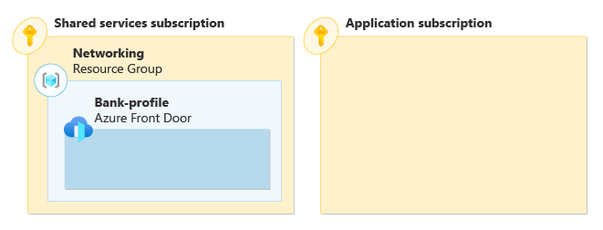
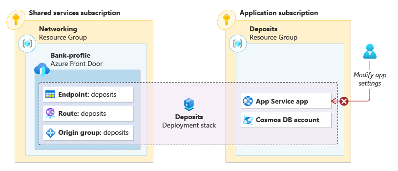
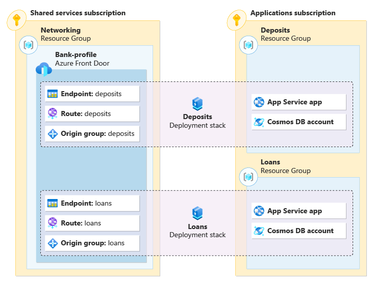

You've spent time learning about deployment stacks and the features they provide. Before you begin to implement deployment stacks in your resource provisioning process, you want to learn more about a scenario that uses them.

In this unit, you review a scenario that uses deployment stacks for grouping resources across resource groups and subscriptions.

## The scenario

Suppose your community bank has an Azure environment with multiple subscriptions. The platform team manages a shared services subscription while the applications team manages a subscription for the bank's user facing applications.

The shared services subscription contains a resource group that contains an Azure Front Door profile. Azure Front Door is a cloud content delivery network (CDN) that provides secure access, HTTP caching, and traffic acceleration to your web content. The platform team manages the profile, but the application teams share this profile for public access to their web apps.

The deposits application team is ready to deploy their application and its corresponding resources. The application is composed of an App Service app, Cosmos DB account, and an Azure Front Door endpoint, route, and origin group. The Front Door resources are child resources of the Front Door profile.

The team first creates a new resource group in the application subscription for the deposit application's resources. Then deposits application team creates the deployment stack scoped at the subscription level triggering a deployment of the application's resources. The deployment stack now manages the application's resources, including the child resources of the Front Door profile in the shared services subscription.

The deployment stack is created or modified with deny settings that prevent any unauthorized changes to the managed resources in the stack. For example, let's say that one of the members of the deposits application team attempts to modify one of the app service's app settings. The modification is blocked dues to the `--denyWriteAndDelete` deny setting applied to the stack.

The loans application, similar to the deposits application, is composed of an App Service app, Cosmos DB account, and an Azure Front Door endpoint, route, and origin group. The loans application team creates the deployment stack scoped at the subscription level. The stack triggers the deployment of a test version of the application's resources. The deployment stack now manages the application's resources, including the child resources of the Front Door profile in the shared services subscription.

After testing is complete, the loans application team removes the deployment stack for the test version of the application. When the stack is removed, it removes resources and resource groups defined in the `actionOnUnmanage` property of the stack.

