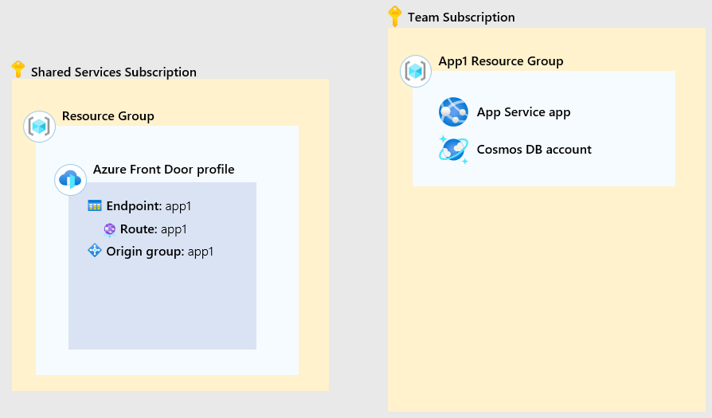
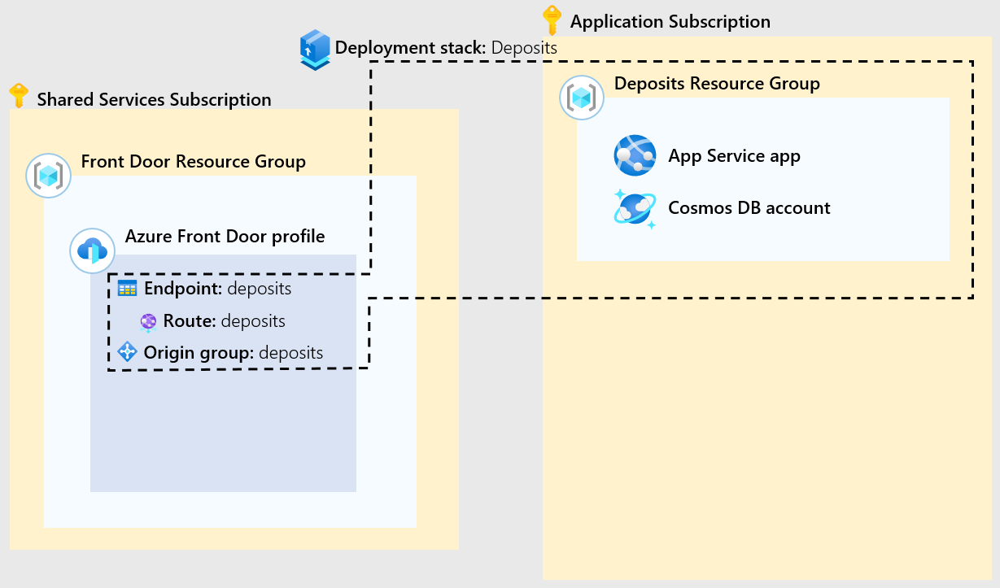
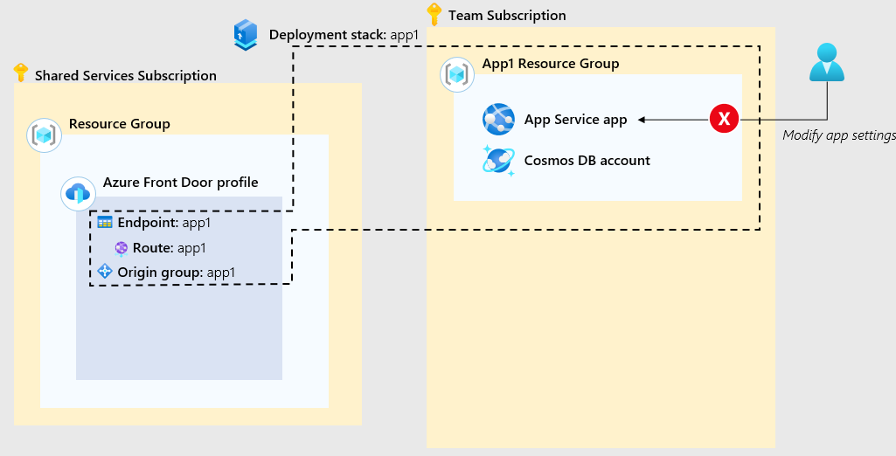
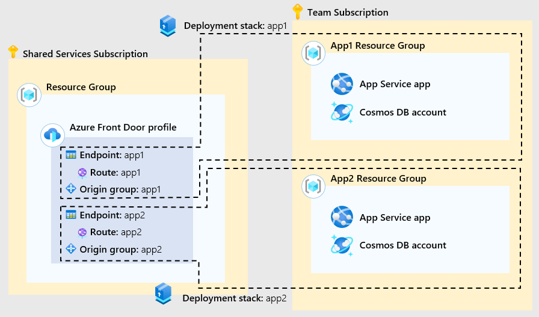
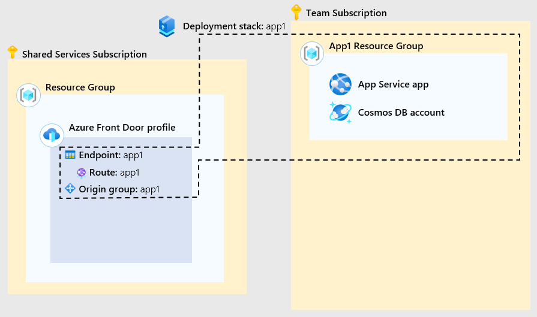

You've spent time learning about deployment stacks and the features they provide. Before you begin to implement deployment stacks in your resource provisioning process, you want to learn more about a scenario that uses them.

In this unit, you review a scenario that uses deployment stacks for grouping resources across resource groups and subscriptions.

## The scenario

Suppose your community bank has an Azure envrionment with multiple subscriptions. The platform team manages a shared services subscription while the applications team manages a subscription for the bank's user facing applications.

The shared services subscription contains a resource group which contains an Azure Front Door profile. This profile will be shared by application teams for public access to their web apps.

The deposits application team is ready to deploy their application and its corresponding resources. The team first creates a new resource group in the application subscription for the deposit application's resources.

The application is comprised of an App Service app, Cosmos DB account, and an Azure Front Door endpoint, route, and origin group. The Front Door resources are child resources of the Front Door profile.

The deposits application team creates the deployment stack scoped at the subscription level triggering a deployment of the application's resources. All of the application's resources are now managed by the stack including the child resources of the Front Door profile in the shared services subscription.

The deployment stack is created or modified with deny settings that prevent any unathorized changes to the managed resources in the stack.

The loans application team creates the deployment stack scoped at the subscription level triggering a the deployment of a test version of the application's resources. All of the application's resources are now managed by the stack including the child resources of the Front Door profile in the shared services subscription.

The loans application team removes the deployment stack for the test version of the application after testing is complete. When the stack is removed it removes resources and resource groups defined in the `actionOnUnmanage` property of the stack.

