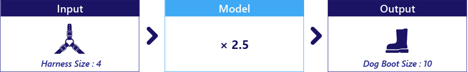
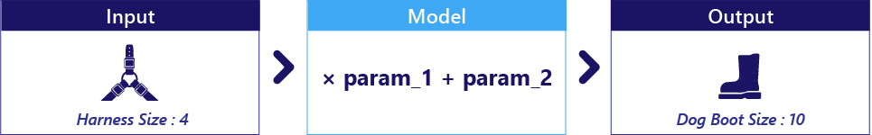
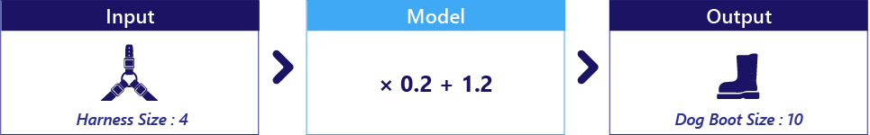
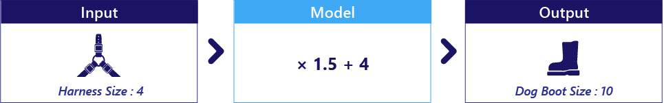

The model is the core component of machine learning, and ultimately what we are trying to build. A model might estimate how old a person is from a photo, predict what you might like to see on social media, or decide where a robotic arm should move to. In our scenario, we want to build a model that can estimate the best boot size for a dog based on their harness size.

Models can be built in lots of ways. For example, a traditional model that simulates how an airplane flies is built by people, using knowledge of physics and engineering. Machine learning models are special—rather than being edited by people so that they work well, machine learning models are shaped by data: they learn from experience.

## How to think about models

A model can be thought of as a function that accepts data as an input and produces an output. More specifically, a model uses input data to estimate something else. For example, in our scenario, we want to build a model that is given a harness size, and estimates boot size:

Note that harness size and dog boot size are data; they are not part of the model. Harness size is our input, Dog boot size is the output.

## Models are often simple code

Models are often not meaningfully different from simple functions you are already familiar with. Like other code, they contain logic and parameters. For example, the logic might be “multiply the harness size by parameter_1”:

If parameter_1 here was 2.5, our model would multiply harness size by 2.5 and return the result:

## Selecting a model

There are many model types, some simple and some complex.

Like all code, simpler models are often the most reliable and easy to understand, whilst complex models can potentially perform impressive feats. Which kind of model should be chosen depends on your goal. For example, medical scientists often work with models that are relatively simple because they are reliable and intuitive. By contrast, AI-based robots typically rely on very complex models.

The first step in machine learning is selecting the kind of model that you would like to use. This means we are choosing a model based on its internal logic. For example, we might select a two-parameter model to estimate dog boot size from harness size:

Notice how we have selected a model based on how it works logically, but not based on its parameter values. In fact, at this point the parameters have not yet been set to any particular value.

## Parameters are discovered during training

Parameter values are not selected by the human designer. Instead, parameter values are set to an initial guess, and then adjusted during an automated learning process called training.

Given our selection of a two-parameter model (above), we now provide random guesses for our parameters:

These random parameters will mean the model isn’t good at estimating boot size, so we perform training. During training, these parameters are automatically changed to two new values that give better results:

Exactly how this process works is something we will progressively explain throughout your learning journey.