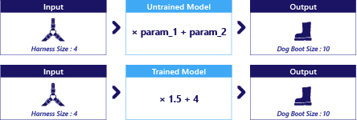

The goal of training is to improve a model so that it can make high-quality estimations or predictions. Once trained, you can use a model in the real world like normal software.

Models don’t train themselves. They're trained using data plus two pieces of code, the *objective function* and the *optimizer*. Let’s explore how these components work together to train a model to work well.

## The objective

The objective is what we want the model to be able to do. For example, the objective of our scenario is to be able to estimate a dog’s boot size based on their harness size.

So that a computer can understand our objective, we need to provide our goal as a code snippet called an objective function (also known as a cost function). Objective functions judge whether the model is doing a good job (estimating boot size well) or bad job (estimating boot size badly). We cover objective functions in more depth in later learning material.

## The data

Data refers to the information that we provide to the model (also known as inputs). In our scenario, the input is harness size.

Data also refers to information that the objective function might need. For example, if our objective function reports whether the model guessed the boot size correctly, it needs to know the correct boot size! For this reason, in our previous exercise, we provided both harness sizes and the correct answers to the training code.

We'll practice working with data in the next exercise.

## The optimizer

During training, the model makes a prediction, and the objective function calculates how well it performed. The optimizer is code that then changes the model’s parameters so the model will do a better job next time.

How an optimizer adjusts the parameters is complex, and something we cover in later material. Don’t be intimidated, though; we don’t normally write our own optimizers, we use open-source frameworks where the hard work has been done for us.

It's important to keep in mind that the objective, data, and optimizer are simply a means to train the model. They aren't needed once training is complete. It's also important to remember that training only changes the parameter values inside of a model; it doesn't change what kind of model is used.