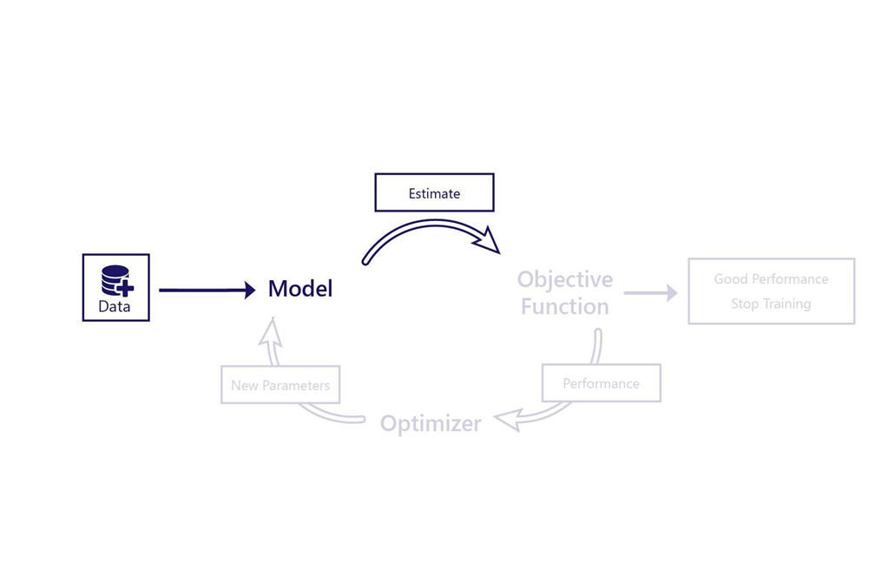

Let’s revise how these parts fit together to train a model. 

## Training versus using a model

It's important to make a distinction between training and using a model.

Using a model means providing inputs and receiving an estimation or prediction. We do this process both when we're training our model and when we or our customers use it in the real world. Using a model normally takes less than a few seconds.

In contrast, training a model is the process of improving how well a model works. Training requires that we use the model, the objective function, and the optimizer, in a special loop. Training can take minutes or days to complete. Usually, we only train a model once. Once it's trained, we can use it as many times as we like without making further changes.

For example, in our avalanche-rescue dog store scenario, we want to train a model, using a public dataset. The dataset changes the model so that it can predict a dog’s boot size based on its harness size. Once our model is trained, we use the model as part of our online store to make sure customers are buying doggy boots that fit their dogs.

## Data for use, data for training

Recall that a dataset is a collection of information about objects or things. For example, a dataset might contain information about dogs:

|Dog ID|Boot Size|Harness Size| Dog Color| Breed|
|----------|-------------|-----|-----|-----|
| 0     |   27    |  12   |   Brown  |  St Bernard   |
|  1    |    26   |   11 |  Black   |   Labrador  |
|   2   |     25 |   10  |  White   |  Labrador   |
|   3   |    29  |   14  |  Black   |  Black Shepherd |

When we use our model, we only need the column(s) of data that the model accepts as input. These columns are called **features**. In our scenario, if our model accepts harness size and estimates boot size, then our **feature is harness size**.

During training, the objective function usually needs to know both the model’s output and what the correct answer is. These values are called **labels**. In our scenario, if our model predicts boot size, then **boot size is our label**.

So, to use a model, we only ever need features, while during training we usually need both features and labels. During training in our scenario, we need both our harness-size feature and our boot-size label. When we use our model in our website, we only need to know the harness-size feature; our model then estimates the boot size for us to use.

## I've finished training. What now?

Once a model has finished training, you can save it to a file by itself. **We no longer need the original data, the objective function, or the model optimizer**. When we want to use the model, we can load it from disk, provide it with new data, and get back a prediction.

In our next exercise, we practice saving a model, loading it from disk, and using it as we would in the real world. To complete our online store scenario, we also practice using the model's outputs to warn our customers if they seem to be buying the wrong sized doggy boots.
