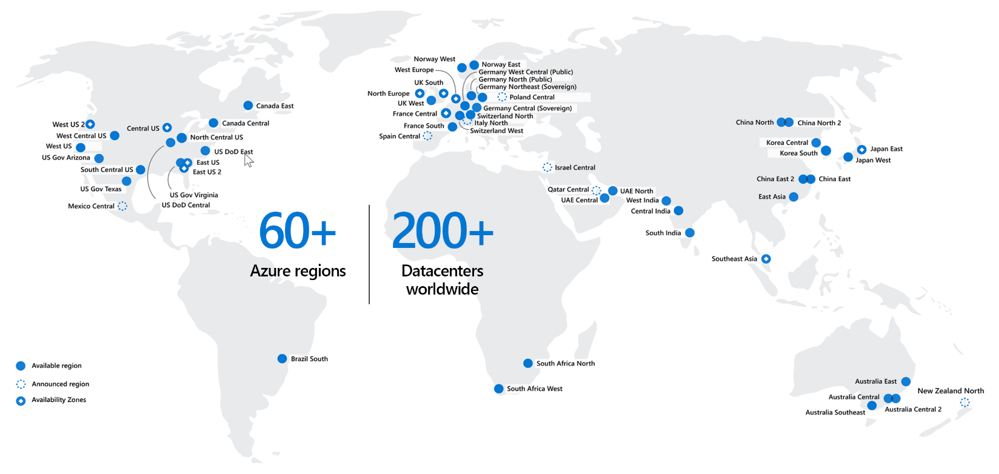

Now that you know something about the physical aspects of Microsoft datacenters, you want to understand where these services run and how those locations might align with Contoso's global computing initiatives.

Microsoft places datacenters around the world to optimize the user experience and ensure data sovereignty. The Microsoft Cloud consists of a hierarchy with geographies at the top level, and regions with one or more datacenters under those geographies. A geography is generally a country/region - for example, Japan, Canada, Chile, Norway, or the United States - and typically represents the boundaries required for data sovereignty. Broader geographies, like Europe or Asia-Pacific, encompass more than one country/region. Microsoft runs over 60 datacenter regions globally, across more than 30 geographies.

Each geography includes one or more regions. For example, the United States have six regions with four more planned, while Brazil and Norway each have a single region. 

Regions can include multiple datacenters connected through a dedicated, regional, low-latency network. All regional datacenters lie within a perimeter defined to meet Microsoft's required network response time. This design ensures that services within any region offer the best possible performance and security. It also helps ensure that organizations have options for how to implement redundancy and failover in case an entire datacenter goes down. Inside each datacenter, local redundancy is built into the storage systems and applications can be created to take advantage of multiple servers inside a single datacenter. 

From experience, you know how vulnerable your operation can be if you run apps in a single datacenter. Imagine if that datacenter was hit with flooding that caused an outage. You might wonder what Microsoft offers to address the problems caused when a single datacenter goes down. This scenario is where availability zones come into play. Understanding Azure geographies and regions (and availability zones) can help Contoso operate in regions that support its business continuity and business expansion goals. And when it's no longer beneficial to pursue operations in a particular geography, cloud operations make it easy to decommission applications rather than an entire datacenter.
