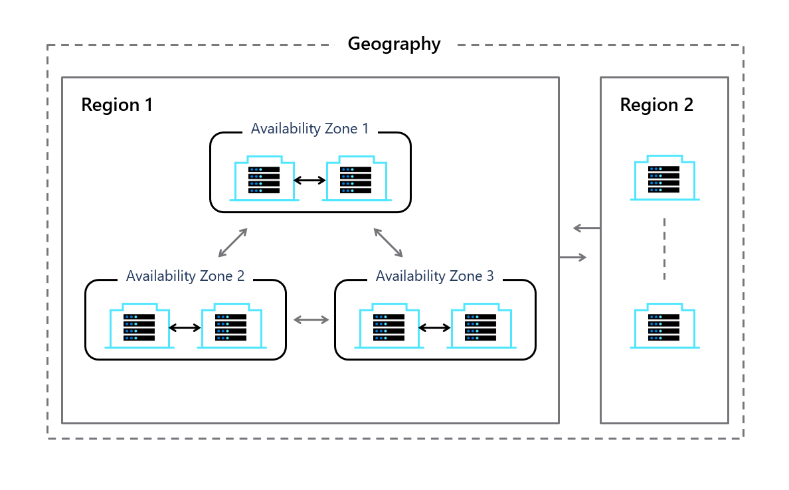

You've had to manage the crisis of having an entire datacenter fail, which can happen in areas with intermittent power or extreme weather. Outages cost significant time and money to plan for and deal with, which has kept Contoso from expanding into geographies that might otherwise be good for business.

Mitigating the risk of outages is one of the reasons why you're especially interested in any Microsoft datacenter capabilities that help you address issues around redundancy, uptime of applications, and availability of data. You want to make sure that a single datacenter failure won't bring down Contoso's operations.

## How do availability zones work?

You'll recall that regions reside within geographies. Availability zones reside within regions. Availability zones are physically separate datacenter locations within each Azure region that are tolerant to local failures, which can range from software and hardware failures to events such as earthquakes, floods, fires, or other disasters. Overall, datacenters deliver tolerance to failures through redundancy and logical isolation of services. Not all regions contain availability zones, but many do, and more are planned.

To help ensure resiliency and tolerance to failure, Microsoft offers a minimum of three separate availability zones in all availability zone-enabled regions. Each zone is comprised of one or more datacenters equipped with independent power, cooling, and networking infrastructure. Even if one zone is affected, the other two zones can deliver regional services, capacity, and high availability. 

Availability zones and associated datacenters are connected by a high-performance network with a round-trip latency of less than 2 ms. This low latency design requirement helps keep data synchronized and accessible when things go wrong. With availability zones, you can design and operate applications and databases that automatically transition between zones to avoid interruption. Azure availability zones are highly available, fault-tolerant, and more scalable than traditional single- or multiple-datacenter infrastructures.

## Availability zones and resiliency

By choosing Azure services that support availability zones, Contoso can design resilient solutions that will survive outages in one area. 

You can configure these services in two ways: _zone redundant_, with automatic replication across zones, or _zonal_, with instances pinned to a specific zone. You can also combine these approaches to create maximum efficiency by balancing cost, value, and risk for implementations.

Some organizations, including Contoso, might also require protection from disasters that could take down an entire region. Cross-region replication and disaster recovery add another layer of capability that help ensure that data and applications are available even in the event of major disruptions to an entire region.

With what you've learned, you can help Contoso co-locate compute, storage, networking, and data resources across an availability zone and replicate this arrangement in other availability zones.
