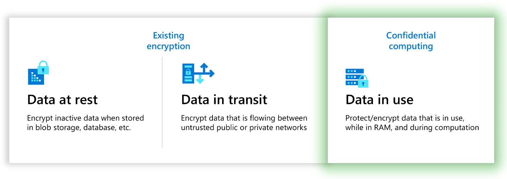

As in many organizations, Contoso's executive team prioritizes data and application privacy. Contoso systems handle significant amounts of sensitive data, intellectual property, and government solutions around the world. For that reason, you want to understand how CPU-enabled, secure computing in Azure can help your organization protect data and applications.

You're also working on machine-learning models that use sensitive data that Contoso considers intellectual property. What if Contoso could set up a secure environment in Azure and run machine-learning workloads to speed analysis by using preferred machine-learning frameworks? To make a business case for this workload, you want to be able to communicate how Microsoft addresses data privacy and security in its cloud operations. You also want to be able to describe new developments that can help secure data and the execution of applications.

## Data privacy and security

As you learn, Microsoft takes data privacy and security seriously. All data is encrypted at rest and in transit to help ensure privacy and security. Data isn't only encrypted, it's triple-replicated in a datacenter for secure availability of 11 nines. For even higher availability, this encrypted data can be replicated across availability zones and even across geographies with the same level of security. 

Microsoft has even implemented immutable data concepts in both blob storage and SQL Server in Azure to ensure that data is never changed. You begin to understand that you can help Contoso enable secure, highly available, and immutable data. You're also interested in Microsoft's award-winning blockchain technology, which Contoso might include in its global purchasing environment. 

Microsoft doesn't inspect, approve, or monitor applications that customers deploy to Azure. Moreover, Microsoft doesn't know what kind of data customers choose to store in Azure. Microsoft doesn't claim ownership of any of the data or information that customers enter into Azure.

By default, Microsoft operations and support can't access customer data. When customers grant access to data related to a support case, access is granted with a just-in-time model that uses policies that are audited and vetted against Microsoft compliance and privacy policies. Access-control requirements are established by the following Azure security policies:

- No access to customer data, by default.

- No user or administrator accounts on customer VMs.

- Grant the least privilege that's required to complete the task, and audit and log access requests.

Your CIO wants to understand how Microsoft addresses a few other concerns, which include:

**Data destruction**: When customers delete data or leave Azure, Microsoft follows strict policies for deleting data. Microsoft also systematically destroys decommissioned hardware. 

**Records management**: Microsoft has established internal records-retention requirements for back-end data. Contoso is responsible for identifying its own record retention requirements, like extracting data and retaining content outside of Azure for the retention period. Microsoft allows customers to export data and audit reports from Azure and save them locally.

**Cloud security investments**: Microsoft invests over $1 billion annually in security. It has 3,500 security experts and tracks over 6.5 trillion security-related signals every day. Microsoft also runs the Microsoft Security Response Center, which is on the front line of protecting customers and Microsoft from current and emerging threats that are related to security and privacy. 

By using the Microsoft Cloud, Contoso can strengthen its security and privacy posture for global operations, compared to what it's able to do on-premises.

## Confidential computing

To replace its secure datacenters, you know that Contoso will require high security and confidentiality, which is why Microsoft's Confidential Computing initiatives are so vital to your research.

_Confidential computing_ is an industry term defined by the [Confidential Computing Consortium](https://confidentialcomputing.io/) (CCC) - a foundation dedicated to defining and accelerating the adoption of confidential computing. The CCC defines confidential computing as “the protection of data in use by performing computations in a hardware-based trusted execution environment (TEE).”

A TEE is an environment that enforces execution of only authorized code. Any data in the TEE can't be read or tampered with by any code outside that environment. This capability enhances the security of the application while it's being executed in the CPU. 

As a result, the confidential computing threat model minimizes the ability of a cloud provider and other actors in the tenant's domain to access code and data as it's being executed.

When used with data encryption at rest and in transit, confidential computing protects sensitive or highly regulated datasets and application workloads in a secure public cloud platform. Confidential computing extends beyond generic data protection. TEEs are also being used to protect proprietary business logic, analytics functions, machine-learning algorithms, and entire applications.

## Reducing the attack surface

The trusted computing base (TCB) refers to all a system's hardware, firmware, and software components that provide a secure environment. All the components inside the TCB are considered to be critical. If one component inside the TCB is compromised, the security of the entire system can be jeopardized. 

Azure confidential computing makes it easier to trust the cloud provider by reducing the need for trust across the compute cloud infrastructure - the host operating system kernel, the hypervisor, the VM admin, and the host admin.

Azure confidential computing enables these key security capabilities:

- **Prevent unauthorized access**: Run sensitive data in the cloud. Trust that Azure provides the best data protection possible, with little to no change from what gets done today.

- **Meet regulatory compliance**: Migrate to the cloud, keep full control of data to satisfy government regulations for protecting personal information, and secure organizational IP.

- **Ensure secure and untrusted collaboration**: Tackle industry-wide work-scale problems by combing data across organizations (even competitors) to unlock broad data analytics and deeper insights.

- **Isolate processing**: Offer a new wave of products that remove liability on private data by using blind processing. User data can't even be retrieved by the service provider.

Bringing confidential computing to life in Azure are technologies like [Intel Software Guard Extensions](https://www.intel.com.au/content/www/au/en/architecture-and-technology/software-guard-extensions-enhanced-data-protection.html) (Intel SGX) and [AMD Secure Encrypted Virtualization](https://www.amd.com/en/developer/sev.html) (SEV-SNP). These CPU technologies are delivered as virtualization extensions and provide feature sets including memory encryption and integrity, CPU-state confidentiality and integrity, and attestation, for building the confidential computing threat model.

Remember that secure environment you were thinking Contoso could build in Azure to run machine-learning workloads? Confidential computing appears to be key. Azure confidential computing powered by NVIDIA GPU VMs - a capability that's currently in preview - will bring together trusted-VM security with secure boot and vTPM coupled with up to four NVIDIA A100 Tensor Core GPUs. You'd get an added layer of confidence knowing that the GPU-enabled VM boots and runs within a trusted environment. Contoso could take advantage of GPU performance for its workloads while the confidentiality of Contoso data remains intact. 

You can see that when you need to place applications and databases that require confidential computing or extra privacy, you'll want to make sure that these security options are supported in your Azure region.
