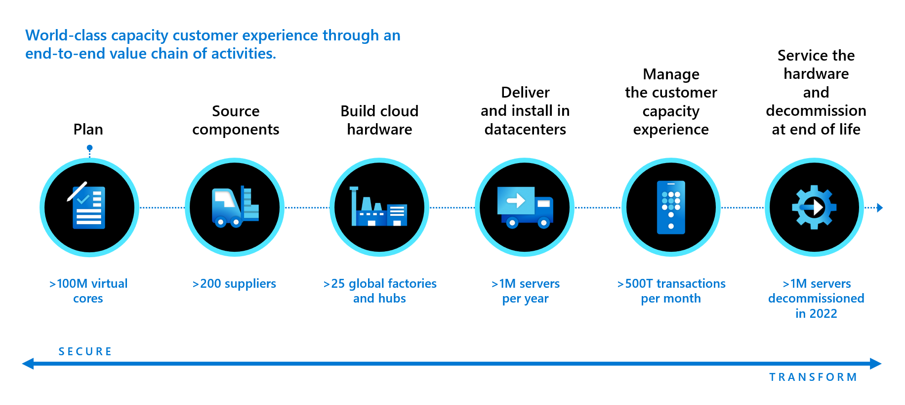

Your CIO (Chief information officer) is especially interested in Microsoft support operations for Azure datacenters. When Contoso applications and workloads don't work, whether they're on-premises or in the cloud, the CIO is accountable.

That heavy responsibility requires you to investigate how Microsoft delivers support and supports its own datacenters and infrastructure. You consider the metrics that count with on-premises datacenters: equipment refresh rates and customer support service-level agreements (SLAs).

*Equipment refresh* refers to a datacenter's ability to replace servers, disk drives, networking gear, and other supporting areas on a timely basis before the technology becomes obsolete. You learn that Microsoft is on a two-year refresh cycle for servers. The company is constantly adding new servers, storage, and networking gear as datacenters expand, or when it adds new capabilities or even new geographies, regions, or entire datacenters.

Managing hardware refreshes and upgrades in a large-scale computing environment is complex, as you know. To support massive numbers of customer transactions, the Microsoft Cloud contains around 130 million virtual cores and supporting infrastructure from over 200 suppliers. The company installs approximately 1 million servers per year, and it decommissioned over 1 million servers in fiscal 2022. Microsoft investments in supply chain efficiencies led to being the winner of Gartner's 2022 Supply Chain Award for Social Impact. Microsoft is on a mission to become carbon-negative, zero-waste, and water-positive by 2030. Circularity enables this mission by creating regenerative and restorative cycles for everything it produces. Microsoft Circular Centers offer a proven approach, achieving circularity at scale with a zero-waste plan for every part.

The other major area of concern is SLAs across both the online services and customer support:

- Online services SLAs: Microsoft provides SLAs with a commitment for uptime and connectivity for each service. Online service SLAs range from 99.9% to 99.99% for paid services. Free tiers and preview products generally have no SLAs. 

- Customer support SLAs: When issues arise, as happens in every datacenter, you want to be able to seek and receive support from Microsoft. The following levels of support are available:

  - Basic support is included, and lets you access self-help resources and submit as many support tickets as you need. 
  
  - Paid support tiers increase available resources and decrease response times. Tiers include Developer, Standard, Professional Direct, and Enterprise. Developer support is for trial and nonproduction environments, Standard is for production workloads. Professional Direct and Enterprise include business-critical applications, and response times of within one hour are available. In addition, Professional Direct and Enterprise include consultation and proactive guidance from delivery managers, which help to ensure successful operation and deployment.

## Extensive guidance

These free resources can help you at every point in your cloud journey. 

**Documentation and Microsoft Learn.** These foundational resources help you understand Microsoft cloud technologies. Documentation and self-serve skilling modules cover key aspects of Azure products and services.

**Cloud Adoption Framework.** Find guidance and best practices to help you adopt the cloud and achieve business outcomes. Download information, tools, and assessments to help you understand your readiness for cloud adoption. Get guidance to help you define strategies for eight critical design areas. Including identity and access management, management group and subscription organization, network topology, and connectivity.

**Azure Well-Architected Framework.** Guiding tenets help you improve the quality of a workload. The framework contains information covering the five pillars of architectural excellence: reliability, security, cost optimization, operational excellence, and performance efficiency. 

**Azure Architecture Center.** Find guidance for architecting solutions on Azure by using established patterns and practices. The site contains detailed guidance for specific technology areas, to include AI and machine learning, analytics, databases, high-performance computing, IoT, VMs, SAP solutions, and more. 

When you understand Microsoft datacenter processes and support programs, and available resources, you can use them to support Contoso cloud migration, adoption, and operation. You can help executives more accurately assess the cost-benefit of moving on-premises workloads to Azure cloud infrastructure, avoiding the cost of new equipment.
