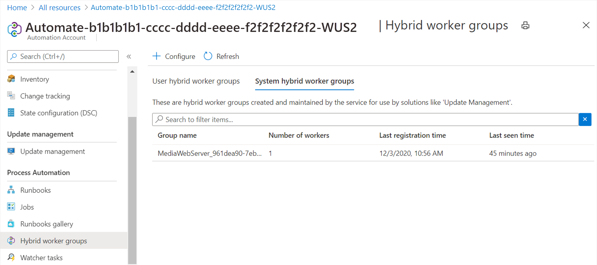

 Your PIO wants to set up a virtual machine to serve as a web resource for local media outlets. It is imperative that this virtual machine is as protected as it can be to prevent unauthorized access. As part of your security profile, you want to implement Update Management on this VM so that you can ensure that it is always up-to-date with the latest security patches. 

## Create a virtual machine

Here you will create a new virtual machine to serve as a web server for the local media.

1. Sign in to the [Azure portal](https://portal.azure.com/?azure-portal=true).
2. In the left navigation pane, click **Create a resource**.
3. In the **New** pane, click **Windows Server 2016 Datacenter**.
4. Enter the following values in the **Create a virtual machine** window:

    | Field                | Value                                                    |
    |----------------------|----------------------------------------------------------|
    | Subscription         | *Select your Azure subscription*                         |
    | Resource group       | Create a new resource group named "mslearn-vmupdate"     |
    | Virtual machine name | MediaWebServer                                           |
    | Region               | *Select the region nearest you*                          |
    | Availability options | No infrastructure redundancy required                    |
    | Image                | Windows Server 2016 Datacenter                           |
    | Size                 | Select **Change size** and select **B2s** from the list  |
    | Username             | *Create a username of your choice and note it for later* |
    | Password             | *Create a password of your choice and note it for later* |

5. In the **INBOUND PORT ROLES** section, choose **Allow selected ports** in the **Public inbound ports** field. Select HTTP, HTTPS, and RDP as shown below.

6. Click **Review + create** and then click **Create**. Wait for the VM to be created. You can click the Bell icon in the upper right corner of the portal to monitor the progress.

## Onboard Update Manager to the VM

Here you'll enable Update Manager on the virtual machine you created.

1. In the left pane, click **Virtual machines**.
2. In the **Virtual machines** pane, select the virtual machine from the list. In this example, select **MediaWebServer**.
3. In the MediaWebServer pane, scroll down the list to **Operations**, and then click **Update management**.
4. In the **Update Management** pane, ensure that the **Enable for this VM** radio button is selected. Note that a default **Log Analytics workspace** and **Automation account** will be created. Accept the remaining defaults, and then click **Enable**.
5. In the upper left corner, click the Notification bell and wait for deployment to finish.
6. When Update Management deployment has completed, the Update Management menu will appear as shown below.

7. Wait for at least 15 minutes while Update Management configures the virtual machine.
8. When Update Management configuration is complete, the Update Management pane will appear as shown below.

9. **Compliance** is now complete, that the **Failed update deployments** counter is now configured, and that in this example, Update Management has identified that there is a Cumulative Update for Windows Server available. To the right of the notification of the Cumulative Update, under **INFORMATION LINK** that there is a link to the knowledge base article for this Cumulative Update. 

## Examine Hybrid Worker Groups

1. In the left navigation pane, click **All resources**.
1. In the **All resources** pane, examine the **TYPE** column to find the resource of type **Automation Account**, and then click the Automation account.
1. In the Automation account pane, scroll down to the **Process Automation** section and in there, click **Hybrid worker groups**.
1. In the Hybrid worker groups pane, click the **System hybrid worker groups** tab.
1. The virtual machine you created is listed as shown below. 

