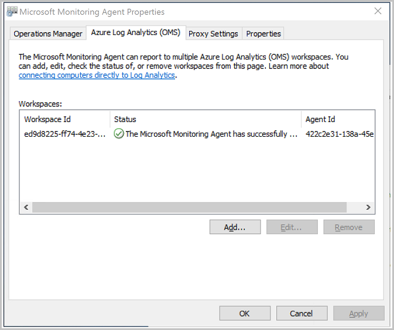
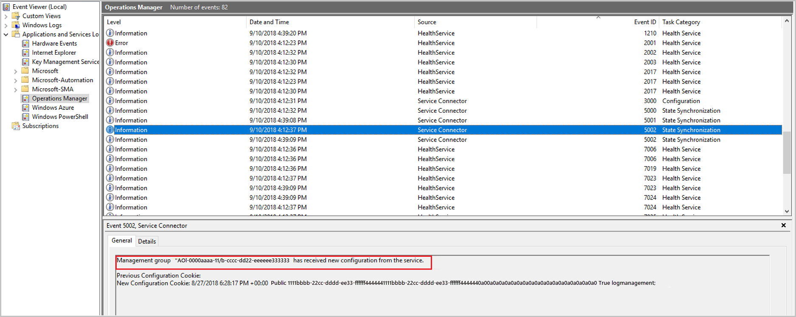

Recently your department moved all of their infrastructure to Azure. There are many VMs serving up web sites and email functions. You have been tasked to keep these VMs up to date with the latest patches and security releases. You decide to roll out the Update Management solution to all of the VMs in your enterprise. 

In the following exercise you will review the agent connectivity to log analytics and, learn how to schedule update deployments.

## Review Agent Connectivity to Log Analytics

Perform the following steps in the Azure portal to assess if connectivity between the agent and log analytics has taken place. Start by signing into the [Azure portal for sandbox](https://portal.azure.com/learn.docs.microsoft.com?azure-portal=true) using the same account with which you activated the sandbox.

1. In the portal, click on the **Virtual machines** option in the left pane and click on the newly create virtual machine.
2. Click on the **Overview** menu option.
3. In the virtual machine page, make note of the **Public IP Address** as shown below.

4. On your local computer, click the Windows icon and type **Remote Desktop Connection** then click the **Remote Desktop Connection** app.
5. In the **Remote Desktop Connection** app, type the public IP address into the **Computer** field, and then click **Connect**.
6. In the **Enter your credentials** dialog box, type the password that you specified when you created the virtual machine, and then click **OK**.
7. In the certificate warning dialog, click **Yes**.
8. On the remote machine, click the Windows icon, and then click the **Control Panel** tile.
9. In Control Panel, open **Microsoft Monitoring Agent** and then click on the **Azure Log Analytics (OMS)** tab.
10. Observe that the agent displays the following message: **The Microsoft Monitoring Agent has successfully connected to Log Analytics.** as shown below.

10. Click **OK** to close the **Microsoft Monitoring Agent Properties** window.
11. In the **All Control Panel Items** window, click **Administrative Tools**.
12. In the **Administrative Tools** window, double-click **Event Viewer**.
13. Expand **Applications and Services Logs**, and then click **Operations Manager**, and then maximize the **Event Viewer** window.
14. In the **Operations Manager** view, click the **Event ID** column heading to sort the list by Event ID.
15. Observe Event IDs 3000 and 5002. These events indicate that the computer has registered with the Log Analytics workspace and is receiving configuration. Event ID 5002 is shown below.

16. Close the Event Viewer and all other windows that were opened.
17. Close the Remote Desktop Connection application.

## Schedule Update Deployments

Here you will learn how to schedule updates for the virtual machine.

1. In the **MediaWebServer - Update management** pane, click **Schedule update deployment** tab. 
2. In the **Name** field, type **Critical and Security Updates**
3. In the **Update classifications** drop down list, check only **Critical updates** and **Security updates**.
4. In the **Schedule settings** field, under **Starts** increment the time up one hour.
5. In the **Recurrence** field, click **Recurring**.
5. In the **Recur every** field, configure update to occur once every week on Sunday as shown below, and then click **OK**.

6. In the **New update deployment** pane, click **Create**.