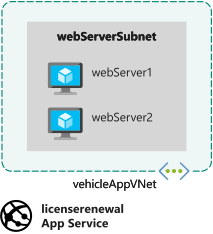

In the motor vehicle department system, you decide to run the web app on two servers. You implement each server using a virtual machine.

In this exercise, you create a pair of virtual machines and install the vehicle registration web app. You also configure a virtual network that Application Gateway can use to connect to the virtual machines. Finally, you deploy the license renewal web site to an instance of Azure App Service.



## Create virtual machines and deploy the vehicle registration site

1. Open the [Azure Cloud Shell](https://shell.azure.com/?azure-portal=true) in your browser, and log in to the directory with access to the subscription in which you want to create resources.

1. Run the following command in the Cloud Shell to create a variable to store your resource group name, and a resource group for your resources. Replace `<resource group name>` with a name for your resource group, and `<location>` with the Azure region in which you'd like to deploy your resources.

    > [!NOTE]
    > If you need to find the location name, you can use the following command: `az account list-locations -o table`

    ```azurecli
    RG=<resource group name>
    az group create --name $RG --location <location>
    ```

1. In the Cloud Shell window, run the following command. This command uses the Azure command-line interface to create a virtual network named `vehicleappvnet`. It's a private network that provides addresses in the range 10.0.0.0 to 10.0.255.255. The command also creates a subnet called `webServerSubnet`, with the address range 10.0.1.0 to 10.0.1.255. This subnet contains the virtual machines.

    ```azurecli
    az network vnet create \
      --resource-group $RG \
      --name vehicleAppVnet \
      --address-prefixes 10.0.0.0/16 \
      --subnet-name webServerSubnet \
      --subnet-prefixes 10.0.1.0/24
    ```

1. To download the script that creates the virtual machines, run the following command:

    ```bash
    git clone https://github.com/MicrosoftDocs/mslearn-load-balance-web-traffic-with-application-gateway module-files
    ```

1. To create and configure the virtual machines for the web servers, run the following commands. The virtual machines are called `webServer1` and `webServer2`. Each virtual machine runs Ubuntu Server. An administrative user account is created for each virtual machine, with the login name `azureuser`. Each virtual machine has the vehicle registration web app installed.

    The first command runs asynchronously to enable both virtual machines to be created simultaneously.

    ```azurecli
    az vm create \
      --resource-group $RG \
      --name webServer1 \
      --image UbuntuLTS \
      --admin-username azureuser \
      --generate-ssh-keys \
      --vnet-name vehicleAppVnet \
      --subnet webServerSubnet \
      --public-ip-address "" \
      --nsg "" \
      --custom-data module-files/scripts/vmconfig.sh \
      --no-wait
    ```

    ```azurecli
    az vm create \
      --resource-group $RG \
      --name webServer2 \
      --image UbuntuLTS \
      --admin-username azureuser \
      --generate-ssh-keys \
      --vnet-name vehicleAppVnet \
      --subnet webServerSubnet \
      --public-ip-address "" \
      --nsg "" \
      --custom-data module-files/scripts/vmconfig.sh
    ```

1. To confirm both virtual machines were created successfully, run the following command:

    ```azurecli
    az vm list \
      --resource-group $RG \
      --show-details \
      --output table
    ```

    You should get output similar to the following. Before continuing, ensure the **PowerState** is **VM running** for both virtual machines.

    ```output
    Name          ResourceGroup      PowerState    PublicIps    Fqdns    Location        Zones
    ------------  -----------------  ------------  -----------  -------  --------------  -------
    webServer1    MyResourceGroup    VM running                          southcentralus
    webServer2    MyResourceGroup    VM running                          southcentralus
    ```

You have now created the virtual machines running the vehicle registration web app. Both virtual machines are identical and are part of the same virtual network.

## Create App Service and deploy the license renewal site

1. To start, to generate a unique name for the website, run the following command:

    ```bash
    APPSERVICE="licenserenewal$RANDOM"
    ```

1. Next, to create the App Service plan the web app uses, run the following command:

    ```azurecli
    az appservice plan create \
        --resource-group $RG \
        --name vehicleAppServicePlan \
        --sku S1
    ```

1. Lastly, create the web app and deploy the license renewal site:

    ```azurecli
    az webapp create \
        --resource-group $RG \
        --name $APPSERVICE \
        --plan vehicleAppServicePlan \
        --deployment-source-url https://github.com/MicrosoftDocs/mslearn-load-balance-web-traffic-with-application-gateway \
        --deployment-source-branch appService 
    ```

Now, let's take a closer look at configuring Application Gateway.
