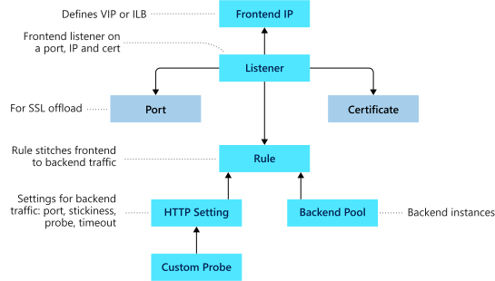

Application Gateway comprises a series of components that combine to route requests to a pool of web servers and to check the health of these web servers. Let's take a look at how these components are related and what role they play in an Application Gateway.

### Front-end IP address

Client requests are received through a *front-end IP address*. You can configure Application Gateway to have a public IP address, a private IP address, or both. Application Gateway can't have more than one public and one private IP address.

### Listeners

Application Gateway uses one or more *listeners* to receive incoming requests. A listener accepts traffic arriving on a specified combination of protocol, port, host, and IP address. Each listener routes requests to a back-end pool of servers following routing rules that you specify. A listener can be *Basic* or *Multisite*. A Basic listener only routes a request based on the path in the URL. A Multisite listener can also route requests using the hostname element of the URL.

Listeners also handle SSL certificates for securing your application between the user and Application Gateway.

### Routing rules

A *routing rule* binds a listener to the back-end pools. A rule specifies how to interpret the hostname and path elements in the URL of a request, and how to direct the request to the appropriate back-end pool. A routing rule also has an associated set of HTTP settings. These settings indicate whether (and how) traffic is encrypted between Application Gateway and the back-end servers, and other configuration information such as:

- Protocol (HTTP or HTTPS).
- Session stickiness, to pass all requests in a client session to the same web server rather than distributing them across servers with load balancing.
- Connection draining to enable the graceful removal of servers from a back-end pool.
- Request timeout period, in seconds.
- Health probes, specifying a probe URL, time-out periods, and other parameters used to determine whether a server in the back-end pool is available.

### Back-end pools

A *back-end pool* references a collection of web servers. You provide the IP address of each web server and the port on which it listens for requests when configuring the pool. Each pool can specify a fixed set of virtual machines, a virtual machine scale-set, an app hosted by Azure App Services, or a collection of on-premises servers. Each back-end pool has an associated load balancer that distributes work across the pool

### Web application firewall

The *web application firewall* (WAF) is an optional component that handles incoming requests before they reach a listener. The web application firewall checks each request for many common threats, based on the *Open Web Application Security Project* (OWASP). These include:

- SQL-injection
- Cross-site scripting
- Command injection
- HTTP request smuggling
- HTTP response splitting
- Remote file inclusion
- Bots, crawlers, and scanners
- HTTP protocol violations and anomalies

OWASP has defined a set of generic rules for detecting attacks called the *Core Rule Set (CRS)*. The rule sets are under continuous review as attacks evolve in sophistication. WAF supports two rule sets, CRS 2.2.9 and CRS 3.0. CRS 3.0 is the default and more recent of these rule sets. If necessary, you can opt to select only specific rules in a rule set, targeting certain threats. Additionally, you can customize the firewall to specify which elements in a request to examine, and limit the size of messages to prevent massive uploads from overwhelming your servers.

You can enable WAF on your Application Gateway by selecting the `WAF` tier when you create a gateway.

### Health probes

Health probes are an important element in assisting the load balancer to determine which servers are available for load balancing in a back-end pool. Application Gateway uses a health probe to send a request to a server. If the server returns an HTTP response with a status code between 200 and 399, the server is deemed healthy.

If you don't configure a health probe, Application Gateway creates a default probe that waits for 30 seconds before deciding that a server is unavailable.

## Application Gateway network requirements

Application Gateway requires a virtual network in which to operate. You must create this virtual network and a dedicated subnet before setting up Application Gateway. Application Gateway uses a number of private addresses for internal use and for communicating with each instance if the gateway scales out. For example, if you plan on scaling out to four instances, create a /28 size subnet. If you're likely to scale to more instances, then create a bigger subnet.

You can expose the Application Gateway through a public IP address, or you can keep it private by only giving it a private IP inside virtual network. This is useful if you have internal sites that you would like to use Application Gateway to provide load balancing.

## Application Gateway options

You can create an Application Gateway on the *Standard* tier or the *WAF* tier. You also have a choice of three sizes with varying performance, pricing, and scalability: Small, Medium, and Large.

The *Standard* and *WAF* tiers are available in two versions, V1 and V2. V2 supports Azure availability zones, but is currently in preview.

Application Gateway supports manual scaling and autoscaling. If you select autoscaling, Application Gateway will scale out and in automatically according to the application traffic. You can limit the maximum and minimum number of instances of Application Gateway.

## Create and configure a gateway

You can create and configure Application Gateway using the Azure portal, Azure PowerShell, or the Azure CLI. For Azure CLI, use the `az network application-gateway create` command to create a new gateway. If you prefer PowerShell, you can use the `New-AzApplicationGateway` cmdlet. You can also use the Azure portal to perform most operations.

You can examine and modify the configuration of the components in a gateway using the `az network application-gateway http-listener`, `az network application-gateway rule`, `az network application-gateway address-pool`, `az network application-gateway http-settings`, and `az network application-gateway front-end-port` commands from the Azure CLI. The `Get-AzApplicationGateway*` and `Set-AzApplicationGateway*` series of cmdlets provide the same operations for PowerShell.

Let's create and configure an Application gateway for the motor vehicle department web sites we deployed.
