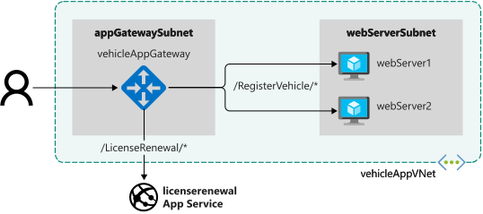

Application Gateway listens on an endpoint for incoming requests, and forwards these requests to one of the web servers in its back-end pool. You provide the configuration that describes how Application Gateway directs traffic, and how to load balance requests across web servers.

In the motor vehicle department system, you need to configure Application Gateway to load balance incoming requests across the web servers hosting the vehicle registration web app. You also need to configure Application Gateway to detect when either of the web servers has failed, so it can redirect traffic to a working server. Additionally, you need to configure path-based routing to send requests for the vehicle registration and license renewal sites to the proper back-end web services.

In this exercise, you'll create an instance of Application Gateway with a back-end pool of web servers. You'll verify that Application Gateway is configured with the correct listener to handle incoming HTTP requests, and routes these requests to a functioning web server.



## Configure the network for Application Gateway

1. To create the private subnet required by Application Gateway, run the following command. The subnet is named `appGatewaySubnet`, in the `vehicleAppVnet` virtual network that you created in the previous exercise.

    ```azurecli
    az network vnet subnet create \
      --resource-group $RG \
      --vnet-name vehicleAppVnet  \
      --name appGatewaySubnet \
      --address-prefixes 10.0.0.0/24
    ```

1. To create a public IP address and DNS label for Application Gateway, run the following command. The DNS label must be globally unique. To generate a label, the following code uses the `$RANDOM` function.

    ```azurecli
    az network public-ip create \
      --resource-group $RG \
      --name appGatewayPublicIp \
      --sku Standard \
      --dns-name vehicleapp${RANDOM}
    ```

## Create an application gateway

1. Create an application gateway named `vehicleAppGateway` with the following configuration:

    - A back-end pool containing the IP addresses of the web server virtual machines.
    - A firewall that blocks malicious requests, such as those used by SQL Injection and Cross-Site Scripting attacks.
    - A temporary listener that listens to port 8080, this will be replaced in a later step but is required for Application Gateway creation.
    - A rule that routes (and load balances) these requests to the web servers in the back-end pool.

    ```azurecli
    az network application-gateway create \
    --resource-group $RG \
    --name vehicleAppGateway \
    --sku WAF_v2 \
    --capacity 2 \
    --vnet-name vehicleAppVnet \
    --subnet appGatewaySubnet \
    --public-ip-address appGatewayPublicIp \
    --http-settings-protocol Http \
    --http-settings-port 8080 \
    --private-ip-address 10.0.0.4 \
    --frontend-port 8080
    ```

    > [!NOTE]
    > This command can take several minutes to complete.

1. To find the private IP addresses of  `webServer1` and `webServer2`, run the following commands. You will save these to variables to use in the next command.

    ```azurecli
    az vm list-ip-addresses \
      --resource-group $RG \
      --name webServer1 \
      --query [0].virtualMachine.network.privateIpAddresses[0] \
      --output tsv
    ```
    ```azurecli
    az vm list-ip-addresses \
      --resource-group $RG \
      --name webserver2 \
      --query [0].virtualMachine.network.privateIpAddresses[0] \
      --output tsv
    ```

1. Next, we'll add the back-end pools for each web site. First, create the back-end pool for the vehicle registration site running on virtual machines. Make sure that the IP addresses in the command below match the IP addresses that were output from the previous commands.

    ```azurecli
    az network application-gateway address-pool create \
      --gateway-name vehicleAppGateway \
      --resource-group $RG \
      --name vmPool \
      --servers 10.0.1.4 10.0.1.5
    ```

1. To create a back-end pool for the license renewal site running on App Service, run the following command.

    ```azurecli
    az network application-gateway address-pool create \
        --resource-group $RG \
        --gateway-name vehicleAppGateway \
        --name appServicePool \
        --servers $APPSERVICE.azurewebsites.net
    ```

1. For port 80, create a front-end port.

    ```azurecli
    az network application-gateway frontend-port create \
        --resource-group $RG \
        --gateway-name vehicleAppGateway \
        --name port80 \
        --port 80
    ```

1. To handle requests on port 80, create the listener.

    ```azurecli
    az network application-gateway http-listener create \
        --resource-group $RG \
        --name vehicleListener \
        --frontend-port port80 \
        --frontend-ip appGatewayFrontendIP \
        --gateway-name vehicleAppGateway
    ```

## Add a health probe

1. Create a health probe that tests the availability of a web server. The health probe runs every 15 seconds (`--interval 15`), and sends an HTTP GET request to the root path of the web app. If the web app doesn't respond within 10 seconds (`--timeout 10`), the probe times out. The web server is marked as unhealthy if the probe fails three times in succession (`--threshold 3`).

    Because you're using App Service as one of our back-ends, you will set the host header to the name of the App Service. Without this setting, the App Service won't respond and will not show as healthy.

    ```azurecli
    az network application-gateway probe create \
        --resource-group $RG \
        --gateway-name vehicleAppGateway \
        --name customProbe \
        --path / \
        --interval 15 \
        --threshold 3 \
        --timeout 10 \
        --protocol Http \
        --host-name-from-http-settings true
    ```

1. Next, to use the health probe you created, create the HTTP Settings for the gateway.

    ```azurecli
    az network application-gateway http-settings create \
        --resource-group $RG \
        --gateway-name vehicleAppGateway \
        --name appGatewayBackendHttpSettings \
        --host-name-from-backend-pool true \
        --port 80 \
        --probe customProbe
    ```

## Configure path-based routing

Now we need to configure path-based routing for our Application gateway. We'll route requests to **/VehicleRegistration/** to the **vmPool** and requests to **/LicenseRenewal/** to the **appServicePool**. Any requests without any URL context will be routed to the **vmPool** as a default.

1. To create the path map for the **vmPool**, run the following command.

    ```azurecli
    az network application-gateway url-path-map create \
        --resource-group $RG \
        --gateway-name vehicleAppGateway \
        --name urlPathMap \
        --paths /VehicleRegistration/* \
        --http-settings appGatewayBackendHttpSettings \
        --address-pool vmPool
    ```

1. To create the path map rule for the **appServicePool**, run the following command.

    ```azurecli
    az network application-gateway url-path-map rule create \
        --resource-group $RG \
        --gateway-name vehicleAppGateway \
        --name appServiceUrlPathMap \
        --paths /LicenseRenewal/* \
        --http-settings appGatewayBackendHttpSettings \
        --address-pool appServicePool \
        --path-map-name urlPathMap
    ```

1. Now, create a new routing rule using the path map you created.

    ```azurecli
    az network application-gateway rule create \
        --resource-group $RG \
        --gateway-name vehicleAppGateway \
        --name appServiceRule \
        --http-listener vehicleListener \
        --rule-type PathBasedRouting \
        --address-pool appServicePool \
        --url-path-map urlPathMap
    ```

1. The last piece of configuration is to delete the rule that was created when we initially deployed the Application Gateway. With your custom rule in place, you no longer need it.

    ```azurecli
    az network application-gateway rule delete \
        --resource-group $RG \
        --gateway-name vehicleAppGateway \
        --name rule1
    ```

With everything set up, it's time to test it out.
