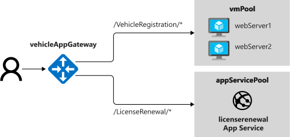

The final step is to test the application gateway and verify that it implements load balancing, and won't attempt to direct traffic to a web server that is unavailable. We also want to ensure that our path-based routing is working correctly.



## Test load balancing for the vehicle registration web app

1. In the Cloud Shell, run the following command to generate the root URL your Application Gateway.

    ```azurecli
    echo http://$(az network public-ip show \
      --resource-group $RG \
      --name appGatewayPublicIp \
      --query dnsSettings.fqdn \
      --output tsv)
    ```

1. Using a web browser, navigate to the web site at the URL returned by the previous command. This is the address of your application gateway. Verify that the home page of the vehicle registration web app appears. Note the name of the web server that you're using as shown in the footer (**webServer1** or **webServer2**).

    :::image type="content" source="../media/6-default-page.png" alt-text="Screenshot showing an image of the vehicle registration web app." loc-scope="other"::: <!-- no-loc -->

1. Click **Register a Vehicle**, enter the details of a vehicle, and then click **Register**.

1. Click **Refresh** in the address bar of the web browser. Notice that your session should now be connected to a different web server. In this configuration, Application Gateway uses round-robin load balancing.

1. Click **Refresh** a few more times. The requests should oscillate between servers.

## Test the resilience of Application Gateway to a failed server

1. In the Cloud Shell, run the following command to stop and deallocate the virtual machine for **webServer1**:

    ```azurecli
    az vm deallocate \
      --resource-group $RG \
      --name webServer1
    ```

1. Return to the application in the web browser and click **Refresh** several times. Notice that the web browser now only connects to **webServer2**.

1. In the Cloud Shell window on the right, restart the **webServer1** instance:

    ```azurecli
    az vm start \
      --resource-group $RG \
      --name webServer1
    ```

1. Return to the web application in the web browser and click **Refresh** several times. You should see that the requests are now distributed across both web servers again.

You've verified that the web application is running. Application Gateway uses load balancing to distribute requests across servers. Application Gateway detects whether a server has failed, and won't route requests to a server that is unavailable.

## Test path-based routing

Now let's test out the path-based routing. Recall that URLs to the root of the site and with **/VehicleRegistration/** will be routed to the **vmPool** containing our VMs, and requests to **/LicenseRenewal/** will be routed to the **appServicePool** containing our App Service.

You just confirmed that routing to the root page works, as you were able to pull up the vehicle registration page. Let's try the other routes to confirm they work.

1. Now click **Register a Vehicle** in the web browser of the application gateway page. This should bring up the Vehicle Registration page for the vehicle registration site. With **/VehicleRegistration/** in the URL, this routes to the **vmPool** where our vehicle registration site is running.

    :::image type="content" source="../media/6-vehicle-registration.png" alt-text="Screenshot showing an image of the vehicle registration web app." loc-scope="other"::: <!-- no-loc -->

1. Now visit `http://<vehicleAppGateway>/LicenseRenewal/Create`. This should take you to the license renewal page running on App Service. With **/LicenseRenewal/** in the URL, this routes to the **appServicePool** where our license renewal site is running.

    :::image type="content" source="../media/6-license-renewal.png" alt-text="Screenshot showing an image of the license renewal web app." loc-scope="other"::: <!-- no-loc -->

With this configuration, we can direct all users for both sites through our Application Gateway, giving them one root URL to remember. We can add additional sites as we expand our web presence.

## Web application firewall

We've also enabled the WAF on our Application Gateway. By doing this, we've automatically added security protection to both web sites. This provides a solid layer of protection from common vulnerabilities and helps protect our infrastructure and data.
