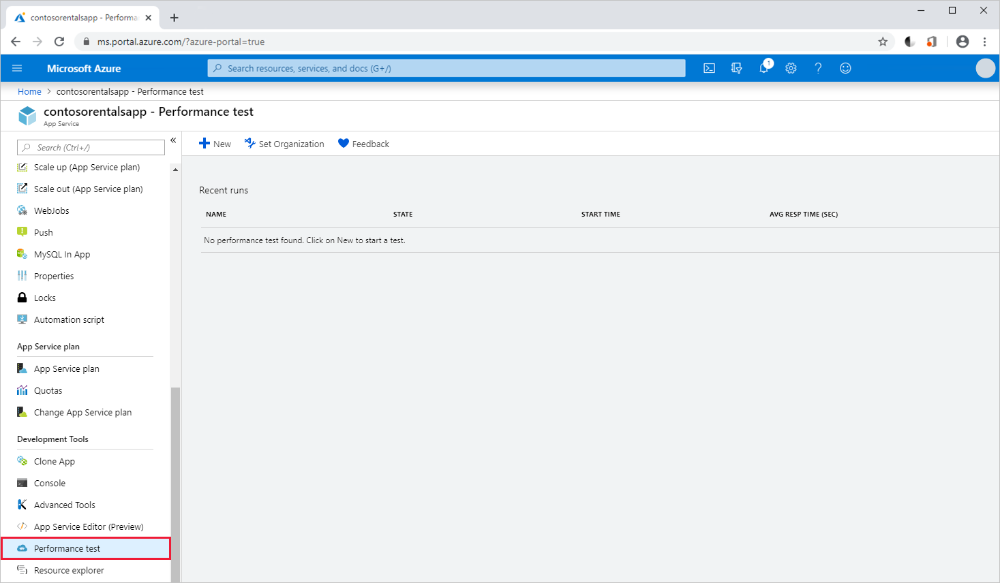
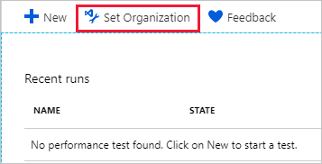
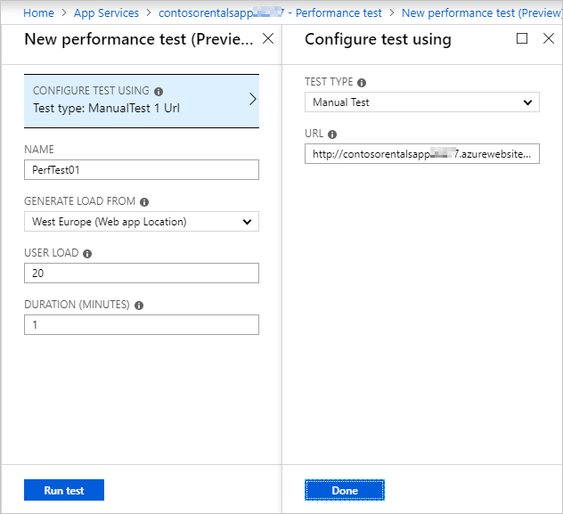
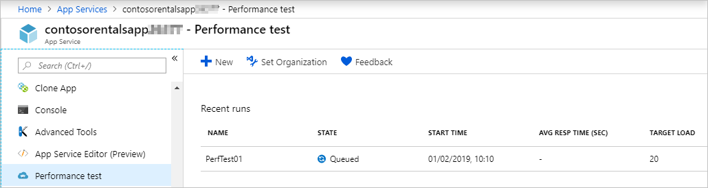

There are times when a basic load test is all you, as a web developer, need. The Azure portal provides an easy way to create these tests and view the results. You might want to test after changing back-end database connectivity strings or after updating front-end UI stylesheets. 

As the lead web developer for the costume rental company, you know that running some basic tests on your existing web app will help as you prepare to scale up your service.

## Plan your performance tests
When you're ready to start performance testing, the first thing you should do is create a separate App Service plan. You should use this plan exclusively for testing. By creating a separate plan for testing, you ensure that users of your live app aren't affected by the load overhead during the test period.

To ensure the testing is realistic, your testing App Service plan should be at the same tier as your production tier. Your performance testing tier doesn't need to be a permanently billed test environment, so you could delete it after you finish testing.

Load performance tests are created and saved within Azure DevOps, but when you plan your tests, you can choose what tools to use to run your tests. In Azure, there are two environments that can help you test your Azure web apps: the Azure portal and Azure DevOps.

> [!NOTE]
> You can also run Azure DevOps performance tests from within Visual Studio.

### Create tests in the Azure portal 
The Azure portal provides shortcuts for creating performance tests. These shortcuts might be all you need during the early stage of web app development. Configuration options for performance testing in the Azure portal are limited. But because all tests are actually part of Azure DevOps, you can later review and rerun these tests by using the Azure DevOps Portal as you move through your web app development cycle.

### Create tests in Azure DevOps 
The Azure DevOps Portal provides more control over your performance testing and lets you easily compare results from different test runs. One of the key components of Azure DevOps is Test Plans, which can be used in a wide range of scenarios. In this module, you're going to look at the load testing features of Azure Test Plans. These are the tests that are also available from the Azure portal.

:::image type="content" source="../media/2-devops-load-test.png" alt-text="Azure DevOps load tests." loc-scope="azure-devops":::

Azure DevOps includes these features:

- Multiple URLs can be tested concurrently.
- Requests can be configured to use a specific user agent string.
- Tests can be configured to simulate a specific mix of user browser types.
- The user load during a test can be increased gradually or stepwise.
- Recorded user sessions can be replayed as the test parameters.

## Performance testing in the Azure portal

The high-level steps to configure and run a performance test by using the Azure portal are outlined here.

> [!IMPORTANT]
> On March 31, 2020, we’ll retire cloud-based load testing in Microsoft Visual Studio and cloud-based load testing in Azure DevOps, the performance testing feature of App Service and Application Insights in the Azure portal. See [cloud-based load testing features to be retired](https://azure.microsoft.com/en-us/updates/cloud-based-load-testing-features-will-be-retired-on-march-31-2020/).

### 1. Open your web app

Open your web app in the Azure portal, and then open the performance test page:

### 2. Link to your Azure DevOps account

If you're running the first test for the web app, set up a link to your Azure DevOps organization:

If you don't have an organization, select **Create new** and then select your Azure subscription:

:::image type="content" source="../media/2-name-organization.png" alt-text="Create an Azure DevOps organization." loc-scope="azure-devops":::

### 3. Configure the test

Now you can configure your test parameters.

- **URL**. By default, the app's default URL is selected, but you can change this to test other pages as long as the URL is for HTTP GET requests.
- **Name**. Give your test a meaningful name.
- **Location**. By default, tests will be run from the app's location (as long as this location is also an Azure location that supports load testing), but you can also change the location manually. You'd typically select a location at or near the app location. But, to test for local conditions and latency, at times you might want to select other locations for generating load, like if you were planning the rollout of a local service to a wider geographic area.
- **User load**. This option specifies the number virtual users that will be used during the test. If you're using the Free App Service plan tier, you're limited to 40 users.
- **Duration**. This option specifies how long the test will run. If you're using the Free App Service plan tier, you're limited to a one-minute test.

> [!NOTE]
> The Shared and Basic/Standard/Premium App Service tiers have different limits.

### 4. Run the test

After you've configured your test, simply select **Run test**. Your test is placed in a queue. It might remain in a queued state for 10 or 15 minutes before the test run starts.

### 5. Run the test again

You might want to repeat your test several times in case the first results were not representative. You should also repeat your test after you make changes to your app.

To repeat a test from the Azure portal, simply open the test and select **Rerun**. The test will run again with the same parameters.

> [!NOTE]
> To compare the results of multiple test runs, you need to use Azure DevOps. You'll do this in a later unit.

In the next unit, you'll configure and run a performance test on an Azure web app.