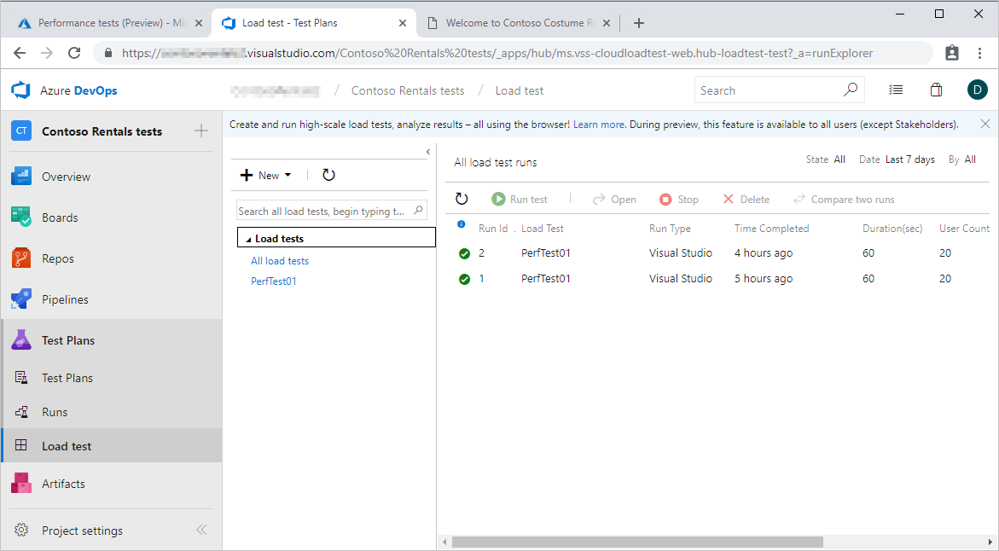
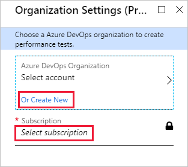

As a Web developer, there are times when a basic load test is all you need, and the Azure portal provides an easy way to create these tests and view the results. You might want to test after changing back-end database connectivity strings, or after updating front-end UI stylesheets. 

As the lead Web developer for the costume rental company, for example, running some basic tests on your existing Web app will help as you prepare to scale up your service.

## Plan your performance tests
When you are ready to start performance testing, the first thing you should do is create a separate app service plan, and use this plan exclusively for testing. By creating a separate plan for testing, live users of your app are not impacted by the load overhead during the test period.

For the testing to be realistic, your testing app service plan should be at the same tier as your production tier. Your performance testing tier does not need to be a permanently billed test environment, so could be deleted after you have finished testing.

Load performance tests are created and saved within Azure DevOps, but when planning your tests, you have a choice of what tools to use to run your tests. Within Azure, there are two environments that are available to help you test your Azure Web apps; the Azure portal and Azure DevOps.

> [!NOTE]
> You can also run Azure DevOps performance tests from within Visual Studio.

### Create tests in the Azure portal 
The Azure portal provides quick shortcuts for creating performance tests, and these may be all you need during the early stage of  Web app development. Although there are limited configuration options for performance testing in the Azure portal, because all tests are actually part of Azure DevOps, you can later review and rerun these tests using the Azure DevOps Portal as you move through your Web app development cycle.

### Create tests in Azure DevOps 
The Azure DevOps Portal provides you with a lot more control over your performance testing, and lets you easily compare results from different test runs. One of the key components of Azure DevOps is Test Plans, which can be used in a wide range of scenarios. In this module, you're going to look at the Load Testing features within DevOps Test Plans, and these are the tests that are also exposed from the Azure portal.

Azure DevOps includes several valuable features including:

- The ability to test Multiple URLs concurrently
- Requests can be configured to use a specific user-agent string
- Tests can be configured to simulate a specific mix of user browser types
- The user load during a test can be increased gradually or step-wise
- Recorded user sessions can be replayed as the test parameters

## Performance testing using the Azure portal 

To configure and run a performance test using the Azure portal involve several steps. The high-level steps are outlined below.

### 1. Open your Web app

Start by opening your Web app using the Azure portal, and then opening the performance test page.

### 2. Link to your DevOps account

Next, if this is the first test for this Web App, set up a link to your Azure DevOps organization.

If you do not already have an organization, click **Create new**, and then select your Azure subscription.

### 3. Configure the test

Now you can configure your test parameters.

- **URL**. By default the app's default URL is selected, but you can change this to test other pages as long as the URL is for HTTP GET requests.
- **Name**. Give your test a meaningful name.
- **Location**. By default, tests will be run from the app's location (as long as this location is also an Azure location that supports load testing), but you can also change the location manually. Although you would typically select a location at or close to the app location, to test for local conditions and latency, there may be times when you'd want to select other locations for generating load, such as if you were planning the rollout of a local service to a wider geographic area.
- **User load**. This is how many virtual users will be used during the test; if you are using the Free free app service plan tier, you are limited to 40 users. 
- **Duration**. This is how long the test will run; if you are using the Free app service plan tier, you are limited to a 1-minute test.

> [!NOTE]
> There are separate limits for Shared, and for Basic/Standard/Premium app service tiers.

### 4. Run the test

After you have configured your test, simply click **Run test**; your test will now be placed in a queue, and the test may in a \"queued\" state for 10-15 minutes before the test run starts.

### 5.  Running a test again

You might want to repeat your test several times in case the first results were by chance or unrepresentative. Also, rerun your test after making changes to your app.

To rerun a test from the Azure portal, simply open the test and click **Rerun**; the test will be run again with the same parameters. 

> [!NOTE]
> To compare the results from multiple test runs you need to use Azure DevOps, and you'll do this in a later unit. 

In the next unit, you'll configure and run a performance test on an Azure Web app.