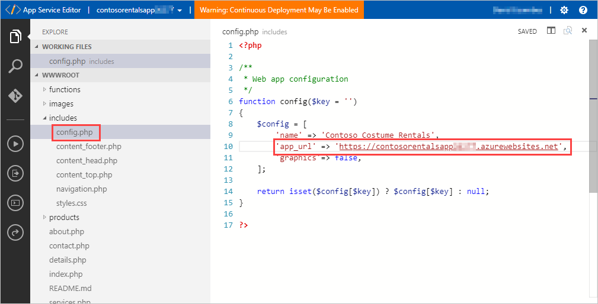
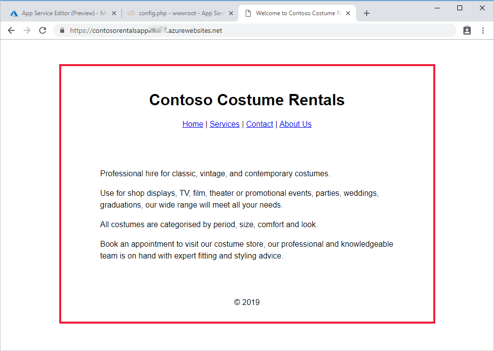
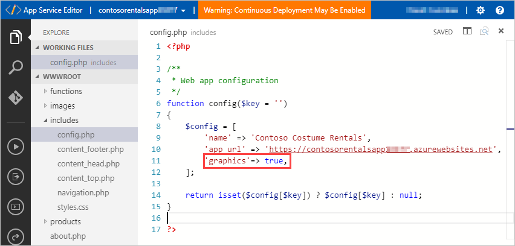
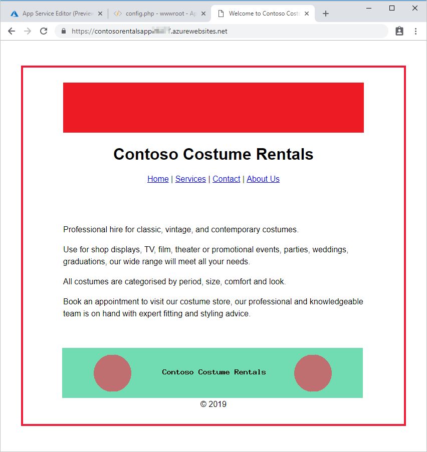

During app development, running quick load tests can help you identify code issues or other issues that might affect your user experience. In this exercise, you'll deploy a basic version of the Contoso Costume Rentals app. You'll then configure and run a test in the Azure portal. Finally, you'll modify the app by adding some media and then rerun the test to see if the change has any effect on the app's performance.

[!include[](../../../includes/azure-free-trial-note.md)]

## Create an Azure DevOps account

You need an Azure DevOps account for the exercises in this module. Skip this step if you already have an Azure DevOps account associated with your Azure account.

- Go to https://dev.azure.com, and sign up for a DevOps account (if you don't already have one). Use your Azure account to sign in. Don't create a new organization.

## Use Azure CLI to deploy a web app

In this step, you'll use Azure CLI commands to create a php-based web app by using code from a GitHub repository.

1. Sign in to the [Azure portal](https://portal.azure.com/?azure-portal=true) using your Azure subscription. 
2. In the Azure portal, select **Cloud Shell** on the toolbar at the top of the window, and, if prompted, select the **Bash** shell option.

3. Run the following commands in the Azure Cloud Shell to set some variables, replacing  `<your-local-Azure-region>` with the closest region to you. (Use `az account list-locations` to get a list of valid locations.)

    ```azurecli
    gitrepo=https://github.com/MicrosoftDocs/mslearn-load-test-web-app-azure-devops
    appName="contosorentalsapp$RANDOM"
    appPlanName="contosorentalsAppPlan"
    appLocation=<your-local-Azure-region>
    resourcegroupName=contosorentalsRG
    ```

4. Run the following commands in the Cloud Shell to deploy the web app:
    ```azurecli
    # Create a resource group
    az group create --name $resourcegroupName --location $appLocation

    # Create an App Service plan
    az appservice plan create --name $appPlanName --resource-group $resourcegroupName --sku FREE
    
    # Create a web app
    az webapp create --name $appName --resource-group $resourcegroupName --plan $appPlanName
    
    # Deploy code from a GitHub repository
    az webapp deployment source config \
        --name $appName \
        --resource-group $resourcegroupName \
        --repo-url $gitrepo \
        --branch master --manual-integration
    ```

5. Wait until the commands complete before you continue with the exercise.

### Configure and verify your web app

In this step, you'll finalize the deployment of your web app by editing a configuration file. You'll then verify that the app works.

1. In the Azure portal, select **App Services** in the left navigation pane.
1. In the **App Services** list, select **contosorentals\<number\>**. In the **Overview** section, select **Click to copy** to the right of the URL string.
1. In the **Development Tools** section, select **App Service Editor (Preview)**, and then, in the **App Service Editor (Preview)** pane, select **Go**. 
1. In the Azure App Service Editor, in the file list, expand **includes**, select **config.php**, and then, in line 10, paste the copied URL string to replace `app-url-here`. (Don't remove the quotation marks.)

   

1. Open a new browser tab, paste the URL string you copied earlier into the address box, and select Enter.
1. Verify that you get the home page for the Contoso Costume Rentals website.

   > [!NOTE]
   > The website is text-only at this point.

   

## Create and run a performance test
In this step, you'll create and run a performance test for your web app. You'll start by creating a new Azure DevOps organization so you can save the results of the test.

1. Go back to the Azure portal. In the **contosorentals\<number\>** App Service pane, in the **Development Tools** section, select **Performance test**.
1. In the **Performance test** pane, select **Set organization**, and then select **Create New**.
1. In the **Azure DevOps Organization** box, enter **ContosoRentals**.
1. Select **Subscription**, select your Azure subscription, and then select **OK**.
1. Wait until the new organization is created.
1. Select **New** to create a new performance test. Use these settings:
   - Test type: **Manual Test**, using the default URL
   - Name: **SimplePerfTest01**
   - Generate load from: the default location
   - User load: **40**
   - Duration (minutes): **1**
1. Select **Run test**. The test will initially show as **Queued**. It might be several minutes before the test run starts.
1. When the test status changes to **In Progress**, select the test and observe it as it runs.
1. When the test is finished, close the **Performance test** pane. You'll look at the results in the next unit.

## Change the website and rerun the performance test

 Now, after adding graphics to your site, you'll configure and run a new test

1. In your browser, switch to the App Service Editor browser tab.
1. In the App Service Editor, in the file list, expand **includes**, select **config.php**, and then, in line 11, change `false` to `true`:

   
1. Switch to the web app's browser tab and refresh the page. You should now see a box at top of the page that varies by page. You'll also see a box containing text and circles at the bottom of the page that loads a new set of random colors on each page load:

   
1. You might notice that some of the graphics are slow to load, so you'll now rerun the performance test.
1. Switch back to the Azure portal. In the **contosorentals\<number\>** App Service pane, in the **Development Tools** section, select **Performance test**, select **SimplePerfTest01**, select **Rerun**, and then, in the **Rerun performance test** pane, select **Run test**.
1. Close the performance test pane and wait for the test run to finish. You'll look at the details in the next unit.
1. You can now close the App Service Editor browser tab.

In the next unit, you'll learn how to use performance test results to optimize your web apps.
