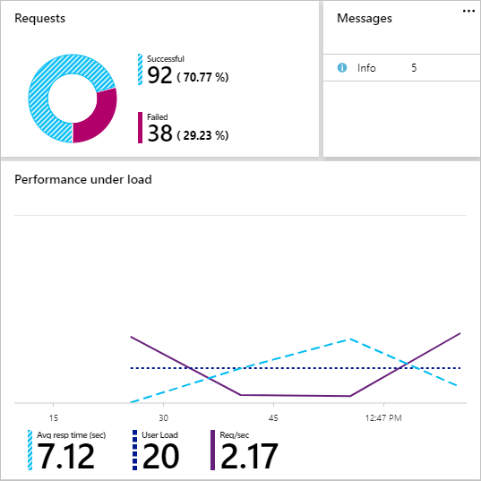

Now you have the results from your first set of performance tests. The next step is to evaluate these results and identify changes you might make to the Contoso Costume Rentals app. You'll also identify additional testing that might provide more guidance to help with the steps that follow.

## What data is provided after a successful test run?

When you select a completed test, you get a results pane. This pane provides two chart areas. The first, labeled **Details**, shows a set of key results from the test. The second, labeled **Web App Usage**, initially shows information about your app's CPU and memory consumption.

### Details

The **Details** chart shows the most important metrics from the performance test, presented in several sections:

This example shows:

- **Requests**: The number and percentage of successful and failed requests.

- **Messages**: Information about how the test was run. You can click in this list to get more details.

- **Performance under load**. Three metrics:

  - **Average response time (sec)**. This number, 7.12 seconds in the example, is the average time taken to respond to a successful request. This number is fairly high. Many companies aim for under 5 seconds. A wait of even 1 or 2 seconds can irritate users. When taking potential network latencies into account, a typical target for maximum response time might be around 500 ms. Response time is a measure of how quickly your app responds to requests and whether app performance decreases as more load is placed on it. These decreases might occur because a back-end database is at full capacity or because no more CPU cycles are available for processing and delivering media files.

  - **User load**. This is the average number of virtual users that were concurrently accessing the site during the test period. In the example, 20 users were configured in the test, and the server was always able to meet this number of users. When testing your app, you need to determine a realistic load to test against. You might also run a series of tests where you incrementally increase the user load to find the point at which the server can longer support the users. You should check whether the maximum number of users you specified in the test configuration was reached in the test. If not, your app might not be able to scale.

  - **Requests/second**. This number, 2.17 in the example, is the average number of requests processed per second. In this example, as the response time increased, the number of processed requests decreased.

  The numbers shown on the chart are the average for the test period. If you move your mouse pointer over the chart, you get details about how these metrics changed during the test period.

> [!IMPORTANT] 
> Remember that when you use the Azure portal you're testing *one URL*, so you should repeat your tests with other pages, especially if functions like database queries are initiated only from specific pages.

### Failed requests

The **Requests** area of the chart shows the number of requests that failed because the app didn't respond quickly enough. These delays could be caused by server load or by other issues, like poor network connectivity. You might also see failed requests if your app uses *throttling* under load, ignoring new requests until current requests are processed.

To get more details about failures, click in the **Requests** area to open the **Request Details** pane. In this example, the host closed the connection 36 times:

### Web app usage

The **Web App Usage** area initially shows **CPU Time** and **Memory working set** for the previous hour. If you're looking at test results more than an hour after the test finished, this graph might be empty. But if you select this chart, you get a new view over a longer time span. You also get the option to add other metrics to the chart, like the number of particular HTTP responses or server errors over time.

## What questions do these results help to answer?

So now that you have some results, what questions can these metrics help you answer about your web app development and deployment?

- *Will my app be able to scale up from dev to production?* If test results show that your app is already slowing down as more user requests are made, you might need to return to your design or look at provisioning more resources.
- *How many concurrent users can my app support?* If your initial test results show that there's no decrease in response times as the test reaches the maximum number of users that you specified, you should repeat the test, adding users until you see an effect on performance. At this point, you're reaching a user limit.
- *How long do users typically need to wait before seeing my app in their browsers?* Within the parameters you've set for the test, the average response time represents a fair approximation of wait time.
- *Does my app get faster over time?* If test results show an improvement in performance over the testing period, your app might be benefitting from caching. You should look at your app's functionality to see if this is because of client-side or server-side caching, and how you could take advantage of caching as you develop and scale up your app deployment.
- *Does my app get slower over time?* If test results show a reduction in performance over the testing period, your app might be hitting issues like CPU bottlenecks or network throttling. You should think about how your app works and then do further tests to see if you can identify the specific issue.
- *Are there pages or functions that are particularly slow?* By repeating your tests with different URLs, you might be able to identify specific issues. The more configurable testing available with Azure DevOps will help here. You'll learn about these tests in the next unit.

Some of these questions can't be answered easily with the testing you've done so far. In the next unit, you'll look at how you can use Azure DevOps for more configurable testing.

